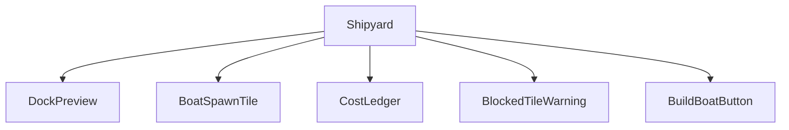
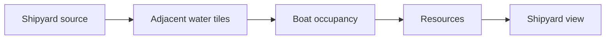
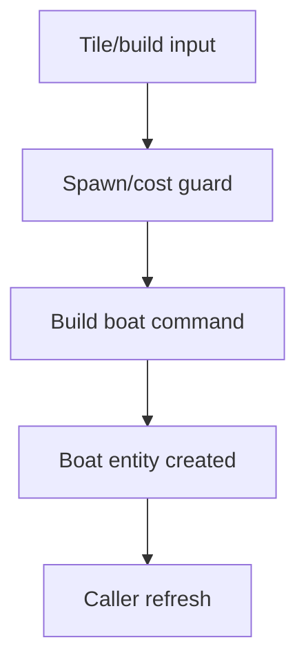
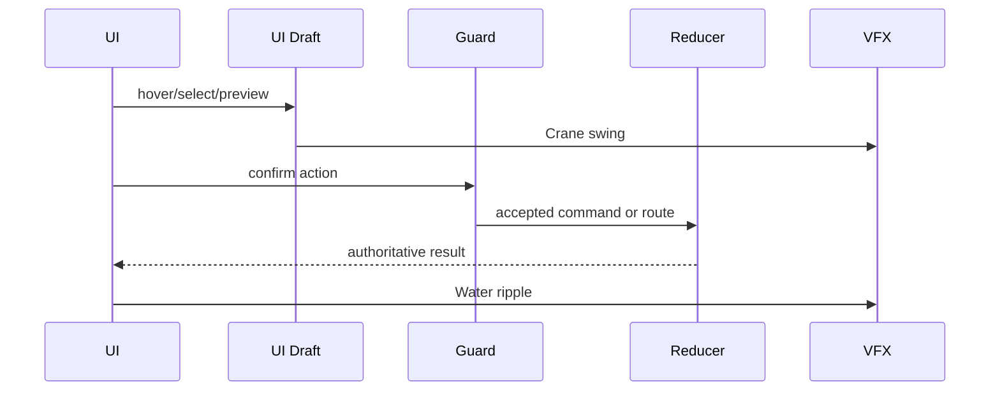
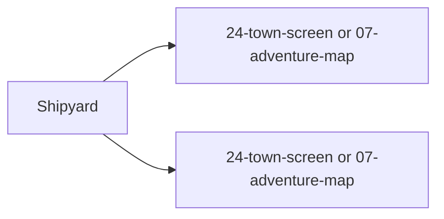

# Screen 33 Architecture: Shipyard

- System: `town`
- Screen ID: `shipyard`
- Visual Archetype: `curated-shipyard`
- Curation Status: `curated-pass-4`

## Purpose

Town-building or adventure-map shipyard service. The visiting player
spends resources to spawn a boat on an adjacent legal water tile.

## Visual Direction

- Original internal UI contract. Do not use third-party captures,
  copied franchise art, or external product pixels as implementation
  input.

## Visual Composition

## Screen Load And Data Resolution

## Main Interaction Flow

## Animation Flow

## Outgoing Transitions

## State Inputs

- `shipyardId` → `state.ui.shipyard.sourceId`
- `spawnTiles` → `selectors.towns.shipyardBoatSpawnTiles`
- `selectedTile` → `state.ui.shipyard.selectedSpawnTile`
- `cost` → `selectors.economy.shipyardBoatCost`
- `resources` → `state.players.active.resources`

## Implementation Contract

- `mockup.html` defines visible regions and data hooks only.
- `spec.md` defines the component tree and state bindings.
- `interactions.md` defines controls, timing, command routing,
  disabled states, and error behavior.
- `data-contracts.md` defines schemas, config, localization, asset,
  audio, VFX, save, and replay references.
- Diagrams in this file are screen-specific summaries of the same
  contract and must not introduce hidden behavior.

---

## 🔍 Sync Check

- **UI: ✔** — Components, state inputs, and outgoing transitions match sibling `spec.md` and `interactions.md` (`24-town-screen` / `07-adventure-map` callers; `BuildBoatButton`, `DockPreview`, `BoatSpawnTile`, `CostLedger`, `BlockedTileWarning`).
- **Schema: ✔** — `BUILD_BOAT` is declared in [`content-schema/schemas/command.schema.json`](../../../../../content-schema/schemas/command.schema.json) (`$defs/buildBoat`, fields `townId`, `shipyardId`, `spawnTile`, `metadata`); selectors named here are sibling-doc-aligned.
- **Tasks: ✔** — UI ownership: [`phase-2.07-ui-screen-backlog.33-shipyard-screen`](../../../../../tasks/phase-2/07-ui-screen-backlog/33-shipyard-screen.md); engine ownership: [`phase-2.05-mod-system.06-build-boat-command-and-shipyard`](../../../../../tasks/phase-2/05-mod-system/06-build-boat-command-and-shipyard.md). Both reference this folder in their Read First.

## ⚠ Issues

- **`Visual Composition` and `spec.md` Component Tree omit the close affordance.** `mockup.html` renders a `CLOSE` button (`data-action="shipyard.close"`) and `interactions.md` lists the `shipyard.close` action, but neither this diagram nor `spec.md § Component Tree` declares a `CloseButton` node. Per [`.agents/rules/ui.md`](../../../../../.agents/rules/ui.md) ("Read all five together"), the component tree should be the union of mockup affordances. Suggested fix in a follow-up edit pass: add `CloseButton` to both this diagram and `spec.md`. Not auto-applied — Hard Prohibition B (never invent features beyond the originals) keeps the rewrite faithful to the prior wording.
- **`command-schema.md` is missing a `BUILD_BOAT` section.** [`content-schema/schemas/command.schema.json`](../../../../../content-schema/schemas/command.schema.json) defines `buildBoat`, but [`docs/architecture/command-schema.md`](../../../command-schema.md) has no human-readable entry for it. Per CLAUDE.md ("`src/contracts/` is generated from `content-schema/schemas/`") the schema is canonical, so this is a documentation gap, not a contract gap. Owning task to close it: `phase-2.05-mod-system.06-build-boat-command-and-shipyard`. Skill did not edit `command-schema.md` (Hard Prohibition D).
