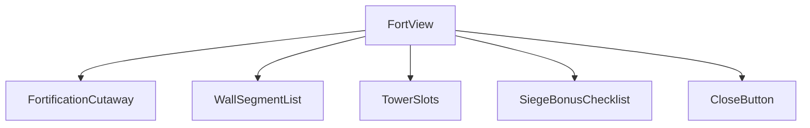
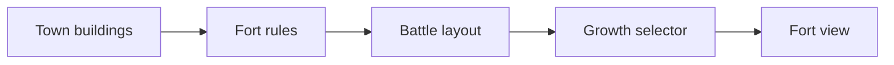
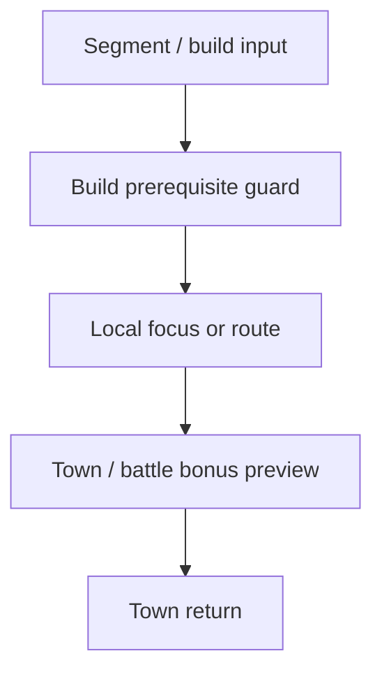
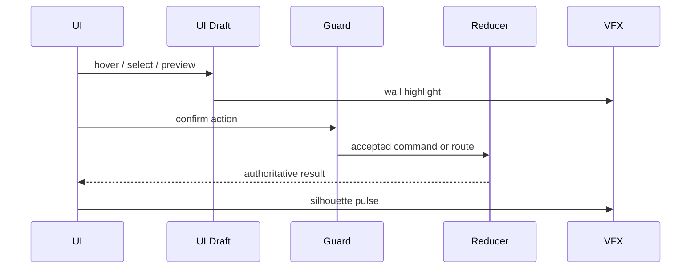
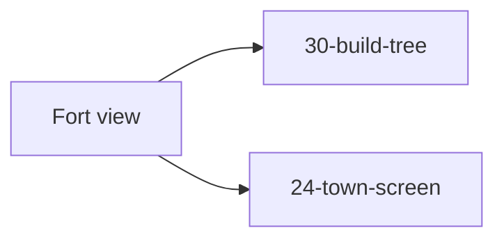

# Screen 34 Architecture: Fort View

- System: `town`
- Screen ID: `fort-view`
- Visual archetype: `curated-fort-view`
- Curation status: `curated-pass-4`

### Companion Files

- Spec: [`spec.md`](./spec.md)
- Interactions: [`interactions.md`](./interactions.md)
- Data Contracts: [`data-contracts.md`](./data-contracts.md)
- Mockup: [`mockup.html`](./mockup.html)

## Purpose

Town fortification inspection view. Surfaces the built fort /
citadel / castle tier, per-wall and per-tower battle bonuses, gate
and moat presence, growth bonus, and the next upgrade's
prerequisites. The screen is read-only on gameplay state — no schema
commands originate here.

## Visual Direction

- Original internal UI contract. Do not use third-party captures,
  copied franchise art, or external product pixels as implementation
  input.

## Visual Composition

## Screen Load And Data Resolution

## Main Interaction Flow

## Animation Flow

## Outgoing Transitions

## State Inputs

- `fortLevel` → `state.towns.byId[selected].fortificationLevel`
- `wallDefinition` → `selectors.towns.fortificationBattleLayout`
- `growthBonus` → `selectors.towns.fortificationGrowthBonus`
- `buildPrereqs` → `selectors.towns.nextFortUpgradePrereqs`
- `selectedSegment` → `state.ui.fortView.selectedSegment`

## Implementation Contract

- `mockup.html` defines visual regions and data hooks only.
- [`spec.md`](./spec.md) defines the component / state contract.
- [`interactions.md`](./interactions.md) defines controls, timing,
  routing of local-ui tokens, disabled states, and error behavior.
- [`data-contracts.md`](./data-contracts.md) defines schemas, config,
  localization, asset, audio, VFX, save, and replay references.
- These diagrams are screen-specific summaries of the same contract;
  they must not introduce hidden behavior.

---

## 🔍 Sync Check

- **UI: ✔** — Visual composition (5 components) matches sibling [`spec.md § Component Tree`](./spec.md); outgoing transitions to `30-build-tree` and `24-town-screen` match sibling [`interactions.md § Navigation Outcomes`](./interactions.md) and the `data-action="fortView.buildTree"` / `data-action="fortView.close"` hooks in [`mockup.html`](./mockup.html).
- **Schema: ✔** — State inputs match sibling [`spec.md § State Bindings`](./spec.md) and [`data-contracts.md § Runtime State Selectors`](./data-contracts.md) verbatim. The Animation-Flow sequence diagram still shows a `Reducer` participant — kept verbatim because the original asserts it, but note that in practice only routing / local-ui tokens leave this screen (the `Reducer` participant fires only when the routed-to screen later dispatches a real command).
- **Tasks: ⚠** — Owning UI task [`phase-2.07-ui-screen-backlog.34-fort-view-screen`](../../../../../tasks/phase-2/07-ui-screen-backlog/34-fort-view-screen.md) lists this file in Read First. The engine source of `selectors.towns.fortification*` is not named in any task's Outputs (see sibling `spec.md § ⚠ Issues`).

## ⚠ Issues

- **`Reducer` participant in `Animation Flow` is slightly misleading.** This screen dispatches no schema commands, so the `Guard → Reducer → UI` arc fires only after the user routes out to `30-build-tree` and that screen dispatches `BUILD_STRUCTURE`. Meaning is preserved by leaving the diagram verbatim (Hard Prohibition A), but a future pass could simplify it to `Guard → Router → UI` for clarity. Not auto-applied because no canonical source explicitly disallows the current shape.
- See sibling [`spec.md § ⚠ Issues`](./spec.md) and [`data-contracts.md § ⚠ Issues`](./data-contracts.md) for the missing `data-inventory.md` row for `state.towns.byId[].fortificationLevel` and the implicit selector ownership — both are flagged once at the spec to avoid duplication.
