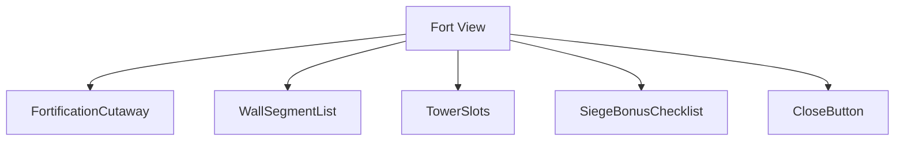
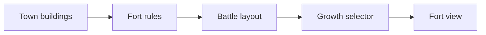
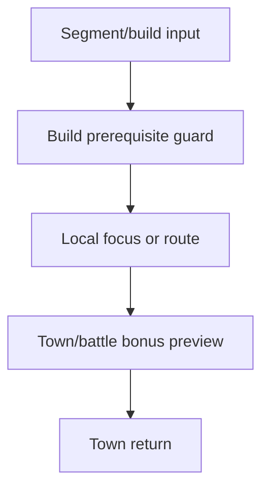
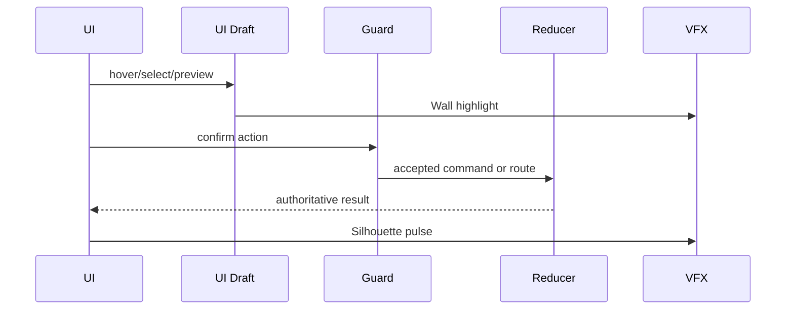
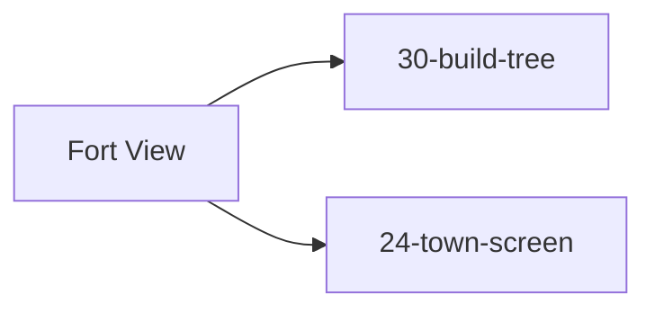

# Screen 34 Architecture: Fort View

System: town
Screen ID: fort-view
Visual Archetype: curated-fort-view
Curation Status: curated-pass-4

## Purpose
Town fortification inspection view showing fort/citadel/castle tier, wall/tower battle bonuses, and siege readiness.

## Visual Direction
- Original internal UI contract. Do not use third-party captures,
  copied franchise art, or external product pixels as implementation input.

## Visual Composition

## Screen Load And Data Resolution

## Main Interaction Flow

## Animation Flow

## Outgoing Transitions

## State Inputs
- fortLevel -> state.towns.byId[selected].fortificationLevel
- wallDefinition -> selectors.towns.fortificationBattleLayout
- growthBonus -> selectors.towns.fortificationGrowthBonus
- buildPrereqs -> selectors.towns.nextFortUpgradePrereqs
- selectedSegment -> state.ui.fortView.selectedSegment

## Implementation Contract
- Mockup defines visual regions and data hooks only.
- Spec defines the component/state contract.
- Interactions define controls, timing, command routing, disabled states, and error behavior.
- Data contracts define schemas, config, localization, asset, audio, VFX, save, and replay references.
- Diagrams are screen-specific summaries of the same contract and must not introduce hidden behavior.
