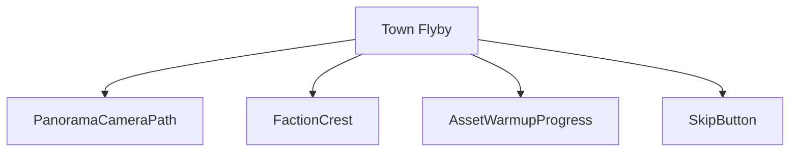
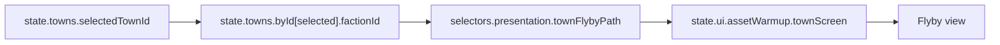
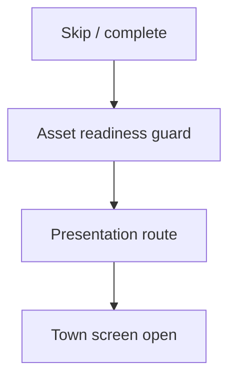
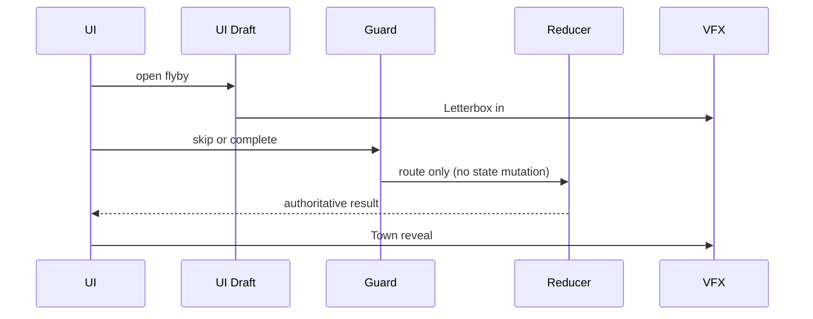
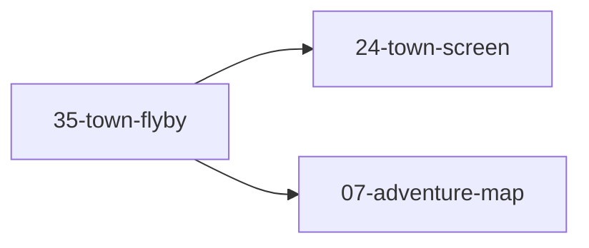

# Screen 35 Architecture: Town Flyby

> Source files: [`mockup.html`](./mockup.html) ·
> [`spec.md`](./spec.md) ·
> [`interactions.md`](./interactions.md) ·
> [`data-contracts.md`](./data-contracts.md)

| Field | Value |
|---|---|
| System | `town` |
| Screen ID | `town-flyby` |
| Visual archetype | `curated-town-flyby` |
| Curation status | `curated-pass-4` |
| Owning task | [`phase-2.07-ui-screen-backlog.35-town-flyby-screen`](../../../../../tasks/phase-2/07-ui-screen-backlog/35-town-flyby-screen.md) |

## 1. Purpose

Optional cinematic town-entry / faction-panorama flyby that runs
before the interactive [`24-town-screen`](../24-town-screen/) becomes
available. Pure presentation — no gameplay mutation, no engine
command emitted. Frame, components, and bindings are detailed in
[`spec.md`](./spec.md); per-control behavior in
[`interactions.md`](./interactions.md); schemas, selectors, and
asset IDs in [`data-contracts.md`](./data-contracts.md).

## 2. Visual Composition

## 3. Screen Load And Data Resolution

The flyby is presentation-only; it resolves IDs through registries
and never embeds asset paths in gameplay records.

## 4. Main Interaction Flow

`COMPLETE_TOWN_FLYBY` waits for `assetWarmup` to report ready;
`SKIP_TOWN_FLYBY` short-circuits the wait but uses the same route
target. `CANCEL_TOWN_ENTRY_AFTER_PRESENTATION_ERROR` routes back to
the adventure map when required town data fails to load.

## 5. Animation Flow

Animation consumes the reducer / route result; it never decides
gameplay outcomes. Reduced-motion mode collapses the eased camera
path to a static frame per
[`animation-contract.md`](../../../animation-contract.md).

## 6. Outgoing Transitions

- `24-town-screen` — on `SKIP_TOWN_FLYBY` or `COMPLETE_TOWN_FLYBY`.
- `07-adventure-map` — on `CANCEL_TOWN_ENTRY_AFTER_PRESENTATION_ERROR`.

## 7. State Inputs

| Binding | Source |
|---|---|
| `townId` | `state.towns.selectedTownId` |
| `factionId` | `state.towns.byId[selected].factionId` |
| `assetWarmup` | `state.ui.assetWarmup.townScreen` |
| `cameraPath` | `selectors.presentation.townFlybyPath` |
| `skipAvailable` | `config.ui.allowSkipCinematics` |

All five are transient / config; none persist, so no
[`data-inventory.md`](../../../data-inventory.md) row is required.

## 8. Implementation Contract

- Diagrams summarize the same contract as the sibling files; they
  introduce no behavior absent from [`spec.md`](./spec.md),
  [`interactions.md`](./interactions.md), or
  [`data-contracts.md`](./data-contracts.md).
- The three commands listed above are local-ui only (prefix-matched
  in [`screen-command-coverage.json`](../../../screen-command-coverage.json)
  via `SKIP_` / `COMPLETE_` / `CANCEL_`). None enter the
  deterministic command log.
- Original internal UI contract; do not use third-party captures or
  external product pixels as implementation input.

---

## 🔍 Sync Check

- **UI: ⚠** — Components and outgoing transitions match sibling [`spec.md`](./spec.md) and [`interactions.md`](./interactions.md); however, the mockup's progress label reads "Castle Flyby" while the docs say "Town Flyby" and the documented `FactionCrest` component is not drawn in [`mockup.html`](./mockup.html). See `## ⚠ Issues`.
- **Schema: ✔** — Camera-path binding resolves through `presentation.flybyCameraEasing` in [`town-presentation.schema.json`](../../../../../content-schema/schemas/town-presentation.schema.json); no other engine schema is touched (presentation-only).
- **Tasks: ✔** — [`phase-2.07-ui-screen-backlog.35-town-flyby-screen`](../../../../../tasks/phase-2/07-ui-screen-backlog/35-town-flyby-screen.md) reads all four sibling files plus the mockup; no orphan task references this screen.

## ⚠ Issues

- **Mockup label drift.** [`mockup.html`](./mockup.html) renders the in-frame status text as "Castle Flyby - assets warming: 88 percent", but every Markdown sibling names the screen "Town Flyby". Suggested fix: update the visual reference text to "Town Flyby"; flagged here rather than rewritten because [`mockup.html`](./mockup.html) is reference-only under the doc-audit skill.
- **`FactionCrest` declared but not drawn in the mockup.** Sibling [`spec.md`](./spec.md) lists `FactionCrest` in the component tree and [`interactions.md`](./interactions.md) describes it fading in. The mockup shows only the panorama, progress label, and skip button. Either the visual reference must add a crest region or the component must be relabeled as runtime-only; flagged in the owning task per Hard Prohibition B (never invent features).
