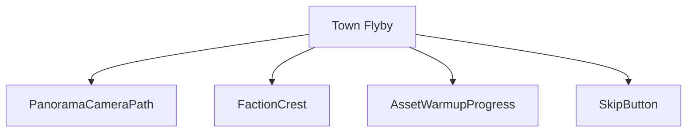
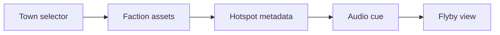
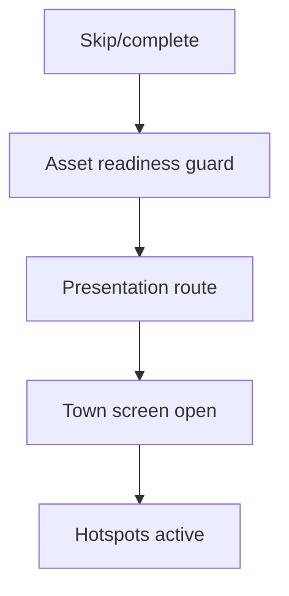
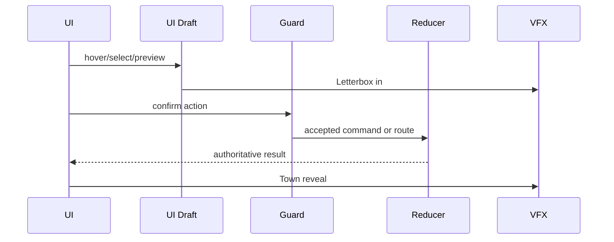
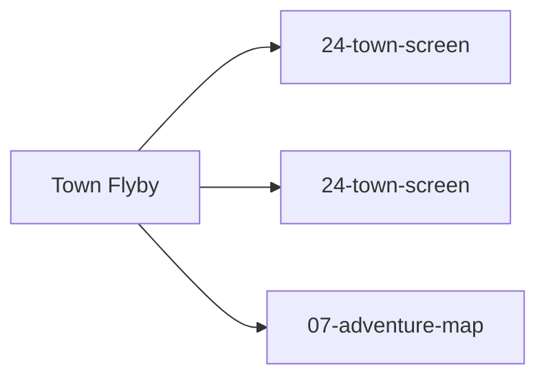

# Screen 35 Architecture: Town Flyby

System: town
Screen ID: town-flyby
Visual Archetype: curated-town-flyby
Curation Status: curated-pass-4

## Purpose
Optional cinematic town entry/faction panorama flyby before the interactive town screen appears.

## Visual Direction
- Original internal UI contract. Do not use third-party captures,
  copied franchise art, or external product pixels as implementation input.

## Visual Composition

## Screen Load And Data Resolution

## Main Interaction Flow

## Animation Flow

## Outgoing Transitions

## State Inputs
- townId -> state.towns.selectedTownId
- factionId -> state.towns.byId[selected].factionId
- assetWarmup -> state.ui.assetWarmup.townScreen
- cameraPath -> selectors.presentation.townFlybyPath
- skipAvailable -> config.ui.allowSkipCinematics

## Implementation Contract
- Mockup defines visual regions and data hooks only.
- Spec defines the component/state contract.
- Interactions define controls, timing, command routing, disabled states, and error behavior.
- Data contracts define schemas, config, localization, asset, audio, VFX, save, and replay references.
- Diagrams are screen-specific summaries of the same contract and must not introduce hidden behavior.
