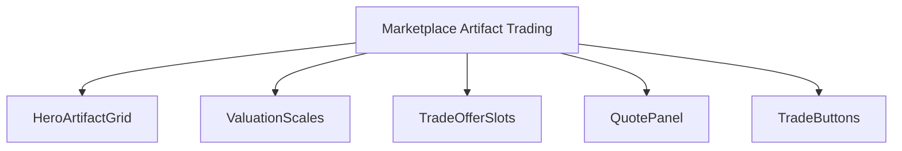
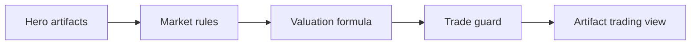
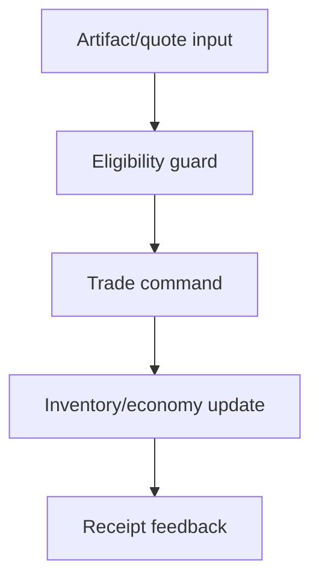
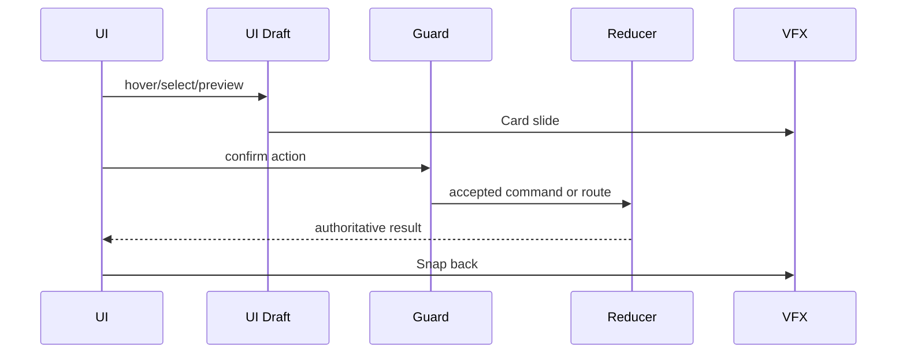
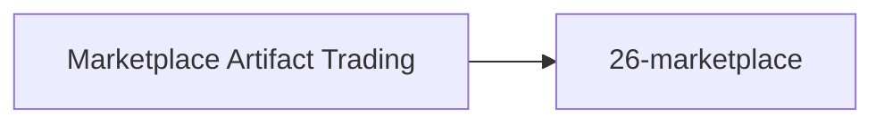

# Screen 36 Architecture: Marketplace Artifact Trading

System: town
Screen ID: marketplace-artifact-trading
Visual Archetype: curated-artifact-trading
Curation Status: curated-pass-4

## Purpose
Marketplace sub-service for exchanging artifacts between hero, backpack, market offer slots, and trade valuation rows.

## Visual Direction
- Original internal UI contract. Do not use third-party captures,
  copied franchise art, or external product pixels as implementation input.

## Visual Composition

## Screen Load And Data Resolution

## Main Interaction Flow

## Animation Flow

## Outgoing Transitions

## State Inputs
- heroArtifacts -> state.heroes.byId[visiting].artifacts
- selectedOffer -> state.ui.artifactTrading.offerArtifactId
- selectedRequest -> state.ui.artifactTrading.requestId
- quote -> selectors.economy.artifactTradeQuote
- tradeGuard -> selectors.economy.artifactTradeGuard

## Implementation Contract
- Mockup defines visual regions and data hooks only.
- Spec defines the component/state contract.
- Interactions define controls, timing, command routing, disabled states, and error behavior.
- Data contracts define schemas, config, localization, asset, audio, VFX, save, and replay references.
- Diagrams are screen-specific summaries of the same contract and must not introduce hidden behavior.
