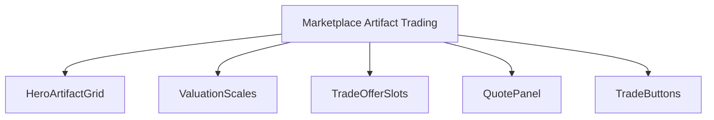
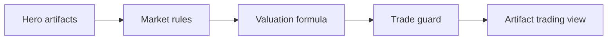
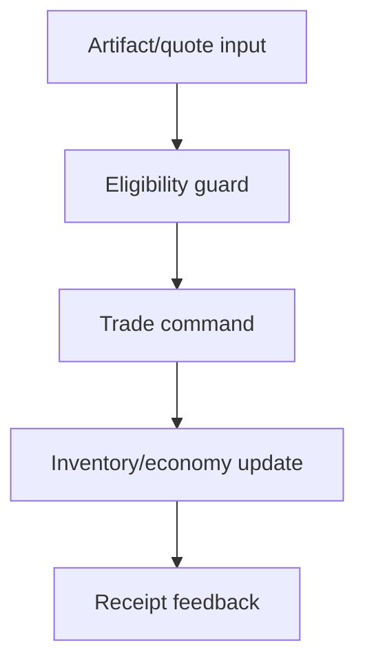
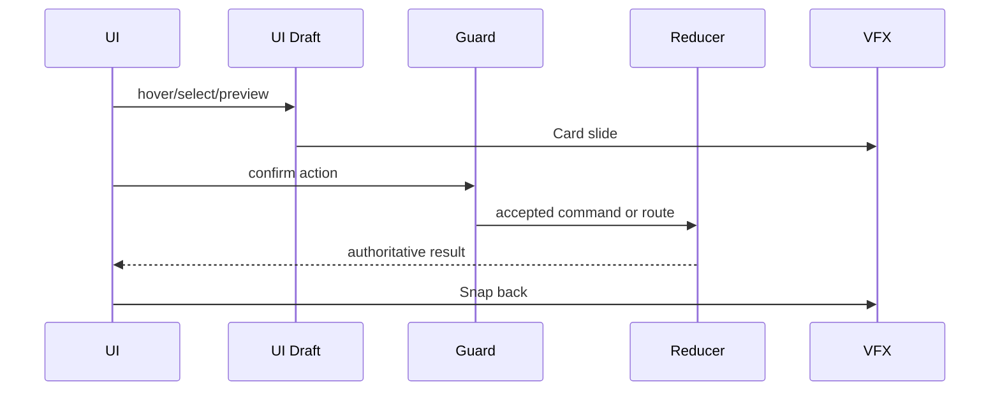
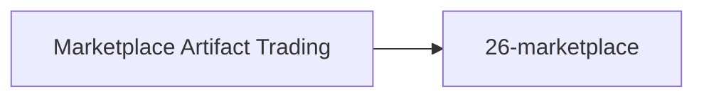

# Screen 36 Architecture: Marketplace Artifact Trading

- System: `town`
- Screen ID: `marketplace-artifact-trading`
- Visual Archetype: `curated-artifact-trading`
- Curation Status: `curated-pass-4`

### Companion Docs
- [`spec.md`](./spec.md) — components, state bindings.
- [`interactions.md`](./interactions.md) — actions, commands, error
  surfaces.
- [`data-contracts.md`](./data-contracts.md) — schemas, selectors,
  config, localization, assets.
- [`mockup.html`](./mockup.html) — visual reference (regions and
  `data-action` hooks only).

## Purpose
Marketplace sub-service that exchanges a hero artifact for gold,
resources, or another artifact via a deterministic quote.

## Visual Direction
- Original internal UI contract. Do not source pixels from third-
  party captures, copied franchise art, or external product
  screenshots.

## Visual Composition

## Screen Load And Data Resolution

## Main Interaction Flow

## Animation Flow

## Outgoing Transitions

## State Inputs
| Name | Path |
| --- | --- |
| `heroArtifacts` | `state.heroes.byId[visiting].artifacts` |
| `selectedOffer` | `state.ui.artifactTrading.offerArtifactId` |
| `selectedRequest` | `state.ui.artifactTrading.requestId` |
| `quote` | `selectors.economy.artifactTradeQuote` |
| `tradeGuard` | `selectors.economy.artifactTradeGuard` |

## Package Boundary
- Mockup defines visual regions and `data-action` hooks only.
- Spec defines components and state bindings.
- Interactions define controls, timing, command routing, disabled
  states, and error behavior.
- Data contracts define schemas, config, localization, asset,
  audio, VFX, save, and replay references.
- These diagrams summarize the same contract and must not
  introduce hidden behavior.

---

## 🔍 Sync Check

- **UI: ✔** — Component nodes mirror the tree in sibling [`spec.md`](./spec.md); state inputs match the bindings in [`spec.md`](./spec.md) and [`data-contracts.md`](./data-contracts.md) row-for-row.
- **Schema: ❌** — The `Trade command` node in the Main Interaction Flow resolves to `TRADE_ARTIFACT`, whose schema payload in [`command.schema.json`](../../../../../content-schema/schemas/command.schema.json) is hero-to-hero, not marketplace-quote. Single canonical entry in sibling [`spec.md`](./spec.md) `## ⚠ Issues`.
- **Tasks: ✔** — Outgoing transition `26-marketplace` matches the `Close` row in [`interactions.md`](./interactions.md); owning UI task [`tasks/phase-2/07-ui-screen-backlog/36-marketplace-artifact-trading-screen.md`](../../../../../tasks/phase-2/07-ui-screen-backlog/36-marketplace-artifact-trading-screen.md) Reads-First all four package files.

## ⚠ Issues

- **`TRADE_ARTIFACT` payload mismatch.** Same gap as sibling [`spec.md`](./spec.md) `## ⚠ Issues`; documented once there. Owner: [`phase-2.01-spells-artifacts.17-trade-artifact-command`](../../../../../tasks/phase-2/01-spells-artifacts/17-trade-artifact-command.md). Not edited here per Hard Prohibition D.
