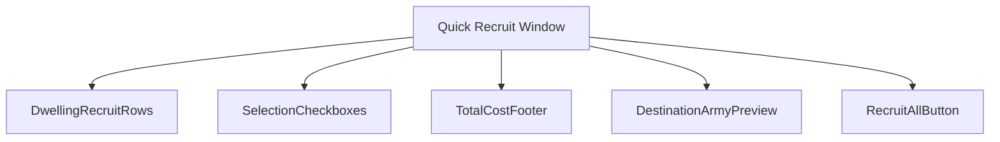
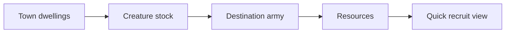
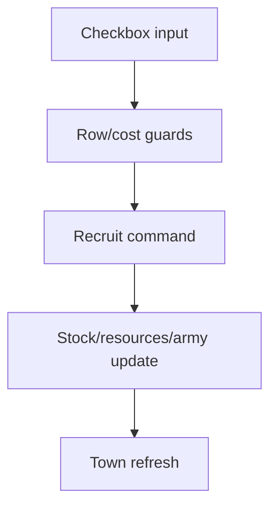
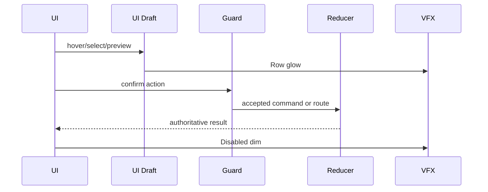
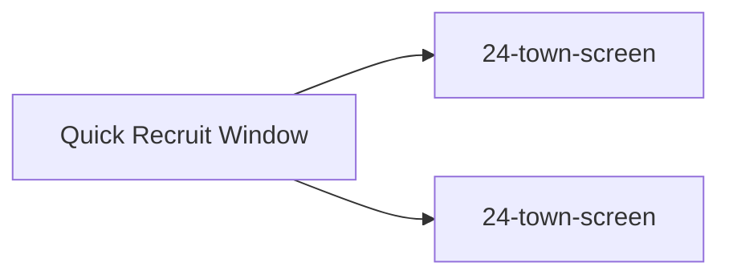

# Screen 37 Architecture: Quick Recruit Window

System: town
Screen ID: quick-recruit-window
Visual Archetype: curated-quick-recruit
Curation Status: curated-pass-4

## Purpose
Condensed town-wide recruitment window for buying available creatures across all built dwellings in one pass.

## Visual Direction
- Original internal UI contract. Do not use third-party captures,
  copied franchise art, or external product pixels as implementation input.

## Visual Composition

## Screen Load And Data Resolution

## Main Interaction Flow

## Animation Flow

## Outgoing Transitions

## State Inputs
- dwellingRows -> selectors.towns.quickRecruitRows
- selectedRows -> state.ui.quickRecruit.selectedDwellingIds
- destinationArmy -> selectors.towns.quickRecruitDestinationArmy
- totalCost -> selectors.economy.quickRecruitTotalCost
- rowGuards -> selectors.towns.quickRecruitRowGuards

## Implementation Contract
- Mockup defines visual regions and data hooks only.
- Spec defines the component/state contract.
- Interactions define controls, timing, command routing, disabled states, and error behavior.
- Data contracts define schemas, config, localization, asset, audio, VFX, save, and replay references.
- Diagrams are screen-specific summaries of the same contract and must not introduce hidden behavior.
