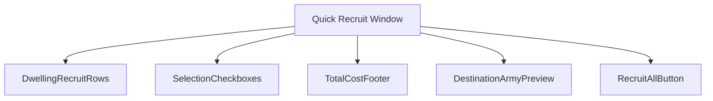
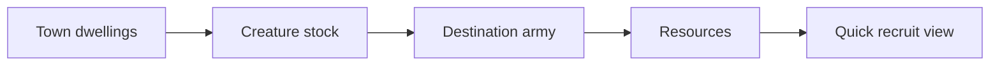
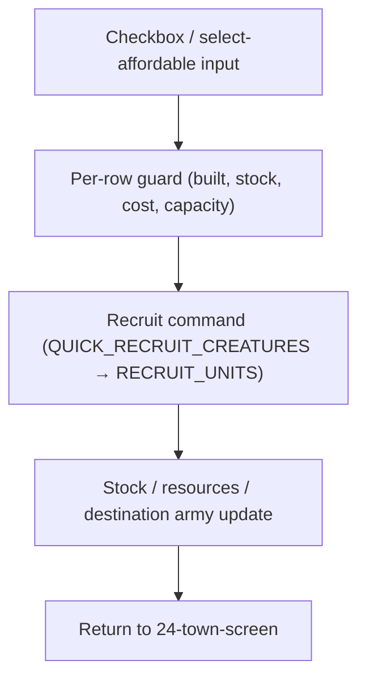
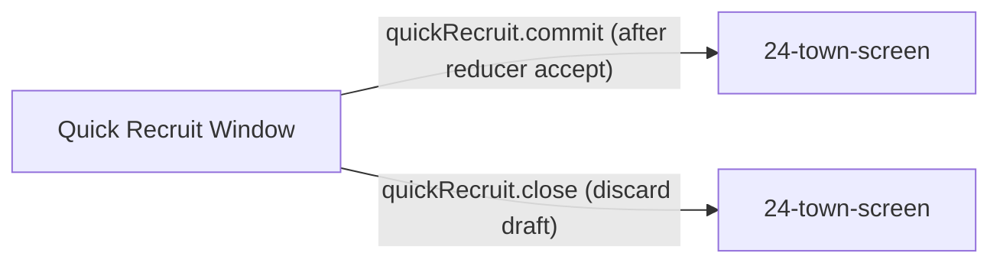

# Screen 37 Architecture: Quick Recruit Window

- System: `town`
- Screen ID: `quick-recruit-window`
- Visual Archetype: `curated-quick-recruit`
- Curation Status: `curated-pass-4`

### Companion docs
- Spec: [`spec.md`](./spec.md)
- Interactions: [`interactions.md`](./interactions.md)
- Data Contracts: [`data-contracts.md`](./data-contracts.md)
- Mockup: [`mockup.html`](./mockup.html)

## Purpose
Condensed town-wide recruitment window: buy available creatures
across every built dwelling in one pass, then return to the town
screen.

## Visual Direction
Original internal UI contract. Do not use third-party captures,
copied franchise art, or external product pixels as implementation
input.

## Visual Composition


## Screen Load And Data Resolution


## Main Interaction Flow


## Animation Flow
```mermaid
sequenceDiagram
  participant UI
  participant Draft as UI Draft
  participant Guard
  participant Reducer
  participant VFX
  UI->>Draft: toggle row / select affordable
  Draft->>VFX: row glow + total rolls up
  UI->>Guard: confirm Recruit
  Guard->>Reducer: accepted command
  Reducer-->>UI: authoritative result
  UI->>VFX: stacks march into army slots; locked rows dim with reason
```

## Outgoing Transitions


## State Inputs
| UI binding | Source |
| --- | --- |
| `dwellingRows` | `selectors.towns.quickRecruitRows` |
| `selectedRows` | `state.ui.quickRecruit.selectedDwellingIds` |
| `destinationArmy` | `selectors.towns.quickRecruitDestinationArmy` |
| `totalCost` | `selectors.economy.quickRecruitTotalCost` |
| `rowGuards` | `selectors.towns.quickRecruitRowGuards` |

## Implementation Contract
- `mockup.html` defines visual regions and data hooks only.
- `spec.md` owns the component / state contract.
- `interactions.md` owns controls, timing, command routing,
  disabled states, error surfaces.
- `data-contracts.md` owns schemas, config, localization, asset,
  audio, VFX, save, and replay references.
- Diagrams above summarize the same contract; they must not
  introduce hidden behavior.

---

## 🔍 Sync Check

- **UI: ✔** — Component tree, state bindings, and animation cues match sibling [`spec.md`](./spec.md), [`interactions.md`](./interactions.md), and the regions drawn in [`mockup.html`](./mockup.html). Both outgoing transitions resolve to the existing [`24-town-screen`](../24-town-screen/spec.md).
- **Schema: ✔** — `QUICK_RECRUIT_CREATURES` aliases `RECRUIT_UNITS` per [`screen-command-coverage.json`](../../../screen-command-coverage.json) `commandAliases`; the canonical command is defined in [`command.schema.json`](../../../../../content-schema/schemas/command.schema.json) and documented in [`command-schema.md` § RECRUIT_UNITS](../../../command-schema.md). The `TOGGLE_` / `SELECT_` / `CLOSE_` UI-local tokens are covered by `localUiPrefixes`.
- **Tasks: ✔** — Owning task [`tasks/phase-2/07-ui-screen-backlog/37-quick-recruit-window-screen.md`](../../../../../tasks/phase-2/07-ui-screen-backlog/37-quick-recruit-window-screen.md) lists all four package files in Read First; engine command owner is `mvp.05-adventure-map.05-town-visit-recruit-build-mage-guild`.

## ⚠ Issues

- **State slice naming drift with sibling town screen.** This package binds `selectedRows` to top-level `state.ui.quickRecruit.selectedDwellingIds`; sibling screen 25 binds town UI drafts under `state.ui.town.*` (see [`25-building-recruitment-dialog/spec.md`](../25-building-recruitment-dialog/spec.md) State Bindings). Per [`state-flow.md`](../../../state-flow.md) the canonical home for town-scoped UI draft state is `state.ui.town.*`. The owning task should confirm whether the slice should be `state.ui.town.quickRecruit.selectedDwellingIds`; flagging here rather than silently rewriting because the slice name is a runtime contract (Hard Prohibition A). See sibling [`spec.md`](./spec.md) § State Bindings and [`data-contracts.md`](./data-contracts.md) § Runtime State Selectors — same slice, same flag.
- **Mockup `data-action` attributes are partial.** [`mockup.html`](./mockup.html) declares `data-action` on the three `<g class="button">` elements (`quickRecruit.selectAffordable`, `quickRecruit.commit`, `quickRecruit.close`) but each row checkbox is rendered as a raw `<rect>` with no `data-action="quickRecruit.toggleRow"`. The owning UI task should attach the toggle action to each row when wiring the React component, so the mockup stays a faithful contract for automated coverage checks. Flagged here for the implementer; siblings already name the action.
