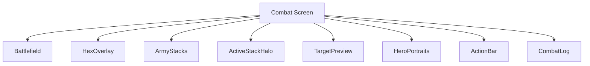
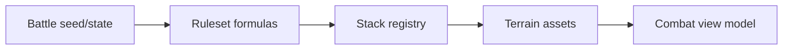
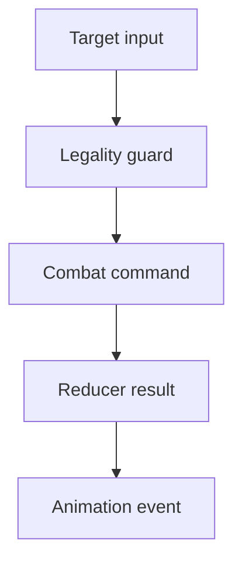
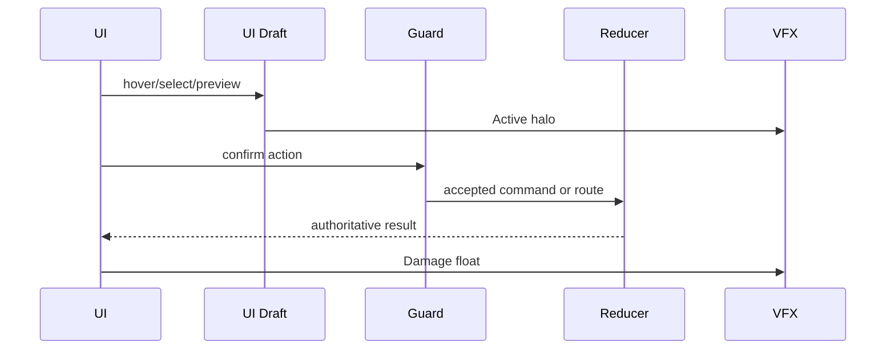
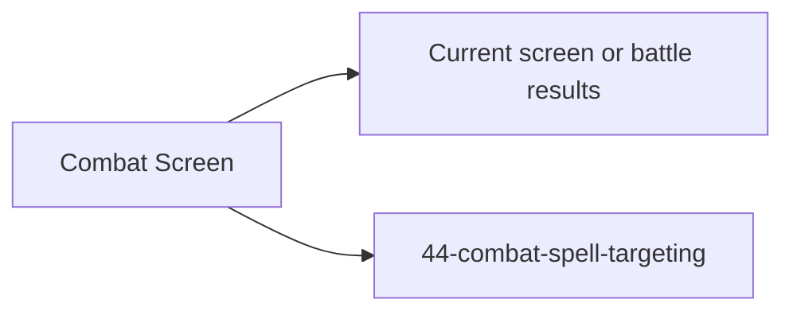

# Screen 38 Architecture: Combat Screen

System: battle
Screen ID: combat-screen
Visual Archetype: curated-combat
Curation Status: anchor-v1

## Purpose
Tactical combat board with hex grid, stack placement, active unit, hero portraits, action bar, target highlights, damage feedback, and combat log.

## Visual Direction
- Original internal UI contract. Do not use third-party captures,
  copied franchise art, or external product pixels as implementation input.

## Visual Composition

## Screen Load And Data Resolution

## Main Interaction Flow

## Animation Flow

## Outgoing Transitions

## State Inputs
- battle.phase -> state.battle.phase
- activeStack -> state.battle.activeStackId
- legalHexes -> state.battle.legalTargets
- combatLog -> state.battle.log
- pendingAnimation -> state.ui.battle.pendingAnimation

## Implementation Contract
- Mockup defines visual regions and data hooks only.
- Spec defines the component/state contract.
- Interactions define controls, timing, command routing, disabled states, and error behavior.
- Data contracts define schemas, config, localization, asset, audio, VFX, save, and replay references.
- Diagrams are screen-specific summaries of the same contract and must not introduce hidden behavior.
