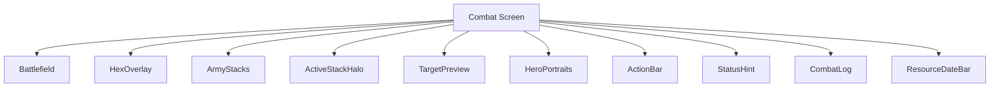
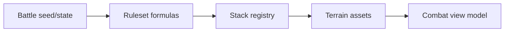
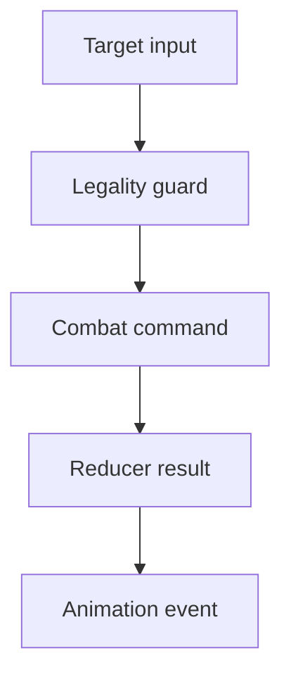
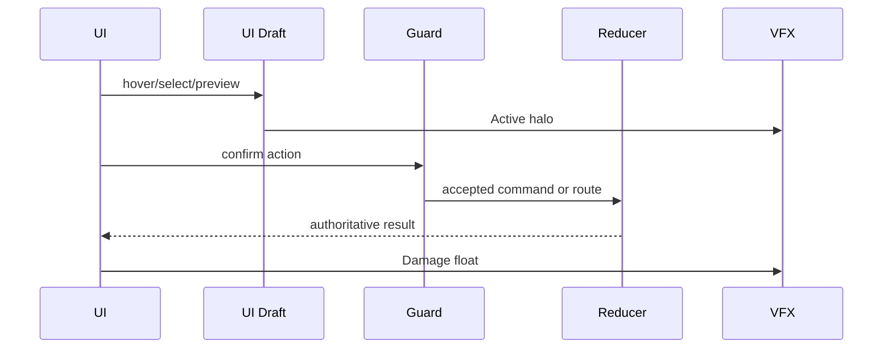
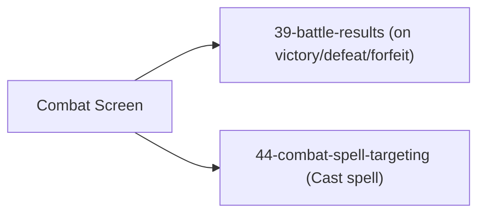

# Screen 38 Architecture: Combat Screen

System: battle
Screen ID: combat-screen
Visual Archetype: curated-combat
Curation Status: anchor-v1

## Purpose
Tactical combat board with hex grid, stack placement, active unit,
hero portraits, action bar, target highlights, damage feedback, and
combat log.

## Visual Direction
- Original internal UI contract. Do not use third-party captures,
  copied franchise art, or external product pixels as implementation
  input.

## Visual Composition

## Screen Load And Data Resolution

## Main Interaction Flow

## Animation Flow

## Outgoing Transitions

## State Inputs
- `battle.phase` → `state.battle.phase`
- `activeStack` → `state.battle.activeStackId`
- `legalHexes` → `state.battle.legalTargets`
- `combatLog` → `state.battle.log`
- `pendingAnimation` → `state.ui.battle.pendingAnimation`
- `opponentDisconnect` → `state.net.opponentDisconnect` (non-deterministic; see [`determinism.md` § Clock Policy](../../../determinism.md#clock-policy))

## Implementation Contract
- Mockup defines visual regions and data hooks only.
- Spec defines the component / state contract.
- Interactions define controls, timing, command routing, disabled
  states, and error behavior.
- Data contracts define schemas, config, localization, asset, audio,
  VFX, save, and replay references.
- Diagrams are screen-specific summaries of the same contract — they
  must not introduce hidden behavior.

---

## 🔍 Sync Check

- **UI: ✔** — Visual Composition components match sibling [`spec.md`](./spec.md) § Component Tree (including `StatusHint` and `ResourceDateBar` visible in [`mockup.html`](./mockup.html)).
- **Schema: ✔** — All `state.*` paths in State Inputs match sibling [`data-contracts.md`](./data-contracts.md) § Runtime State Selectors; `state.net.opponentDisconnect` cross-links to [`determinism.md` § Clock Policy](../../../determinism.md#clock-policy).
- **Tasks: ✔** — Outgoing transitions reflect [`screen-transition-graph.json`](../../../screen-transition-graph.json) (`combat.resolved → 39-battle-results`) and the `44-combat-spell-targeting` route declared in sibling [`interactions.md`](./interactions.md) § Navigation Outcomes; owning task: [`mvp.09-tactical-combat.11-combat-hud-overlay`](../../../../../tasks/mvp/09-tactical-combat/11-combat-hud-overlay.md).

## ⚠ Issues

- **Outgoing-transition diagram does not enumerate Auto / Retreat / Surrender exits.** Sibling [`mockup.html`](./mockup.html) shows three additional action buttons (`combat.auto`, `combat.retreat`, `combat.surrender`); none are documented in [`interactions.md`](./interactions.md), so this diagram omits the resulting routes (e.g. surrender likely opens [`41-surrender-cost-dialog`](../41-surrender-cost-dialog/); retreat exits to [`07-adventure-map`](../07-adventure-map/) via `39-battle-results`). Per CLAUDE.md ("stable IDs are public API"), the owning HUD task [`mvp.09-tactical-combat.11-combat-hud-overlay`](../../../../../tasks/mvp/09-tactical-combat/11-combat-hud-overlay.md) must close the gap in `interactions.md` first; this file follows once the routes are canonical.
