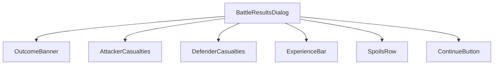
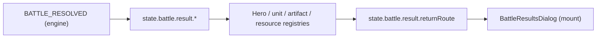
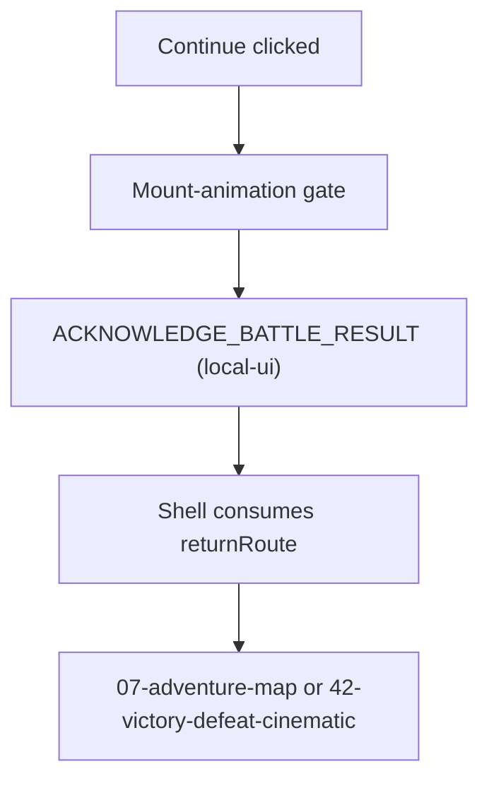
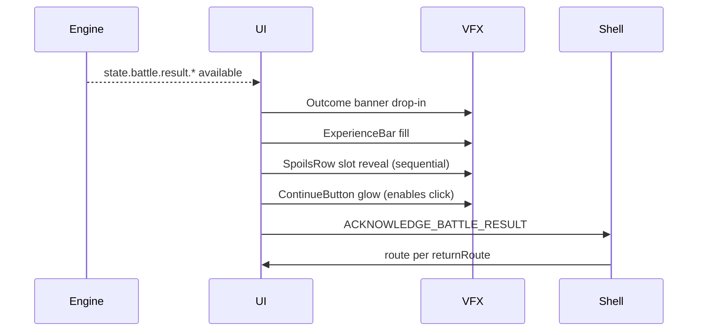
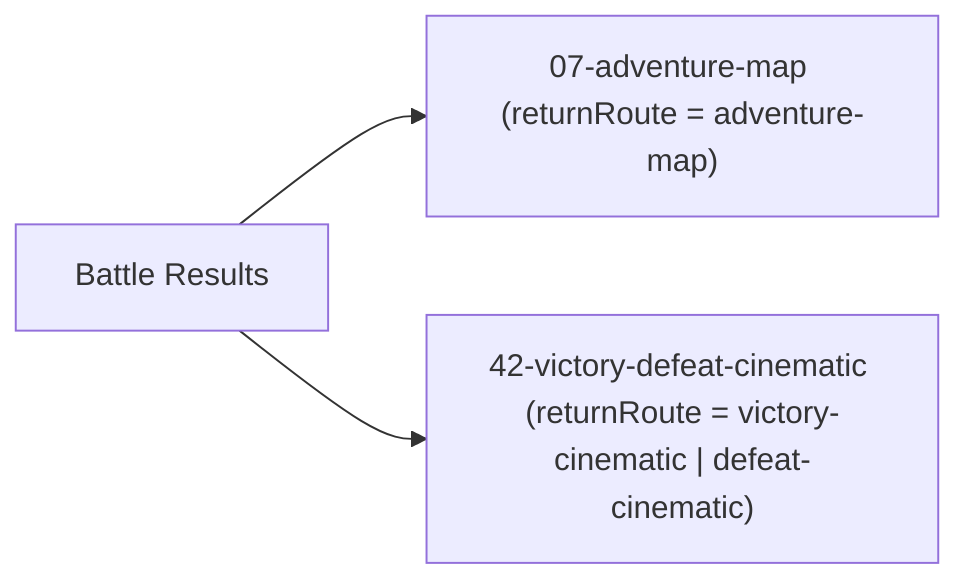

# Screen 39 Architecture: Battle Results

System: battle
Screen ID: battle-results
Visual Archetype: curated-battle-results
Curation Status: curated-pass-2

## Purpose
Post-combat result panel. Shows victory or defeat outcome, hero
experience gained, casualties by side, spoils (resources + captured
artifacts), and routes the player onward via a single continue
acknowledgement. The engine has already applied the outcome through
`BATTLE_RESOLVED` (see
[`command-schema.md`](../../../command-schema.md)) by the time this
screen mounts.

## Visual Direction
- Original internal UI contract. Do not use third-party captures,
  copied franchise art, or external product pixels as implementation
  input.

## Visual Composition

## Screen Load And Data Resolution

## Main Interaction Flow

## Animation Flow

## Outgoing Transitions

## State Inputs
- `battle.outcome` → `state.battle.result.outcome` (closed enum:
  `win` / `loss` / `retreat` / `surrender`).
- `experience` → `state.battle.result.experienceGained`.
- `casualties` → `state.battle.result.casualties` (attacker /
  defender).
- `spoils` → `state.battle.result.spoils` (resources + captured
  artifacts).
- `nextRoute` → `state.battle.result.returnRoute` (route token).

## Implementation Contract
- `mockup.html` defines visual regions and data hooks only.
- `spec.md` defines the component / state contract.
- `interactions.md` defines controls, timing, token routing,
  disabled states, and error behavior.
- `data-contracts.md` defines schemas, config, localization, asset,
  audio, VFX, save, and replay references.
- These diagrams are screen-specific summaries of the same contract
  and must not introduce hidden behavior.

---

## 🔍 Sync Check

- **UI: ✔** — Component tree, mount sequence, and routing diagrams
  mirror [`spec.md`](./spec.md) and
  [`interactions.md`](./interactions.md). The continue token is
  classified `local-ui` consistently across all three files.
- **Schema: ⚠** — Engine command `BATTLE_RESOLVED` is defined in
  [`command.schema.json`](../../../../../content-schema/schemas/command.schema.json);
  the `state.battle.result.*` sub-shape it produces and the
  `returnRoute` enum it sets are not yet modeled in
  [`state-shape.md`](../../../state-shape.md). Detail in
  `## ⚠ Issues`.
- **Tasks: ✔** — Diagrams match the package read by
  [`tasks/phase-2/07-ui-screen-backlog/39-battle-results-screen.md`](../../../../../tasks/phase-2/07-ui-screen-backlog/39-battle-results-screen.md).

## ⚠ Issues

- **`state.battle.result.*` and `returnRoute` enum unmodeled.**
  Diagrams reference paths and enum values that are not yet documented
  in [`state-shape.md`](../../../state-shape.md). Owner: the Phase-2
  task that wires `BATTLE_RESOLVED` to produce the result payload.
  Same gap is surfaced in sibling
  [`spec.md`](./spec.md) and
  [`data-contracts.md`](./data-contracts.md) — see those trailers
  for suggested registration values. Not rewritten here per Hard
  Prohibition D.
- **`returnRoute` token vocabulary undeclared.** Outgoing transition
  diagram names four route tokens (`adventure-map`,
  `victory-cinematic`, `defeat-cinematic`, `campaign`) consistent with
  the spec; no closed enum closes them. Owner: same producer task,
  per [`enum-lifecycle-policy.md`](../../../enum-lifecycle-policy.md).
