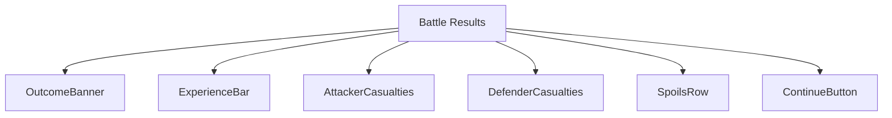
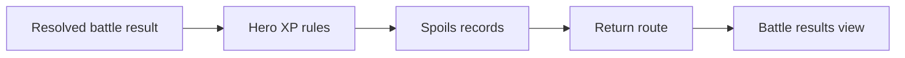
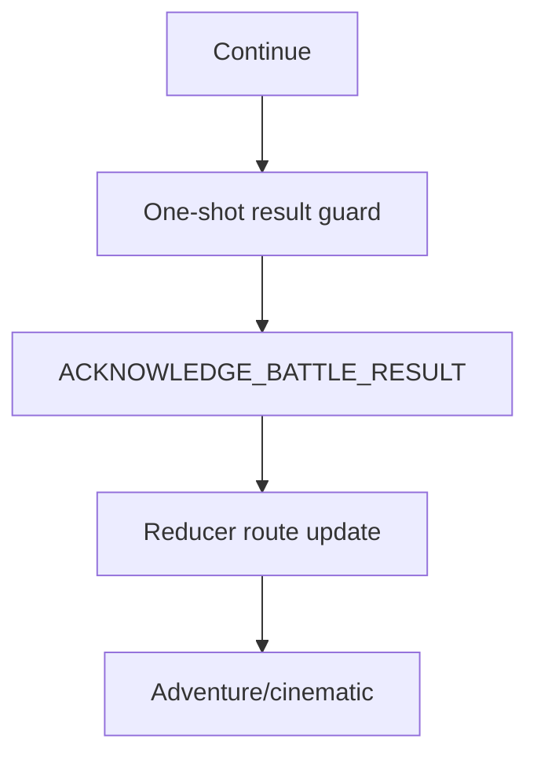
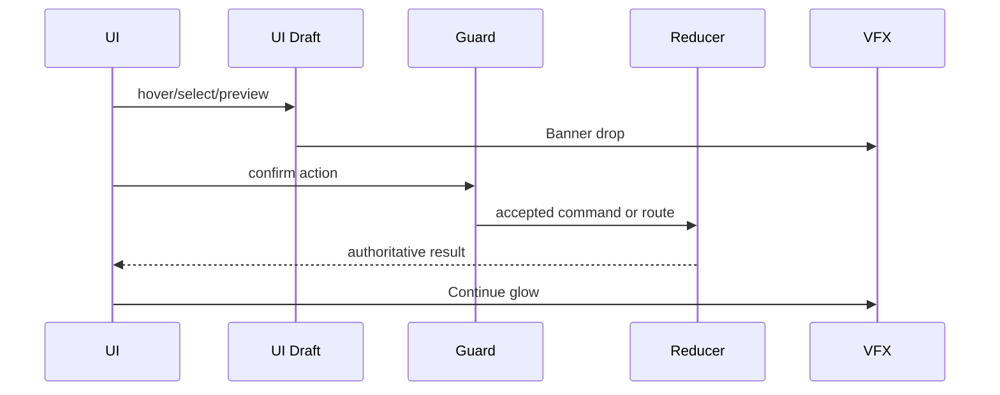
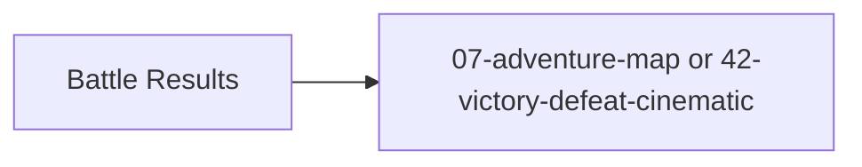

# Screen 39 Architecture: Battle Results

System: battle
Screen ID: battle-results
Visual Archetype: curated-battle-results
Curation Status: curated-pass-2

## Purpose
Post-combat result panel with victory/defeat banner, experience gain, casualties, spoils, captured artifacts, and continue routing.

## Visual Direction
- Original internal UI contract. Do not use third-party captures,
  copied franchise art, or external product pixels as implementation input.

## Visual Composition

## Screen Load And Data Resolution

## Main Interaction Flow

## Animation Flow

## Outgoing Transitions

## State Inputs
- battle.outcome -> state.battle.result.outcome
- experience -> state.battle.result.experienceGained
- casualties -> state.battle.result.casualties
- spoils -> state.battle.result.spoils
- nextRoute -> state.battle.result.returnRoute

## Implementation Contract
- Mockup defines visual regions and data hooks only.
- Spec defines the component/state contract.
- Interactions define controls, timing, command routing, disabled states, and error behavior.
- Data contracts define schemas, config, localization, asset, audio, VFX, save, and replay references.
- Diagrams are screen-specific summaries of the same contract and must not introduce hidden behavior.
