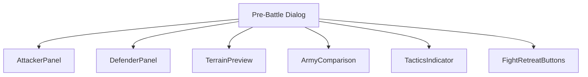
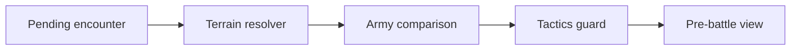
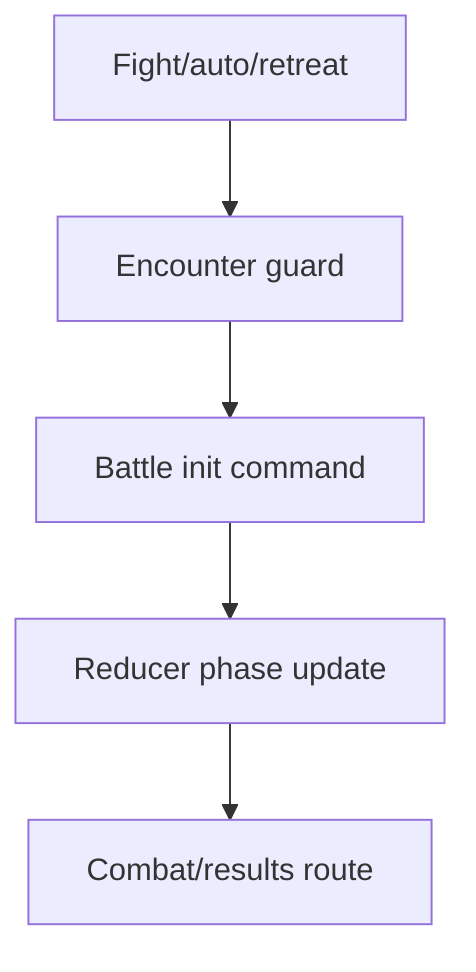
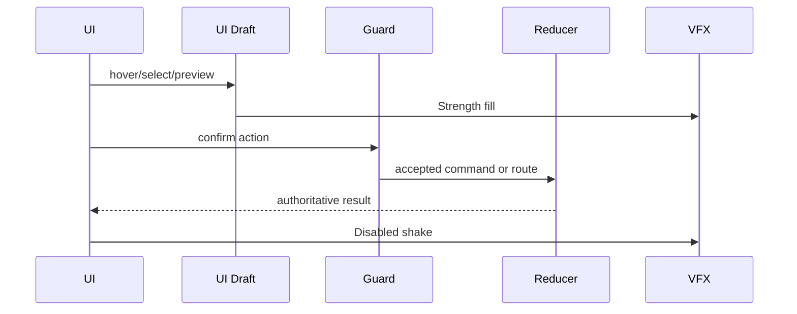
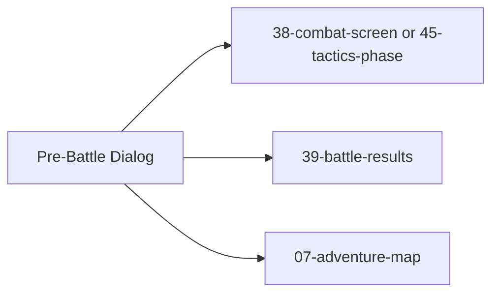

# Screen 40 Architecture: Pre-Battle Dialog

System: battle
Screen ID: pre-battle-dialog
Visual Archetype: curated-pre-battle
Curation Status: curated-pass-2

## Purpose
Encounter confirmation dialog comparing attacker and defender heroes/armies, terrain context, tactics availability, and fight/retreat/auto-resolve choices.

## Visual Direction
- Original internal UI contract. Do not use third-party captures,
  copied franchise art, or external product pixels as implementation input.

## Visual Composition

## Screen Load And Data Resolution

## Main Interaction Flow

## Animation Flow

## Outgoing Transitions

## State Inputs
- attacker -> state.pendingBattle.attacker
- defender -> state.pendingBattle.defender
- terrain -> state.pendingBattle.terrainId
- tacticsAvailable -> state.pendingBattle.tacticsAvailable
- retreatAllowed -> state.pendingBattle.retreatAllowed

## Implementation Contract
- Mockup defines visual regions and data hooks only.
- Spec defines the component/state contract.
- Interactions define controls, timing, command routing, disabled states, and error behavior.
- Data contracts define schemas, config, localization, asset, audio, VFX, save, and replay references.
- Diagrams are screen-specific summaries of the same contract and must not introduce hidden behavior.
