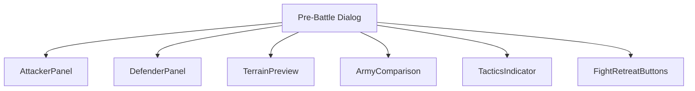
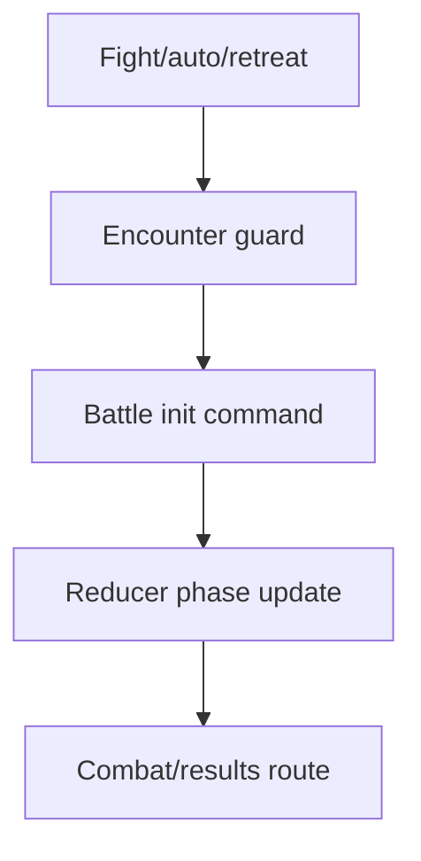
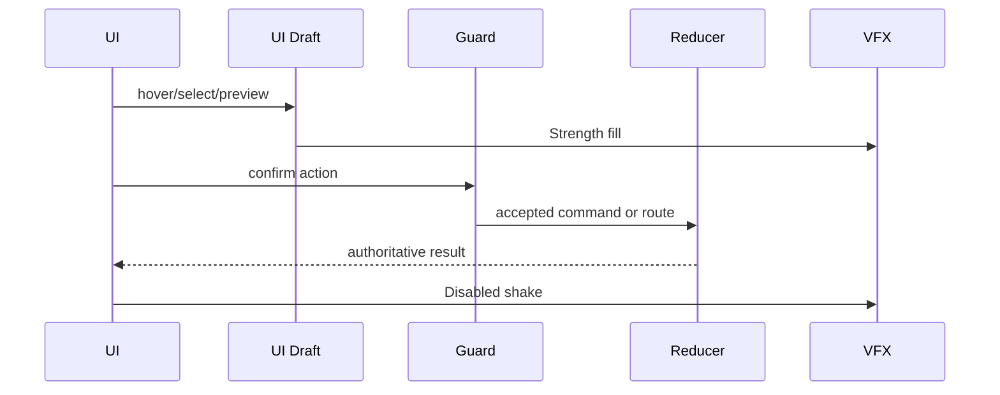
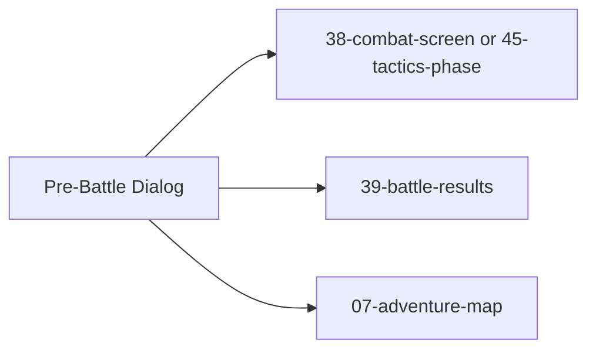

# Screen 40 Architecture: Pre-Battle Dialog

System: battle
Screen ID: pre-battle-dialog
Visual Archetype: curated-pre-battle
Curation Status: curated-pass-2

## Purpose
Pre-battle confirmation modal that compares attacker and defender
heroes / armies, surfaces terrain and tactics availability, and
routes the player's choice (Fight / Auto-Resolve / Retreat) to the
correct downstream screen.

## Visual Direction
Original internal UI contract. Do not use third-party captures,
copied franchise art, or external product pixels as implementation
input.

## Visual Composition

## Screen Load And Data Resolution

## Main Interaction Flow

## Animation Flow

## Outgoing Transitions

Fight routes to `45-tactics-phase` when
`state.pendingBattle.tacticsAvailable === true`, otherwise to
`38-combat-screen`. Auto-Resolve always routes to
`39-battle-results`. Retreat returns to `07-adventure-map`. The
mapping is mirrored row-by-row in
[`interactions.md`](./interactions.md) § Actions.

## State Inputs
| Selector | UI Element |
| --- | --- |
| `state.pendingBattle.attacker` | `attacker` |
| `state.pendingBattle.defender` | `defender` |
| `state.pendingBattle.terrainId` | `terrain` |
| `state.pendingBattle.tacticsAvailable` | `tacticsAvailable` |
| `state.pendingBattle.retreatAllowed` | `retreatAllowed` |

## Implementation Contract
- [`mockup.html`](./mockup.html) — visual regions and data hooks
  only.
- [`spec.md`](./spec.md) — component tree and state bindings.
- [`interactions.md`](./interactions.md) — controls, timing,
  command routing, disabled states, and error behaviour.
- [`data-contracts.md`](./data-contracts.md) — schemas, config,
  localization, asset, audio, VFX, save, and replay references.
- The diagrams above summarise the same contract; they must not
  introduce hidden behaviour.

---

## 🔍 Sync Check

- **UI: ✔** — Component nodes match sibling [`spec.md`](./spec.md)
  Component Tree (`AttackerPanel`, `DefenderPanel`, `TerrainPreview`,
  `ArmyComparison`, `TacticsIndicator`, `FightRetreatButtons`).
  Outgoing transitions match sibling
  [`interactions.md`](./interactions.md) Navigation Outcomes
  exactly.
- **Schema: ⚠** — `state.pendingBattle.*` selectors above match
  the three sibling files but are not registered in
  [`state-shape.md`](../../../state-shape.md) /
  [`data-inventory.md`](../../../data-inventory.md). Same gap as
  sibling [`spec.md`](./spec.md) § ⚠ Issues — repeated below.
- **Tasks: ✔** — Owning task
  [`phase-2.07-ui-screen-backlog.40-pre-battle-dialog-screen`](../../../../../tasks/phase-2/07-ui-screen-backlog/40-pre-battle-dialog-screen.md)
  Reads First all four package files.

## ⚠ Issues

- **`state.pendingBattle.*` slice undocumented in state-shape /
  data-inventory.** See sibling [`spec.md`](./spec.md) § ⚠ Issues
  — same structural gap; the owning task closes it before this
  screen ships.
