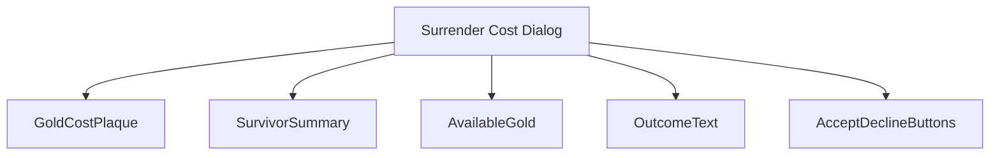
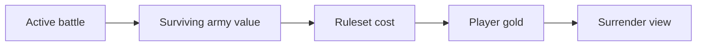
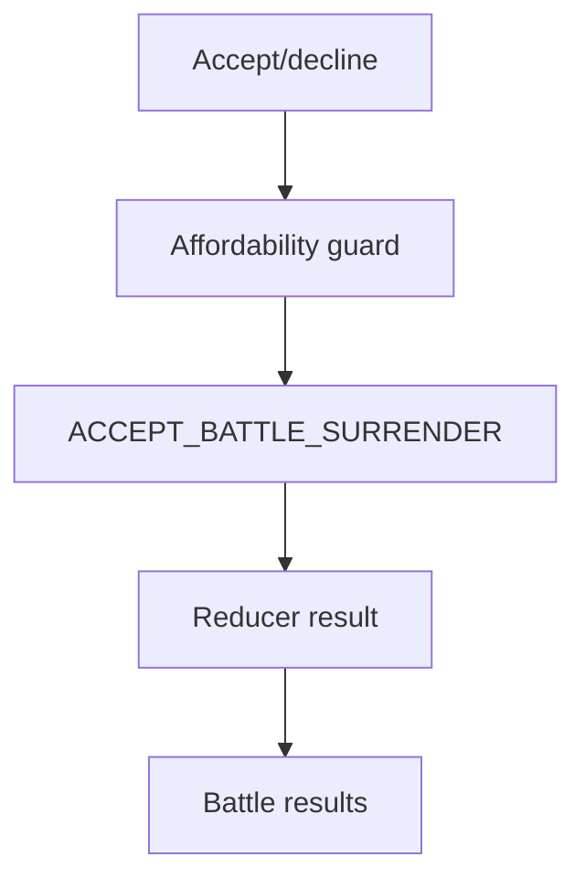
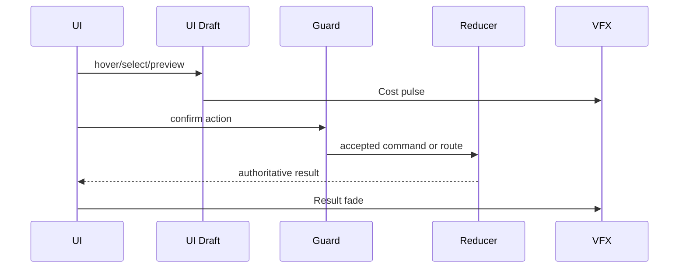
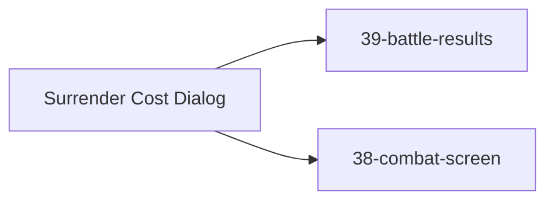

# Screen 41 Architecture: Surrender Cost Dialog

System: battle
Screen ID: surrender-cost-dialog
Visual Archetype: curated-surrender
Curation Status: curated-pass-2

## Purpose
Combat surrender confirmation with ransom cost, available gold, surviving army value, hero survival outcome, and accept/decline controls.

## Visual Direction
- Original internal UI contract. Do not use third-party captures,
  copied franchise art, or external product pixels as implementation input.

## Visual Composition

## Screen Load And Data Resolution

## Main Interaction Flow

## Animation Flow

## Outgoing Transitions

## State Inputs
- survivingArmyValue -> state.battle.surrender.armyValue
- surrenderCost -> state.battle.surrender.cost
- availableGold -> state.players.active.resources.gold
- heroOutcome -> state.battle.surrender.heroOutcome

## Implementation Contract
- Mockup defines visual regions and data hooks only.
- Spec defines the component/state contract.
- Interactions define controls, timing, command routing, disabled states, and error behavior.
- Data contracts define schemas, config, localization, asset, audio, VFX, save, and replay references.
- Diagrams are screen-specific summaries of the same contract and must not introduce hidden behavior.
