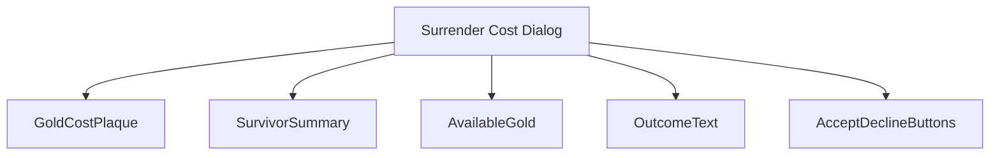
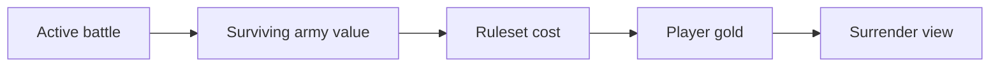
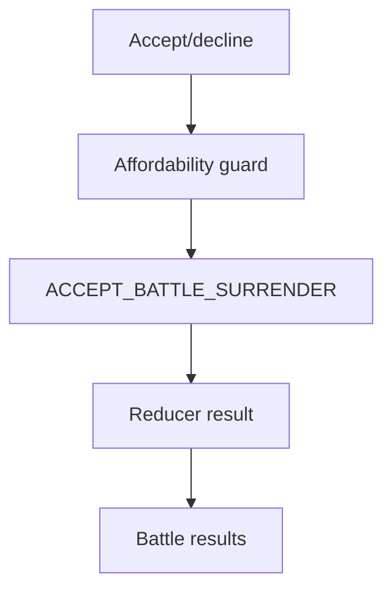
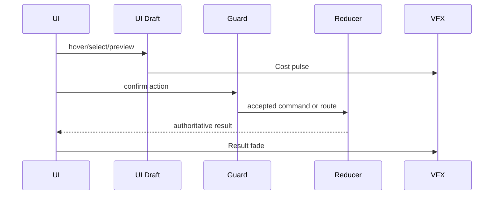
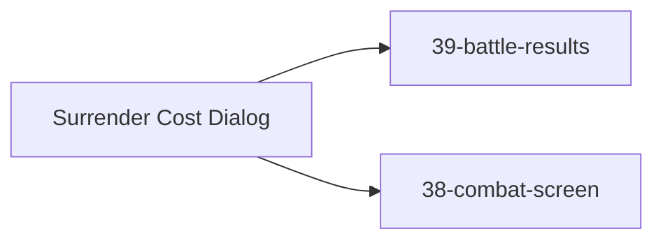

# Screen 41 Architecture: Surrender Cost Dialog

System: `battle`
Screen ID: `surrender-cost-dialog`
Visual Archetype: `curated-surrender`
Curation Status: `curated-pass-2`

## Purpose
Modal that confirms surrendering the active tactical battle. Shows
the ransom cost, available gold, surviving-army value, hero outcome,
and Accept / Decline controls.

## Visual Direction
- Original internal UI contract. Do not use third-party captures,
  copied franchise art, or external product pixels as implementation
  input.

## Visual Composition

## Screen Load And Data Resolution

## Main Interaction Flow

## Animation Flow

## Outgoing Transitions

## State Inputs
- `survivingArmyValue` → `state.battle.surrender.armyValue`
- `surrenderCost` → `state.battle.surrender.cost`
- `availableGold` → `state.players.active.resources.gold`
- `heroOutcome` → `state.battle.surrender.heroOutcome`

## Implementation Contract
- `mockup.html` defines visible regions and data hooks only.
- [`spec.md`](./spec.md) defines the component / state contract.
- [`interactions.md`](./interactions.md) owns controls, timing,
  command routing, disabled states, and error behavior.
- [`data-contracts.md`](./data-contracts.md) owns schemas, config,
  localization, asset, audio, VFX, save, and replay references.
- The diagrams above are screen-specific summaries of the same
  contract and must not introduce hidden behavior.

---

## 🔍 Sync Check
- **UI: ✔** — Component nodes match the component tree in
  [`spec.md`](./spec.md) and the `data-action` tokens in
  [`mockup.html`](./mockup.html); the route arrows match the
  Navigation Outcomes in [`interactions.md`](./interactions.md).
- **Schema: ⚠** — `ACCEPT_BATTLE_SURRENDER` is defined in
  [`content-schema/schemas/command.schema.json`](../../../../../content-schema/schemas/command.schema.json)
  and registered in
  [`command-schema.md`](../../../command-schema.md). The State
  Inputs (`state.battle.surrender.*`) are not yet rowed in
  [`data-inventory.md`](../../../data-inventory.md); see Issues.
- **Tasks: ✔** — Reducer owned by
  [`mvp.09-tactical-combat.13-retreat-and-surrender-commands`](../../../../../tasks/mvp/09-tactical-combat/13-retreat-and-surrender-commands.md);
  the UI screen task
  [`phase-2/07-ui-screen-backlog/41-surrender-cost-dialog-screen.md`](../../../../../tasks/phase-2/07-ui-screen-backlog/41-surrender-cost-dialog-screen.md)
  lists every file in this package under `Read First`.

## ⚠ Issues
- **Missing `data-inventory.md` rows for `state.battle.surrender.*`.**
  Every diagram on this page plus the State Inputs list bind
  `state.battle.surrender.armyValue`, `state.battle.surrender.cost`,
  and `state.battle.surrender.heroOutcome`; no rows exist in
  [`data-inventory.md`](../../../data-inventory.md). Per CLAUDE.md
  root contract ("every persisted field is registered in
  data-inventory.md"),
  [`mvp.09-tactical-combat.13-retreat-and-surrender-commands`](../../../../../tasks/mvp/09-tactical-combat/13-retreat-and-surrender-commands.md)
  must add the rows. Suggested values: domain=`battle`,
  owner=`mvp.09-tactical-combat.13`, persistence=`indexeddb`,
  retention=`battle-scope`.
