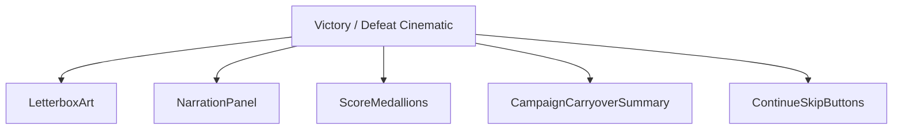
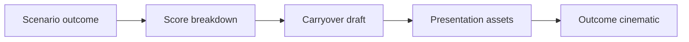
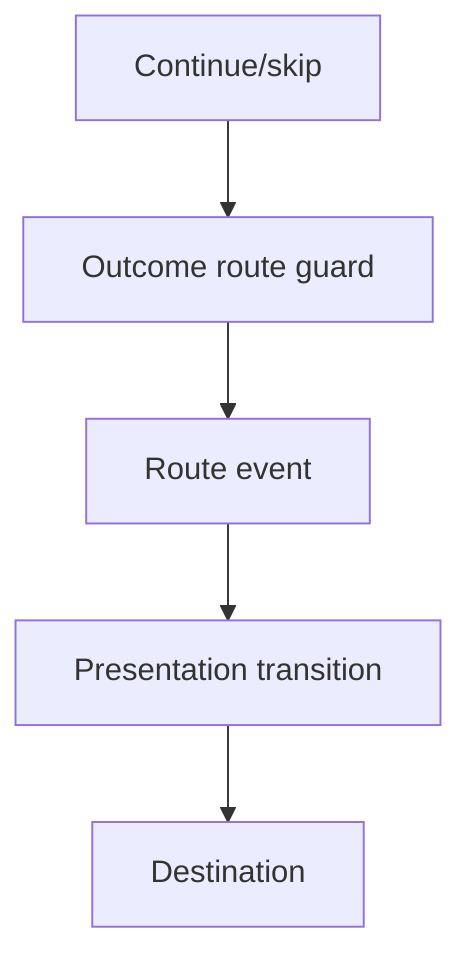
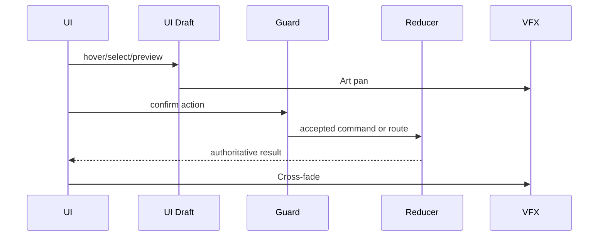
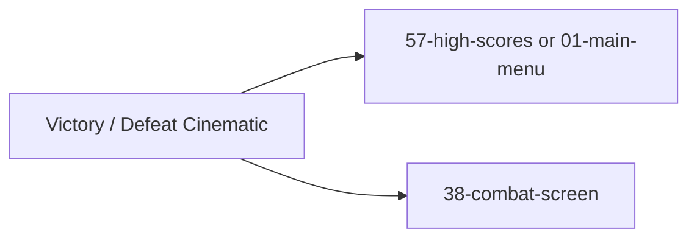

# Screen 42 Architecture: Victory / Defeat Cinematic

System: battle
Screen ID: victory-defeat-cinematic
Visual Archetype: curated-outcome-cinematic
Curation Status: curated-pass-2

## Purpose
Letterboxed campaign/scenario outcome screen with victory or defeat art, score summary, narration text, skip/continue controls, and next-route decision.

## Visual Direction
- Original internal UI contract. Do not use third-party captures,
  copied franchise art, or external product pixels as implementation input.

## Visual Composition

## Screen Load And Data Resolution

## Main Interaction Flow

## Animation Flow

## Outgoing Transitions

## State Inputs
- outcome -> state.scenario.outcome
- score -> state.scenario.finalScore
- carryover -> state.campaign.carryoverDraft
- nextRoute -> state.scenario.outcomeRoute

## Implementation Contract
- Mockup defines visual regions and data hooks only.
- Spec defines the component/state contract.
- Interactions define controls, timing, command routing, disabled states, and error behavior.
- Data contracts define schemas, config, localization, asset, audio, VFX, save, and replay references.
- Diagrams are screen-specific summaries of the same contract and must not introduce hidden behavior.
