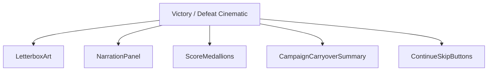
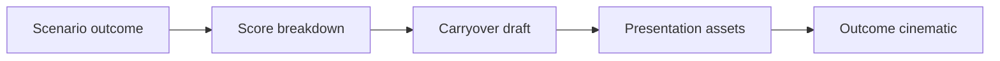
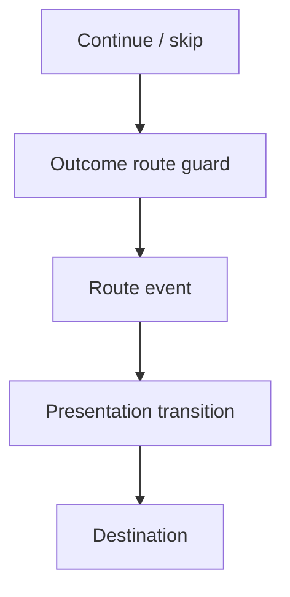
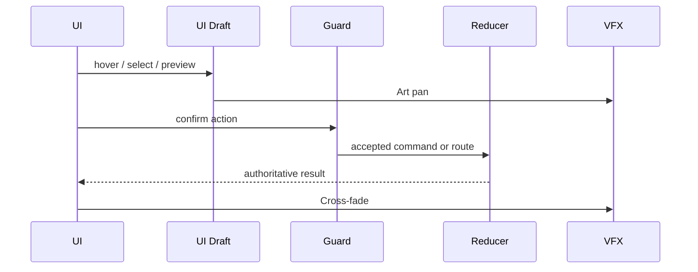
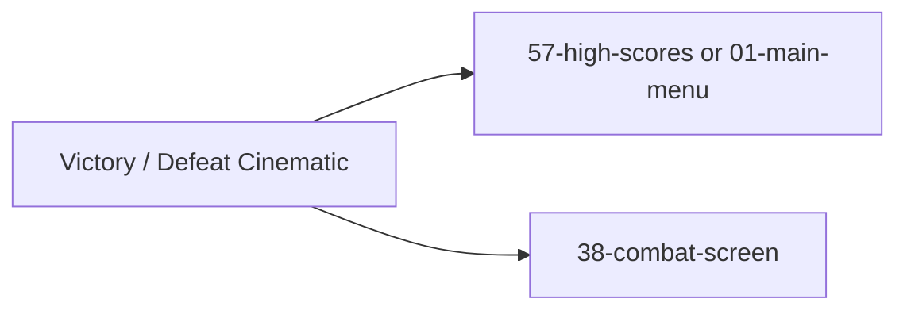

# Screen 42 Architecture: Victory / Defeat Cinematic

> Companion docs:
> [`spec.md`](./spec.md) (components, bindings),
> [`interactions.md`](./interactions.md) (controls, timing),
> [`data-contracts.md`](./data-contracts.md) (schemas, tokens, assets),
> [`mockup.html`](./mockup.html) (visual reference),
> [`ui-technology-choice.md`](../../../ui-technology-choice.md)
> (Z-Stack Contract),
> [`error-formatter.md`](../../../error-formatter.md)
> (user-grade error text).

System: `battle`
Screen ID: `victory-defeat-cinematic`
Visual archetype: `curated-outcome-cinematic`
Curation status: `curated-pass-2`

## 1. Purpose

Letterboxed scenario / campaign outcome screen. Renders victory or
defeat art over an already-finalized result, types narration, reveals
score medallions and carryover, then routes to the next destination on
`Continue` (or `Replay`). No deterministic gameplay state mutates
here.

## 2. Visual Direction

Original internal UI contract. Never use third-party captures, copied
franchise art, or external product pixels as implementation input.

## 3. Visual Composition

## 4. Screen Load And Data Resolution

## 5. Main Interaction Flow

## 6. Animation Flow

## 7. Outgoing Transitions

## 8. State Inputs

| Binding | Selector |
| --- | --- |
| `outcome` | `state.scenario.outcome` |
| `score` | `state.scenario.finalScore` |
| `carryover` | `state.campaign.carryoverDraft` |
| `nextRoute` | `state.scenario.outcomeRoute` |

## 9. Implementation Contract

- `mockup.html` defines visible regions and data hooks only.
- `spec.md` owns the component tree and state bindings.
- `interactions.md` owns controls, timing, command routing, disabled
  states, and error behavior.
- `data-contracts.md` owns schemas, config, localization, asset, audio,
  VFX, save, and replay references.
- Diagrams here summarize the same contract; they introduce no hidden
  behavior.

---

## 🔍 Sync Check

- **UI: ✔** — Components, transitions, and animation order match sibling [`spec.md`](./spec.md) § Component Tree and [`mockup.html`](./mockup.html). The mockup is `curated-pass-2` and intentionally minimal — only the `LetterboxArt` panel and a single `CONTINUE` button are drawn.
- **Schema: ✔** — Selectors match sibling [`data-contracts.md`](./data-contracts.md) § Runtime State Selectors. The three action tokens are UI-local routing per the `CONTINUE_` / `SKIP_` / `REQUEST_` prefixes in [`screen-command-coverage.json`](../../../screen-command-coverage.json) § `localUiPrefixes`, so none enters the closed [`command-schema.md`](../../../command-schema.md) vocabulary.
- **Tasks: ⚠** — Owning UI task [`tasks/phase-2/07-ui-screen-backlog/42-victory-defeat-cinematic-screen.md`](../../../../../tasks/phase-2/07-ui-screen-backlog/42-victory-defeat-cinematic-screen.md) and cinematic-playback task [`tasks/phase-2/08-meta-systems/03-cinematic-playback-engine.md`](../../../../../tasks/phase-2/08-meta-systems/03-cinematic-playback-engine.md) Read First this package; the four selectors below lack rows in [`data-inventory.md`](../../../data-inventory.md). See `## ⚠ Issues`.

## ⚠ Issues

- **State slices not registered in `data-inventory.md`.** `state.scenario.outcome`, `state.scenario.finalScore`, `state.campaign.carryoverDraft`, and `state.scenario.outcomeRoute` are bound here but have no row in [`data-inventory.md`](../../../data-inventory.md). Per CLAUDE.md root contract ("every persisted field is registered in `data-inventory.md`"), the scenario-resolution producer task (Phase-2) must add rows — or document the slices as session-only (in-memory, n/a wipe) — before this screen can ship a live build. Suggested values: domain=`scenario` / `campaign`, persistence=`in-memory` unless save records persist them, retention=`session`. Not added here per Hard Prohibition D.
- **Mockup omits four of five declared components.** [`mockup.html`](./mockup.html) renders only `LetterboxArt` and a `CONTINUE` button; `NarrationPanel`, `ScoreMedallions`, `CampaignCarryoverSummary`, and the skip / replay affordances are declared in sibling [`spec.md`](./spec.md) but not drawn. Acceptable at `curated-pass-2`; flagged so the next curation pass closes the visual gap.
