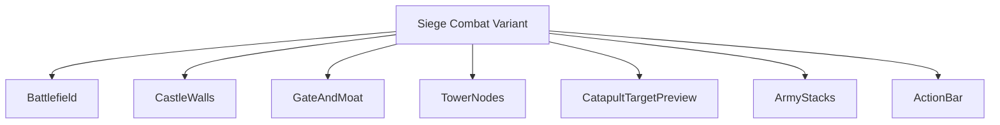
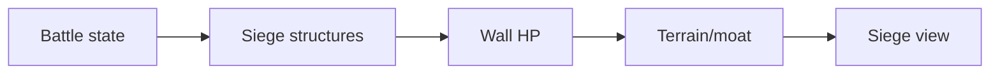
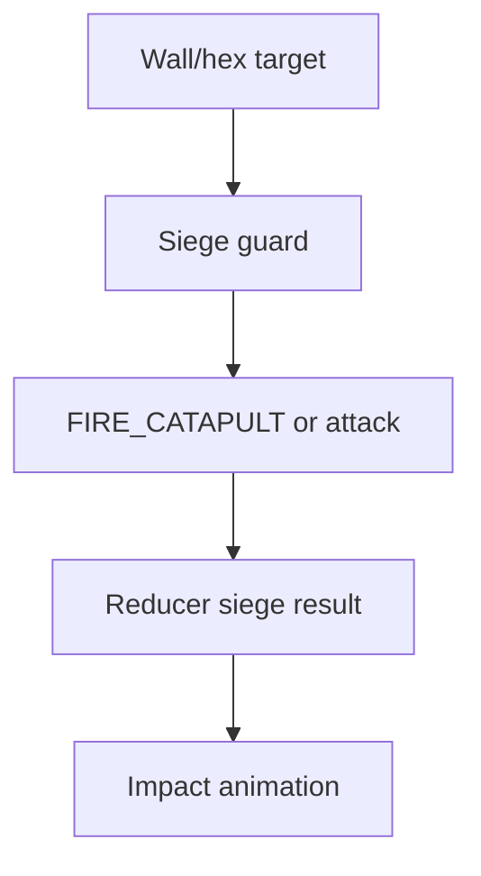
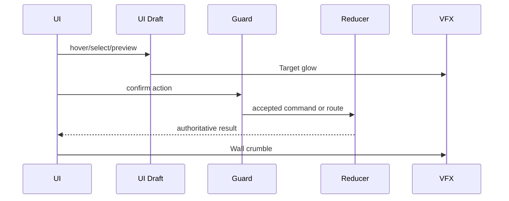
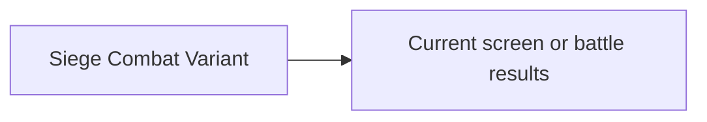

# Screen 43 Architecture: Siege Combat Variant

System: battle
Screen ID: siege-combat
Visual Archetype: curated-siege-combat
Curation Status: curated-pass-2

## Purpose
Siege battlefield variant with walls, gate, towers, moat, catapult target preview, breaching state, and defender/attacker stack placement.

## Visual Direction
- Original internal UI contract. Do not use third-party captures,
  copied franchise art, or external product pixels as implementation input.

## Visual Composition

## Screen Load And Data Resolution

## Main Interaction Flow

## Animation Flow

## Outgoing Transitions

## State Inputs
- wallState -> state.battle.siege.wallSegments
- gateState -> state.battle.siege.gate
- towerState -> state.battle.siege.towers
- catapultTarget -> state.ui.battle.catapultTarget
- activeStack -> state.battle.activeStackId

## Implementation Contract
- Mockup defines visual regions and data hooks only.
- Spec defines the component/state contract.
- Interactions define controls, timing, command routing, disabled states, and error behavior.
- Data contracts define schemas, config, localization, asset, audio, VFX, save, and replay references.
- Diagrams are screen-specific summaries of the same contract and must not introduce hidden behavior.
