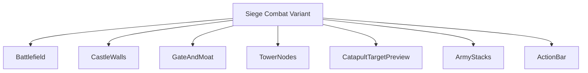
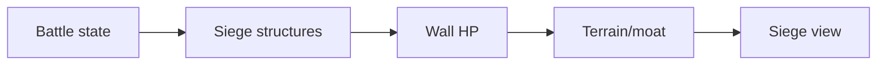
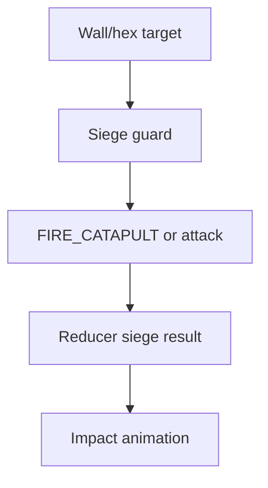
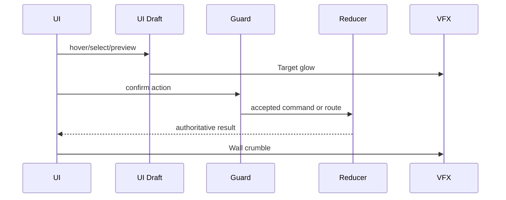
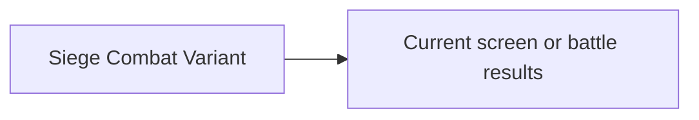

# Screen 43 Architecture: Siege Combat Variant

System: `battle`
Screen ID: `siege-combat`
Visual Archetype: `curated-siege-combat`
Curation Status: `curated-pass-2`

### Companion Docs
- Mockup: [`mockup.html`](./mockup.html)
- Spec: [`spec.md`](./spec.md)
- Interactions: [`interactions.md`](./interactions.md)
- Data Contracts: [`data-contracts.md`](./data-contracts.md)
- Owning task: [`phase-2.07-ui-screen-backlog.43-siege-combat-screen`](../../../../../tasks/phase-2/07-ui-screen-backlog/43-siege-combat-screen.md)
- Engine owners: [`phase-2.01-spells-artifacts.13-siege-state-machine`](../../../../../tasks/phase-2/01-spells-artifacts/13-siege-state-machine.md), [`phase-2.01-spells-artifacts.14-fire-catapult-command`](../../../../../tasks/phase-2/01-spells-artifacts/14-fire-catapult-command.md)

## Purpose
Siege battlefield variant with walls, gate, towers, moat, catapult target preview, breaching state, and defender / attacker stack placement.

## Visual Direction
- Original internal UI contract. Do not use third-party captures,
  copied franchise art, or external product pixels as implementation input.

## Visual Composition

## Screen Load And Data Resolution

## Main Interaction Flow

## Animation Flow

## Outgoing Transitions

## State Inputs
- `wallState` → `state.battle.siege.wallSegments`
- `gateState` → `state.battle.siege.gate`
- `towerState` → `state.battle.siege.towers`
- `catapultTarget` → `state.ui.battle.catapultTarget`
- `activeStack` → `state.battle.activeStackId`

## Implementation Contract
- `mockup.html` defines visual regions and data hooks only.
- `spec.md` defines the component / state contract.
- `interactions.md` defines controls, timing, command routing, disabled states, and error behavior.
- `data-contracts.md` defines schemas, config, localization, asset, audio, VFX, save, and replay references.
- Diagrams in this file are screen-specific summaries of the same contract and must not introduce hidden behavior.

---

## 🔍 Sync Check

- **UI: ✔** — Visual Composition mirrors `spec.md` Component Tree; State Inputs mirror `spec.md` State Bindings and `interactions.md` State Changes.
- **Schema: ✔** — `FIRE_CATAPULT` referenced by the Main Interaction Flow diagram is a schema kind in [`command.schema.json`](../../../../../content-schema/schemas/command.schema.json); other siege commands resolve via [`screen-command-coverage.json`](../../../screen-command-coverage.json) (see sibling `data-contracts.md` § Commands And Events — aligned).
- **Tasks: ✔** — Owning + engine tasks linked above; all three reference this package in their Read First blocks.

## ⚠ Issues

- **`ActionBar` is a single node in Visual Composition.** The mockup shows six labeled buttons under `ActionBar`. This diagram aggregates them by design (one node per `spec.md` component), so the diagram itself is consistent with `spec.md`. The underlying gap — that `interactions.md` and `spec.md` do not enumerate the six buttons — is tracked in sibling [`spec.md`](./spec.md) `## ⚠ Issues` and [`interactions.md`](./interactions.md) `## ⚠ Issues`. Not duplicated here.
