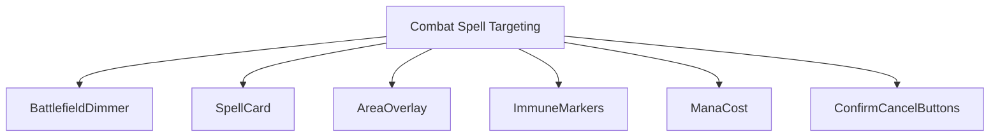
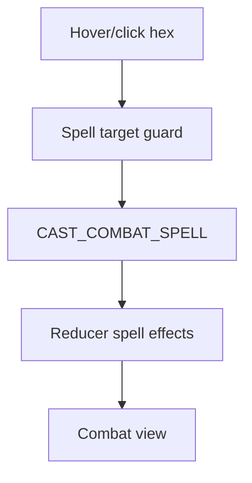
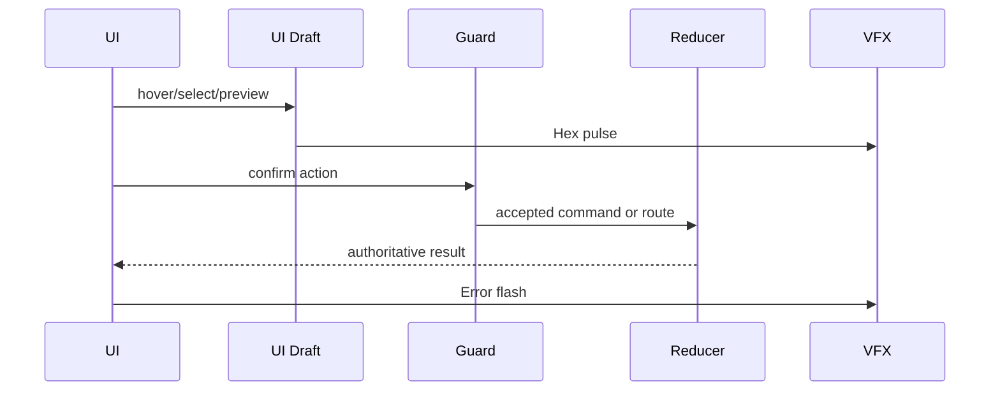
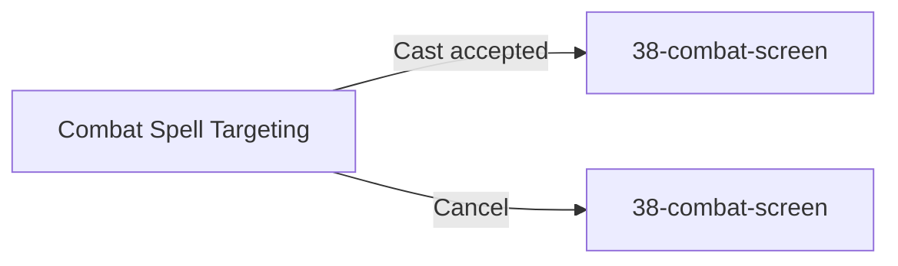

# Screen 44 Architecture: Combat Spell Targeting

System: battle
Screen ID: combat-spell-targeting
Visual Archetype: curated-combat-spell-targeting
Curation Status: curated-pass-2

## Companion docs
- [`spec.md`](./spec.md) — components and state bindings
- [`interactions.md`](./interactions.md) — controls, commands, error surfaces
- [`data-contracts.md`](./data-contracts.md) — schemas, assets, localization
- [`mockup.html`](./mockup.html) — visual reference

## 1. Purpose
Targeting overlay raised over [`38-combat-screen`](../38-combat-screen/)
after the player selects a combat spell in
[`47-spell-book`](../47-spell-book/). Shows the chosen spell, mana
cost, area-of-effect shape, legal hexes, immune targets, and
confirm/cancel controls. Returns to `38-combat-screen` on cast or
cancel.

## 2. Visual Direction
Original internal UI contract. Do not use third-party captures, copied
franchise art, or external product pixels as implementation input.

## 3. Visual Composition

## 4. Screen Load And Data Resolution

## 5. Main Interaction Flow

## 6. Animation Flow

## 7. Outgoing Transitions

## 8. State Inputs
- `selectedSpell` → `state.ui.battle.selectedSpellId`
- `casterHero` → `state.battle.activeHeroId`
- `mana` → `state.heroes.byId[caster].mana`
- `legalTargets` → `state.battle.spellTargeting.legalTargets`
- `immuneTargets` → `state.battle.spellTargeting.immuneTargets`

## 9. Implementation Contract
- `mockup.html` defines visual regions and data hooks only.
- `spec.md` owns the component/state contract.
- `interactions.md` owns controls, timing, command routing, disabled states, and error behavior.
- `data-contracts.md` owns schemas, config, localization, asset, audio, VFX, save, and replay references.
- Diagrams in this file summarize the same contract; they must not introduce hidden behavior.

---

## 🔍 Sync Check

- **UI: ✔** — Component tree and outgoing transitions match sibling [`spec.md`](./spec.md) § Component Tree and the targeting overlay drawn in [`mockup.html`](./mockup.html). Both Cast and Cancel return to [`38-combat-screen`](../38-combat-screen/).
- **Schema: ✔** — `CAST_COMBAT_SPELL` resolves as an alias of `SPELL_CAST` in [`screen-command-coverage.json`](../../../screen-command-coverage.json#L7); the runtime target shape is the closed `targeting` `oneOf` in [`targeting.schema.json`](../../../../../content-schema/schemas/targeting.schema.json) (`single_unit` / `hex` in MVP, `area` reserved for phase-2).
- **Tasks: ⚠** — Owning task [`phase-2.01-spells-artifacts.08-spell-casting-in-combat-ui`](../../../../../tasks/phase-2/01-spells-artifacts/08-spell-casting-in-combat-ui.md) Read-Firsts this file. State paths `state.battle.activeHeroId` and `state.battle.spellTargeting.{legalTargets,immuneTargets}` are not registered in [`data-inventory.md`](../../../data-inventory.md) and diverge from sibling [`38-combat-screen/spec.md`](../38-combat-screen/spec.md) (`state.battle.activeStackId`, `state.battle.legalTargets`). Detail in `## ⚠ Issues`.

## ⚠ Issues

- **State-path divergence with `38-combat-screen`.** This screen binds `casterHero` to `state.battle.activeHeroId` and `legalTargets` / `immuneTargets` to `state.battle.spellTargeting.*`, but [`38-combat-screen/spec.md`](../38-combat-screen/spec.md) registers the active actor as `state.battle.activeStackId` (initiative-based) and legal hexes as `state.battle.legalTargets` (non-namespaced). Per CLAUDE.md root contract ("every persisted field is registered in data-inventory.md") and `38-combat-screen/spec.md` § 🔍 Sync Check ("state.battle.* … owned by mvp.09-tactical-combat"), the owning Phase-2 task `phase-2.01-spells-artifacts.08-spell-casting-in-combat-ui` must reconcile with `mvp.09-tactical-combat` before the screen ships. Suggested values: keep `state.battle.activeStackId` (caster derived via `state.stacks[activeStackId].heroId`); namespace spell-target overlays as `state.battle.spellTargeting.legalTargets` / `.immuneTargets` and register both rows. Skill did not silently rewrite the paths (Hard Prohibition A — never change meaning).
- **Missing `data-inventory.md` rows for the spell-targeting overlay.** `state.ui.battle.selectedSpellId`, `state.battle.spellTargeting.legalTargets`, and `state.battle.spellTargeting.immuneTargets` have no rows in [`data-inventory.md`](../../../data-inventory.md). Per CLAUDE.md root contract, every persisted gameplay field needs a row; UI-only paths under `state.ui.*` are exempt only if `persistence.md` explicitly opts them out. Owner: `phase-2.01-spells-artifacts.08-spell-casting-in-combat-ui` (UI slice) and `mvp.09-tactical-combat` (engine slice) must add the rows before `validate:data-inventory` is run on the screen task.
