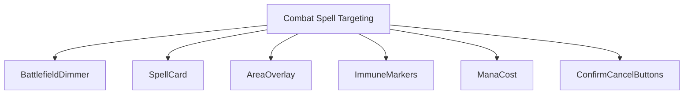
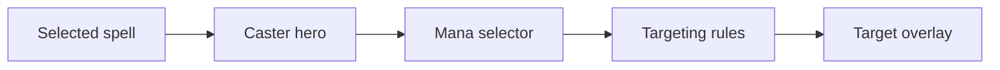
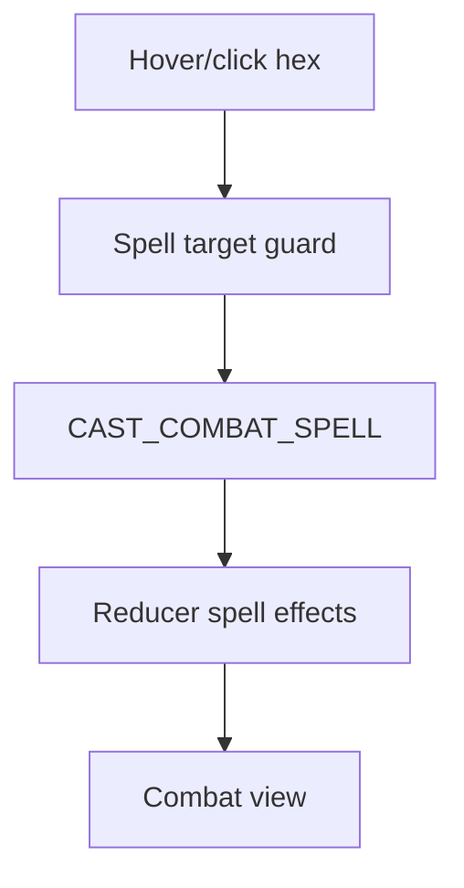
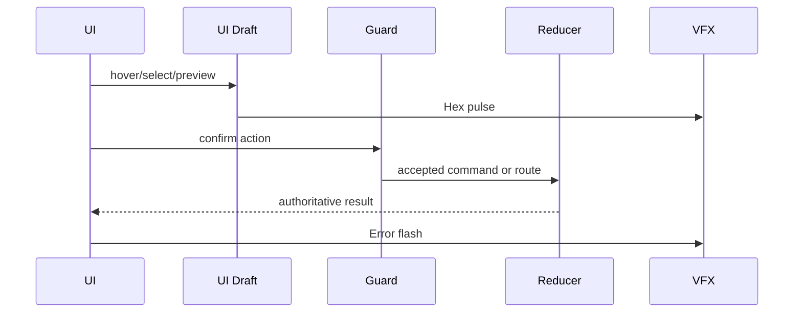
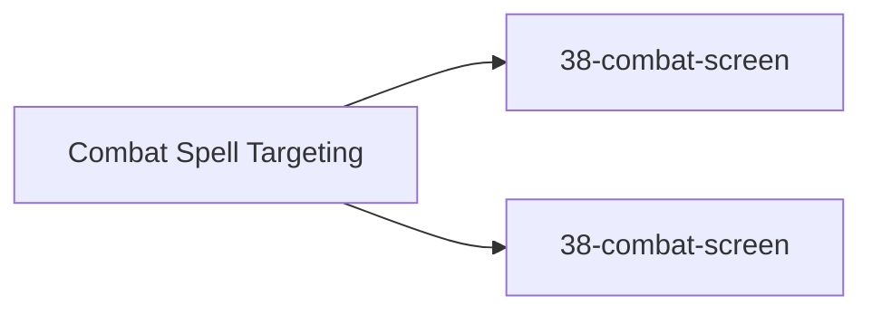

# Screen 44 Architecture: Combat Spell Targeting

System: battle
Screen ID: combat-spell-targeting
Visual Archetype: curated-combat-spell-targeting
Curation Status: curated-pass-2

## Purpose
Combat spell targeting overlay with selected spell, mana cost, area-of-effect shape, legal hexes, immune targets, and cancel/confirm controls.

## Visual Direction
- Original internal UI contract. Do not use third-party captures,
  copied franchise art, or external product pixels as implementation input.

## Visual Composition

## Screen Load And Data Resolution

## Main Interaction Flow

## Animation Flow

## Outgoing Transitions

## State Inputs
- selectedSpell -> state.ui.battle.selectedSpellId
- casterHero -> state.battle.activeHeroId
- mana -> state.heroes.byId[caster].mana
- legalTargets -> state.battle.spellTargeting.legalTargets
- immuneTargets -> state.battle.spellTargeting.immuneTargets

## Implementation Contract
- Mockup defines visual regions and data hooks only.
- Spec defines the component/state contract.
- Interactions define controls, timing, command routing, disabled states, and error behavior.
- Data contracts define schemas, config, localization, asset, audio, VFX, save, and replay references.
- Diagrams are screen-specific summaries of the same contract and must not introduce hidden behavior.
