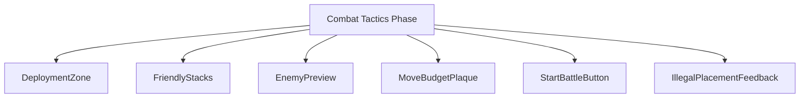
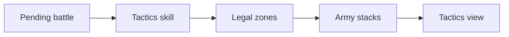
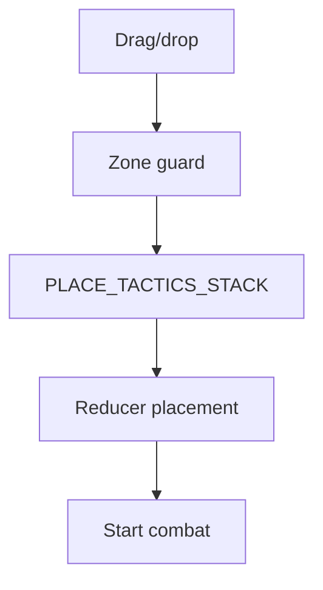
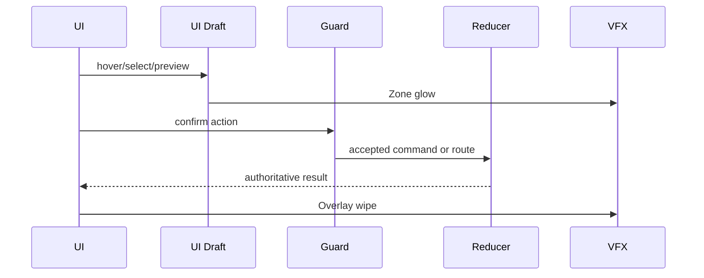
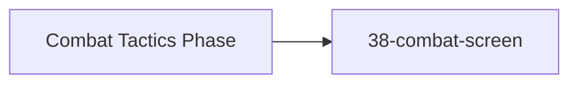

# Screen 45 Architecture: Combat Tactics Phase

System: battle
Screen ID: tactics-phase
Visual Archetype: curated-tactics-phase
Curation Status: curated-pass-2

## Purpose
Pre-combat tactics deployment phase with legal placement zones, draggable friendly stacks, locked enemy side, remaining placement moves, and start battle action.

## Visual Direction
- Original internal UI contract. Do not use third-party captures,
  copied franchise art, or external product pixels as implementation input.

## Visual Composition

## Screen Load And Data Resolution

## Main Interaction Flow

## Animation Flow

## Outgoing Transitions

## State Inputs
- tacticsAvailable -> state.battle.tactics.enabled
- deploymentZone -> state.battle.tactics.legalHexes
- friendlyStacks -> state.battle.armies.attacker.stacks
- enemyPreview -> state.battle.armies.defender.stacks
- remainingMoves -> state.battle.tactics.remainingMoves

## Implementation Contract
- Mockup defines visual regions and data hooks only.
- Spec defines the component/state contract.
- Interactions define controls, timing, command routing, disabled states, and error behavior.
- Data contracts define schemas, config, localization, asset, audio, VFX, save, and replay references.
- Diagrams are screen-specific summaries of the same contract and must not introduce hidden behavior.
