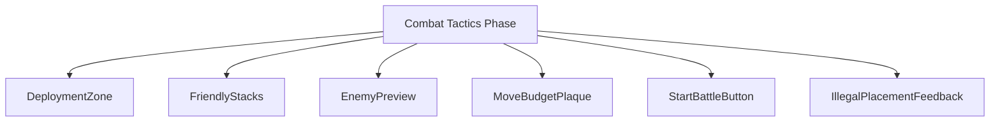
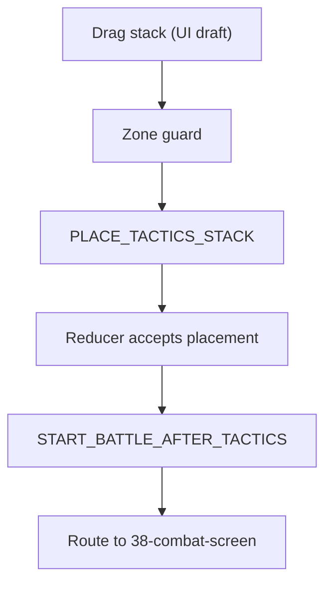
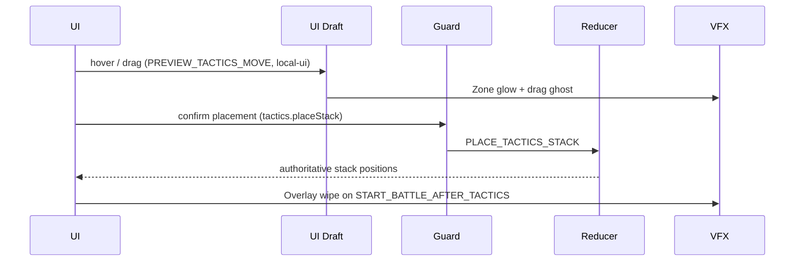

# Screen 45 Architecture: Combat Tactics Phase

System: `battle`
Screen ID: `tactics-phase`
Visual Archetype: `curated-tactics-phase`
Curation Status: `curated-pass-2`

### Source Files
- Mockup: `mockup.html`
- Spec: `spec.md`
- Interactions: `interactions.md`
- Data Contracts: `data-contracts.md`

## Purpose
Pre-combat deployment phase. Legal hexes (granted by the hero's
tactics skill) glow on the attacker side; friendly stacks are
draggable inside those hexes; the defender side is locked; the
remaining-moves budget is displayed; starting battle freezes
deployment and routes to [`38-combat-screen`](../38-combat-screen/).

## Visual Direction
Original internal UI contract. Do not use third-party captures,
copied franchise art, or external product pixels as implementation
input.

## Visual Composition

## Screen Load And Data Resolution

## Main Interaction Flow

## Animation Flow

## Outgoing Transitions

## State Inputs
Authoritative selectors (full list and notes live in sibling
[`data-contracts.md`](./data-contracts.md) § Runtime State Selectors):
- `tacticsAvailable` → `state.battle.tactics.enabled`
- `deploymentZone` → `state.battle.tactics.legalHexes`
- `friendlyStacks` → `state.battle.armies.attacker.stacks`
- `enemyPreview` → `state.battle.armies.defender.stacks`
- `remainingMoves` → `state.battle.tactics.remainingMoves`

## Implementation Contract
- `mockup.html` defines visible regions only; logic and timing live
  in the other package files.
- `spec.md` owns the component / state-binding contract.
- `interactions.md` owns controls, timing, command routing, disabled
  states, and error surfaces.
- `data-contracts.md` owns schemas, config, localization, assets,
  audio, VFX, and save / replay references.
- These diagrams are screen-specific summaries; they never introduce
  hidden behavior. Reducer commands shown here are defined in
  [`command.schema.json`](../../../../../content-schema/schemas/command.schema.json)
  and owned by
  [`mvp.09-tactical-combat.12-tactics-phase-engine`](../../../../../tasks/mvp/09-tactical-combat/12-tactics-phase-engine.md);
  UI-local tokens are governed by
  [`screen-command-coverage.json`](../../../screen-command-coverage.json).

---

## 🔍 Sync Check

- **UI: ⚠** — Component nodes and animation steps match sibling [`spec.md`](./spec.md) § Component Tree and [`interactions.md`](./interactions.md) § Actions after this pass. The mockup ([`mockup.html`](./mockup.html)) renders a six-button command strip (`tactics-phase.spell|wait|defend|auto|retreat|end`) that does not appear in the interaction flow here — see `## ⚠ Issues` in sibling `spec.md` and `interactions.md`.
- **Schema: ✔** — `PLACE_TACTICS_STACK` and `START_BATTLE_AFTER_TACTICS` referenced in the diagrams are defined in [`command.schema.json`](../../../../../content-schema/schemas/command.schema.json). `PREVIEW_TACTICS_MOVE` is correctly drawn as a UI draft event per the `PREVIEW_` prefix policy in [`screen-command-coverage.json`](../../../screen-command-coverage.json). `state.battle.*` is transient (not persisted), so no [`data-inventory.md`](../../../data-inventory.md) row is required.
- **Tasks: ✔** — UI owner [`phase-2.07-ui-screen-backlog.45-tactics-phase-screen`](../../../../../tasks/phase-2/07-ui-screen-backlog/45-tactics-phase-screen.md) Reads First this file; engine owner [`mvp.09-tactical-combat.12-tactics-phase-engine`](../../../../../tasks/mvp/09-tactical-combat/12-tactics-phase-engine.md) owns the two reducer steps drawn in the Animation Flow.

## ⚠ Issues

- **Mockup command strip not reflected in the interaction flow.** The visible buttons in `mockup.html` (`tactics-phase.spell|wait|defend|auto|retreat|end`) are not edges in the Main Interaction Flow diagram. Per Hard Prohibition B, this audit did not invent new diagram edges. Owner: [`phase-2.07-ui-screen-backlog.45-tactics-phase-screen`](../../../../../tasks/phase-2/07-ui-screen-backlog/45-tactics-phase-screen.md). See sibling [`spec.md`](./spec.md) § ⚠ Issues and [`interactions.md`](./interactions.md) § ⚠ Issues for the canonical statement of the mismatch.
