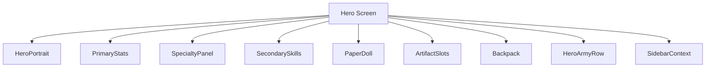
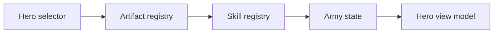
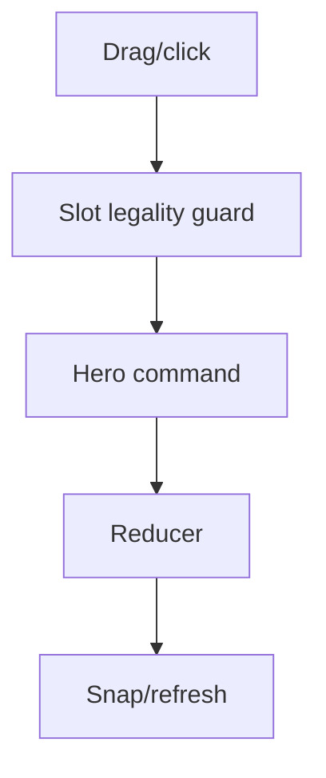
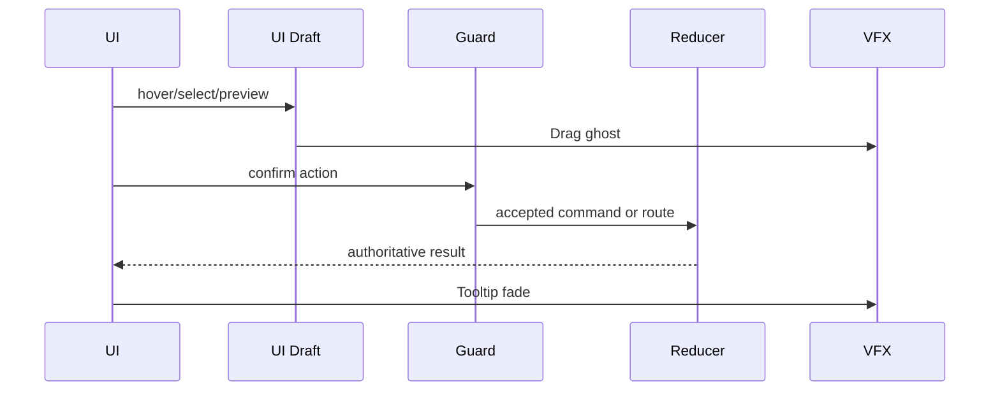
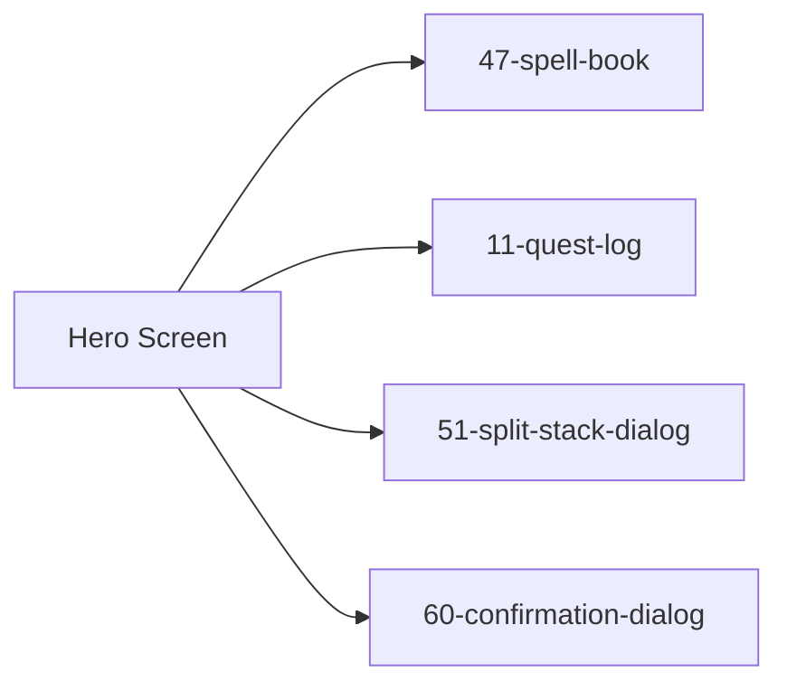

# Screen 46 Architecture: Hero Screen

Companion docs:
[`spec.md`](./spec.md) (components, bindings),
[`interactions.md`](./interactions.md) (controls, timing, errors),
[`data-contracts.md`](./data-contracts.md) (schemas, assets,
save/replay),
[`mockup.html`](./mockup.html) (visual reference).

- System: `hero`
- Screen ID: `hero-screen`
- Visual archetype: `curated-hero`
- Curation status: `anchor-v1`

## Purpose

Hero management sheet: portrait, primary stats, specialty,
experience, secondary skills, equipment paper doll, backpack, army
row, minimap / sidebar context, and routes to spell book, quest log,
stack split, and dismiss confirmation.

## Visual Direction

- Original internal UI contract. Do not use third-party captures,
  copied franchise art, or external product pixels as implementation
  input.

## Visual Composition

## Screen Load And Data Resolution

## Main Interaction Flow

## Animation Flow

## Outgoing Transitions

Each transition is gated by guard approval and an exit animation;
the canonical action → next-screen list lives in sibling
[`interactions.md`](./interactions.md) § Actions.

## State Inputs

Authoritative selectors (full list and notes in sibling
[`data-contracts.md`](./data-contracts.md) § Runtime State
Selectors):

- `hero.id` → `state.heroes.selectedHeroId`
- `hero.primaryStats` → `state.heroes.byId[selected].stats`
- `hero.skills` → `state.heroes.byId[selected].secondarySkills`
- `hero.equipment` → `state.heroes.byId[selected].equipment`
- `hero.backpack` → `state.heroes.byId[selected].backpack`
- `hero.army` → `state.heroes.byId[selected].army`

## Implementation Contract

- `mockup.html` defines visible regions and data hooks only.
- `spec.md` owns the component / state-binding contract.
- `interactions.md` owns controls, timing, command routing, disabled
  states, and error surfaces.
- `data-contracts.md` owns schemas, config, localization, asset,
  audio, VFX, save, and replay references.
- These diagrams are screen-specific summaries; they never introduce
  hidden behavior. Reducer commands shown here
  (`EQUIP_HERO_ARTIFACT`, `UNEQUIP_HERO_ARTIFACT`) are defined in
  [`command.schema.json`](../../../../../content-schema/schemas/command.schema.json);
  UI-local routing tokens (`OPEN_*`, `REQUEST_*`) are governed by
  [`screen-command-coverage.json`](../../../screen-command-coverage.json).

---

## 🔍 Sync Check

- **UI: ⚠** — Component tree and selectors align with sibling [`spec.md`](./spec.md) and [`data-contracts.md`](./data-contracts.md). The mockup ([`mockup.html`](./mockup.html)) renders a visible `ResourceDateBar` and a 3×3 right-side slot grid that are not named in the Visual Composition tree, and the tree lists both `PaperDoll` and `ArtifactSlots` while the mockup shows one paper-doll region — see `## ⚠ Issues`.
- **Schema: ✔** — `EQUIP_HERO_ARTIFACT` and `UNEQUIP_HERO_ARTIFACT` shown in the Main Interaction Flow are defined in [`command.schema.json`](../../../../../content-schema/schemas/command.schema.json). The four routing tokens (`OPEN_HERO_SPELLBOOK`, `OPEN_QUEST_LOG`, `OPEN_SPLIT_STACK_DIALOG`, `REQUEST_DISMISS_HERO`) match the `OPEN_`/`REQUEST_` UI-local prefixes in [`screen-command-coverage.json`](../../../screen-command-coverage.json). `state.heroes.*` is save-borne gameplay state, not a privacy-tracked slice, so no [`data-inventory.md`](../../../data-inventory.md) row is required.
- **Tasks: ✔** — UI owner [`phase-2.07-ui-screen-backlog.46-hero-screen-screen`](../../../../../tasks/phase-2/07-ui-screen-backlog/46-hero-screen-screen.md) Reads First this file. Engine prerequisites are listed in that task's Dependencies (`mvp.07-ui-shell.05-hero-info-panel`, `phase-2.01-spells-artifacts.00-hero-leveling`, `phase-2.01-spells-artifacts.01a-hero-skill-assignment`).

## ⚠ Issues

- **Component tree misses `ResourceDateBar` and the right-side context grid.** [`mockup.html`](./mockup.html) renders a `data-component="ResourceDateBar"` along the bottom and a 3×3 slot grid in the right chrome below the minimap; neither appears in the Visual Composition tree. Per Hard Prohibition B, this audit did not invent the missing nodes. Owner: [`phase-2.07-ui-screen-backlog.46-hero-screen-screen`](../../../../../tasks/phase-2/07-ui-screen-backlog/46-hero-screen-screen.md) decides whether the bar is a global HUD inherited from the adventure shell (link it from `spec.md` rather than adding to the tree) or a screen-owned component that should be added. The 3×3 grid likely belongs under `SidebarContext`; clarify in `spec.md`.
- **`PaperDoll` vs `ArtifactSlots` redundancy.** The component tree lists both, but the mockup renders a single paper-doll region with seven slots. Sibling [`spec.md`](./spec.md) carries the same dual entry. Resolve by either folding `ArtifactSlots` into `PaperDoll` or naming a distinct surface (e.g. the right-side 3×3 grid). Audit did not pick one — owner above.
