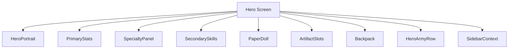
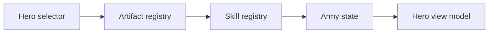
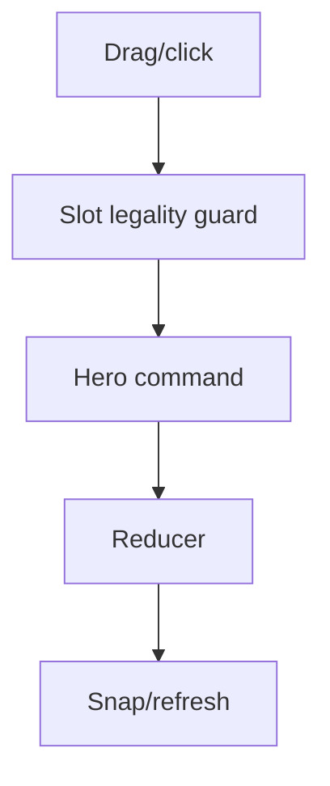
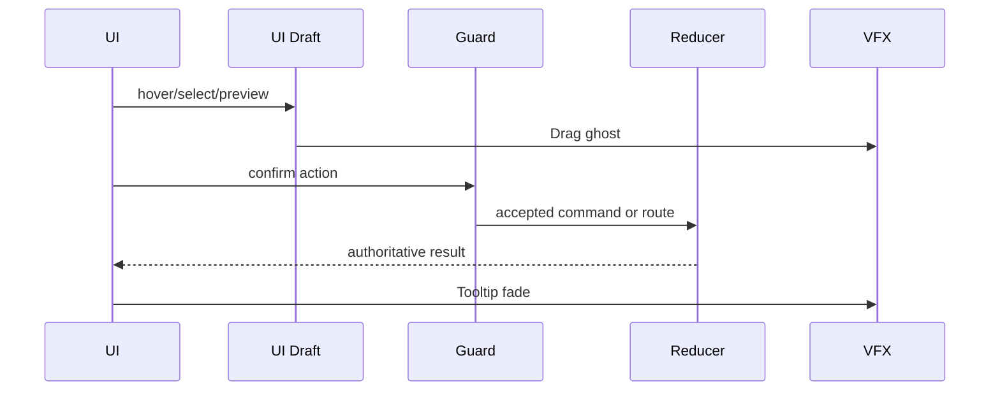
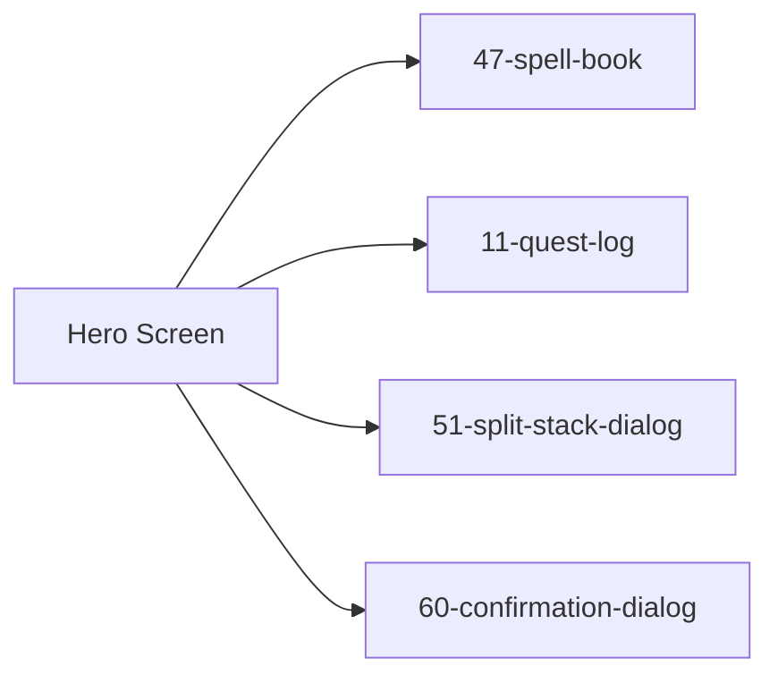

# Screen 46 Architecture: Hero Screen

System: hero
Screen ID: hero-screen
Visual Archetype: curated-hero
Curation Status: anchor-v1

## Purpose
Hero management sheet with portrait, primary stats, specialty, experience, secondary skills, equipment paper doll, backpack, army, minimap/sidebar context, and dismiss/quest/spell routes.

## Visual Direction
- Original internal UI contract. Do not use third-party captures,
  copied franchise art, or external product pixels as implementation input.

## Visual Composition

## Screen Load And Data Resolution

## Main Interaction Flow

## Animation Flow

## Outgoing Transitions

## State Inputs
- hero.id -> state.heroes.selectedHeroId
- hero.primaryStats -> state.heroes.byId[selected].stats
- hero.skills -> state.heroes.byId[selected].secondarySkills
- hero.equipment -> state.heroes.byId[selected].equipment
- hero.backpack -> state.heroes.byId[selected].backpack
- hero.army -> state.heroes.byId[selected].army

## Implementation Contract
- Mockup defines visual regions and data hooks only.
- Spec defines the component/state contract.
- Interactions define controls, timing, command routing, disabled states, and error behavior.
- Data contracts define schemas, config, localization, asset, audio, VFX, save, and replay references.
- Diagrams are screen-specific summaries of the same contract and must not introduce hidden behavior.
