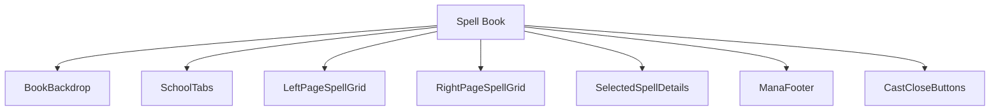
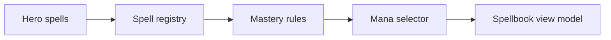
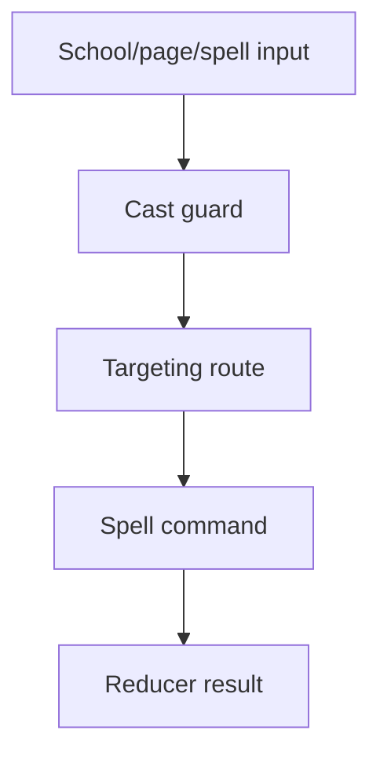
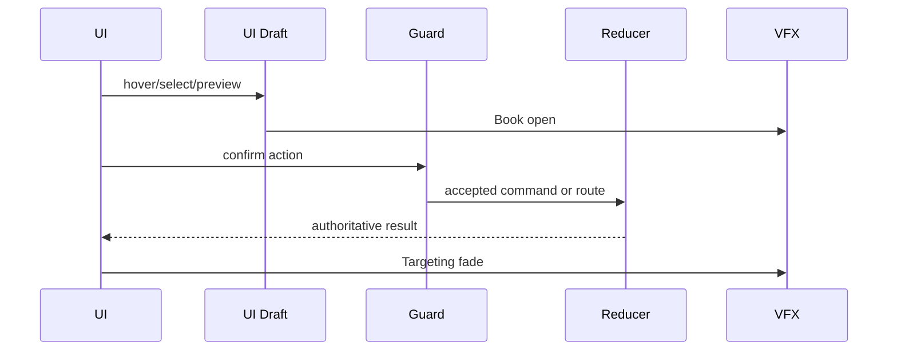
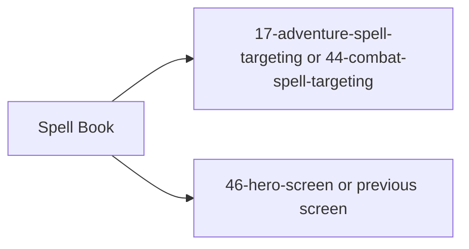

# Screen 47 Architecture: Spell Book

System: hero
Screen ID: spell-book
Visual Archetype: curated-spellbook
Curation Status: anchor-v1

## Purpose
Open spellbook view with school tabs, two-page spell grid, known/disabled spell states, mastery-derived details, mana cost, and cast/close controls.

## Visual Direction
- Original internal UI contract. Do not use third-party captures,
  copied franchise art, or external product pixels as implementation input.

## Visual Composition

## Screen Load And Data Resolution

## Main Interaction Flow

## Animation Flow

## Outgoing Transitions

## State Inputs
- hero.spells -> state.heroes.byId[selected].knownSpells
- spellbook.school -> state.ui.spellbook.selectedSchool
- selectedSpell -> state.ui.spellbook.selectedSpellId
- mana -> state.heroes.byId[selected].mana
- castContext -> state.ui.spellbook.castContext

## Implementation Contract
- Mockup defines visual regions and data hooks only.
- Spec defines the component/state contract.
- Interactions define controls, timing, command routing, disabled states, and error behavior.
- Data contracts define schemas, config, localization, asset, audio, VFX, save, and replay references.
- Diagrams are screen-specific summaries of the same contract and must not introduce hidden behavior.
