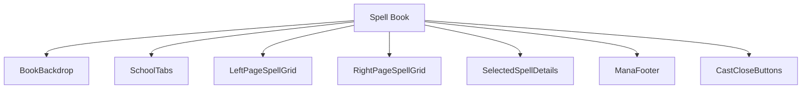
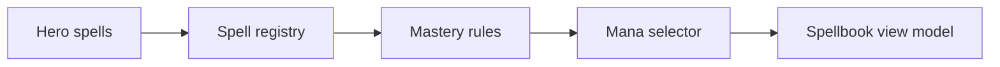
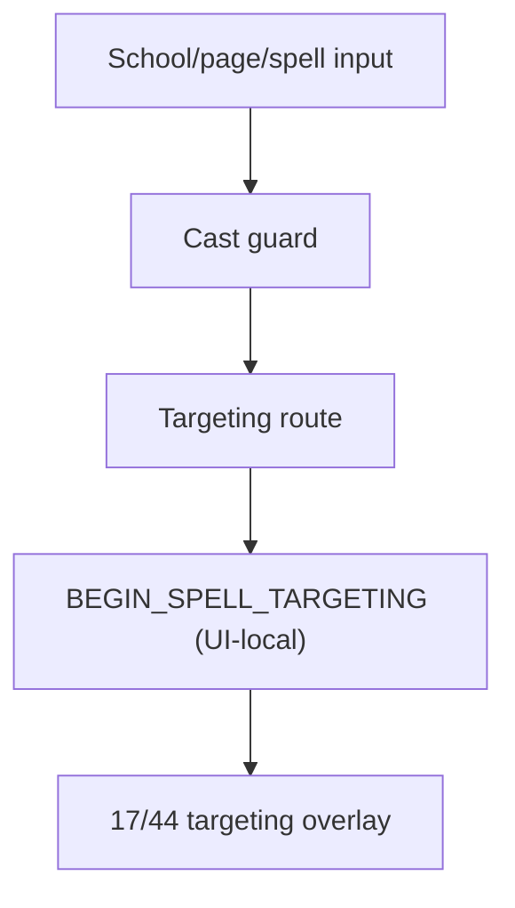
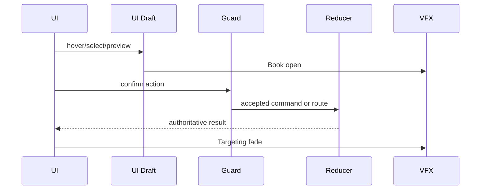
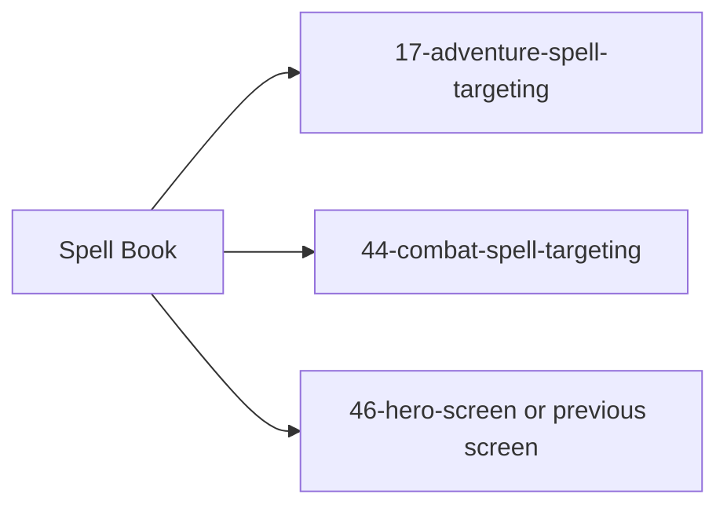

# Screen 47 Architecture: Spell Book

Companion docs:
[`spec.md`](./spec.md) (components, bindings),
[`interactions.md`](./interactions.md) (controls, timing, errors),
[`data-contracts.md`](./data-contracts.md) (schemas, assets,
save/replay),
[`mockup.html`](./mockup.html) (visual reference).

- System: `hero`
- Screen ID: `spell-book`
- Visual archetype: `curated-spellbook`
- Curation status: `anchor-v1`

## Purpose

Open-spellbook view for the selected hero: school tabs, two-page
spell grid, known / disabled spell states, mastery-derived details,
mana cost, and cast / close controls. Mounts on top of
`46-hero-screen` (or the previous caller); routes into
`17-adventure-spell-targeting` or `44-combat-spell-targeting` when
a spell is cast.

## Visual Direction

- Original internal UI contract. Do not use third-party captures,
  copied franchise art, or external product pixels as
  implementation input.

## Visual Composition

The `ResourceDateBar` rendered along the bottom of
[`mockup.html`](./mockup.html) is shared adventure-shell chrome
(see [`19-status-bar`](../19-status-bar/)); it is not owned by this
screen.

## Screen Load And Data Resolution

## Main Interaction Flow

This screen dispatches **no engine reducer commands**. All five
action tokens listed in sibling
[`interactions.md`](./interactions.md) § Actions resolve as
UI-local through the `SELECT_`, `TURN_`, `BEGIN_`, and `CLOSE_`
prefixes in
[`screen-command-coverage.json`](../../../screen-command-coverage.json).
The actual `SPELL_CAST` (engine reducer) is dispatched downstream
by `17-adventure-spell-targeting` or `44-combat-spell-targeting`.

## Animation Flow

## Outgoing Transitions

Each transition is gated by guard approval and an exit animation;
the canonical action → next-screen list lives in sibling
[`interactions.md`](./interactions.md) § Actions.

## State Inputs

Authoritative selectors (full list and notes in sibling
[`data-contracts.md`](./data-contracts.md) § Runtime State
Selectors):

- `hero.spells` → `state.heroes.byId[selected].knownSpells`
- `spellbook.school` → `state.ui.spellbook.selectedSchool`
- `selectedSpell` → `state.ui.spellbook.selectedSpellId`
- `mana` → `state.heroes.byId[selected].mana`
- `castContext` → `state.ui.spellbook.castContext`

`state.ui.spellbook.*` is a non-persisted local-UI draft slice;
`state.heroes.*` is save-borne gameplay state mutated only by the
engine reducer.

## Implementation Contract

- `mockup.html` defines visible regions and data hooks only.
- `spec.md` owns the component / state-binding contract.
- `interactions.md` owns controls, timing, command routing,
  disabled states, and error surfaces.
- `data-contracts.md` owns schemas, config, localization, asset,
  audio, VFX, save, and replay references.
- These diagrams are screen-specific summaries; they never
  introduce hidden behavior. Every action token shown here is
  UI-local per
  [`screen-command-coverage.json`](../../../screen-command-coverage.json);
  the downstream `SPELL_CAST` kind is defined in
  [`command.schema.json`](../../../../../content-schema/schemas/command.schema.json).

---

## 🔍 Sync Check

- **UI: ⚠** — Component tree (`BookBackdrop`, `SchoolTabs`,
  `LeftPageSpellGrid`, `RightPageSpellGrid`,
  `SelectedSpellDetails`, `ManaFooter`, `CastCloseButtons`)
  matches sibling [`spec.md`](./spec.md) § Component Tree and the
  `data-action` / `data-component` attributes in
  [`mockup.html`](./mockup.html). The mockup also renders a
  shared `ResourceDateBar` (called out above) and has no visible
  page-turn affordance — see `## ⚠ Issues`.
- **Schema: ✔** — No engine reducer command is dispatched from
  this screen. All five action tokens match the closed
  `localUiPrefixes` list in
  [`screen-command-coverage.json`](../../../screen-command-coverage.json);
  downstream `SPELL_CAST` lives in
  [`command.schema.json`](../../../../../content-schema/schemas/command.schema.json).
  Spells, heroes, skills, targeting, and effects resolve through
  the schemas listed in
  [`data-contracts.md`](./data-contracts.md) § Content Schemas And
  Registries. `state.heroes.*` is save-borne gameplay state, not
  a privacy-tracked slice, so no
  [`data-inventory.md`](../../../data-inventory.md) row is
  required; `state.ui.spellbook.*` is non-persisted local draft
  for the same reason.
- **Tasks: ✔** — UI owner
  [`phase-2.07-ui-screen-backlog.47-spell-book-screen`](../../../../../tasks/phase-2/07-ui-screen-backlog/47-spell-book-screen.md)
  Reads First this file; engine work for spells is upstream
  (`phase-2.01-spells-artifacts.01b-spell-school-loader-plus-mastery-scaling`,
  `phase-2.01-spells-artifacts.08-spell-casting-in-combat-ui`).

## ⚠ Issues

- **No visible page-turn affordance in the mockup.**
  Sibling [`interactions.md`](./interactions.md) § Actions lists
  `spellbook.turnPage` → `TURN_SPELLBOOK_PAGE`, but
  [`mockup.html`](./mockup.html) has no `data-action="spellbook.turnPage"`
  element — only school tabs, spell slots, and Cast / Close
  buttons. Either the mockup needs a dedicated page-turn affordance
  (corner ribbons or arrow buttons) or the action should be removed
  from interactions / data-contracts. Audit preserved the action
  per Hard Prohibition B. Owner:
  [`phase-2.07-ui-screen-backlog.47-spell-book-screen`](../../../../../tasks/phase-2/07-ui-screen-backlog/47-spell-book-screen.md);
  the mockup is not editable by this audit (skill § 9 prohibition
  D).
