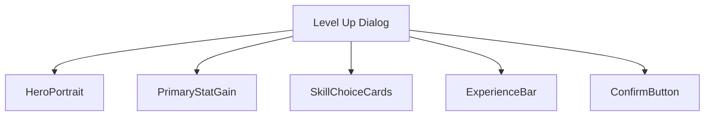
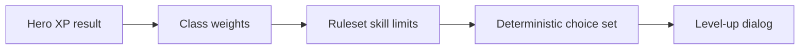
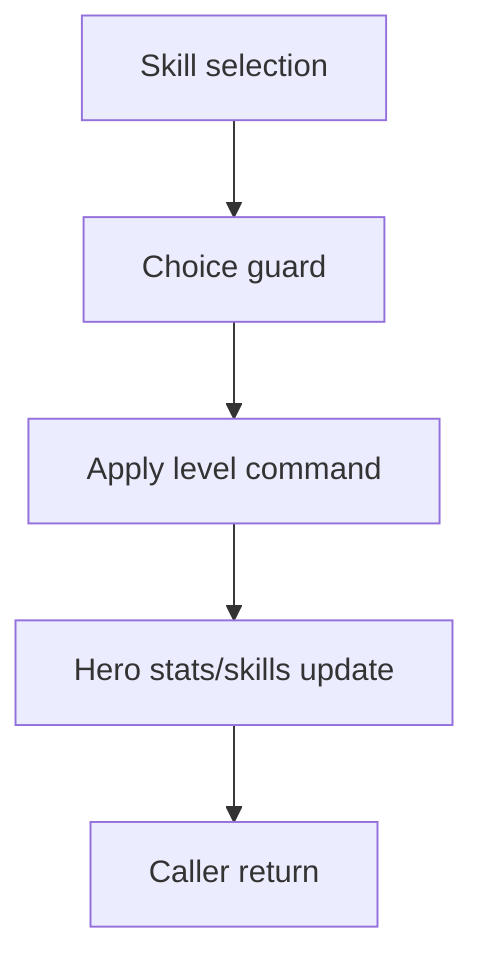
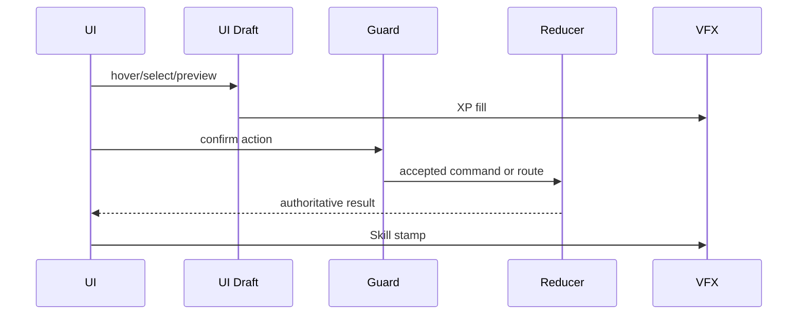
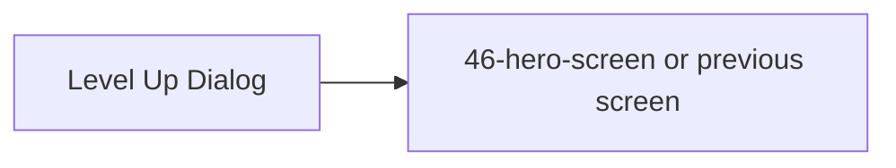

# Screen 48 Architecture: Level Up Dialog

System: hero
Screen ID: level-up-dialog
Visual Archetype: curated-level-up
Curation Status: curated-pass-5

## Purpose
Hero level-up choice dialog showing primary stat gain, two secondary skill choices, class weighting, and acceptance result.

## Visual Direction
- Original internal UI contract. Do not use third-party captures,
  copied franchise art, or external product pixels as implementation input.

## Visual Composition

## Screen Load And Data Resolution

## Main Interaction Flow

## Animation Flow

## Outgoing Transitions

## State Inputs
- heroId -> state.ui.levelUp.heroId
- primaryGain -> state.ui.levelUp.primaryStatGain
- skillChoices -> state.ui.levelUp.skillChoices
- selectedChoice -> state.ui.levelUp.selectedChoiceId
- experience -> state.heroes.byId[heroId].experience

## Implementation Contract
- Mockup defines visual regions and data hooks only.
- Spec defines the component/state contract.
- Interactions define controls, timing, command routing, disabled states, and error behavior.
- Data contracts define schemas, config, localization, asset, audio, VFX, save, and replay references.
- Diagrams are screen-specific summaries of the same contract and must not introduce hidden behavior.
