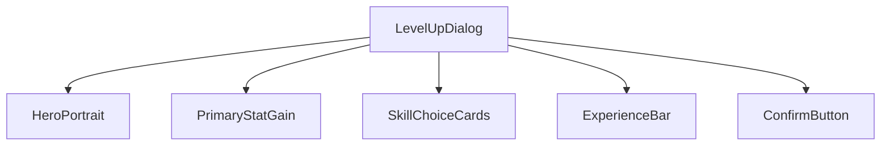
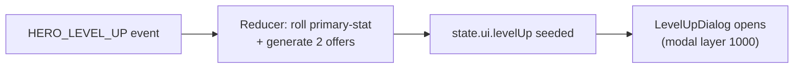
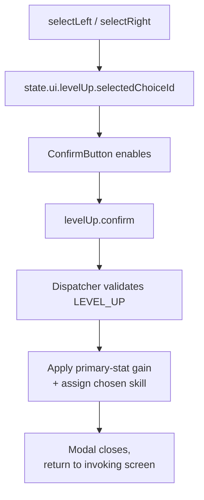
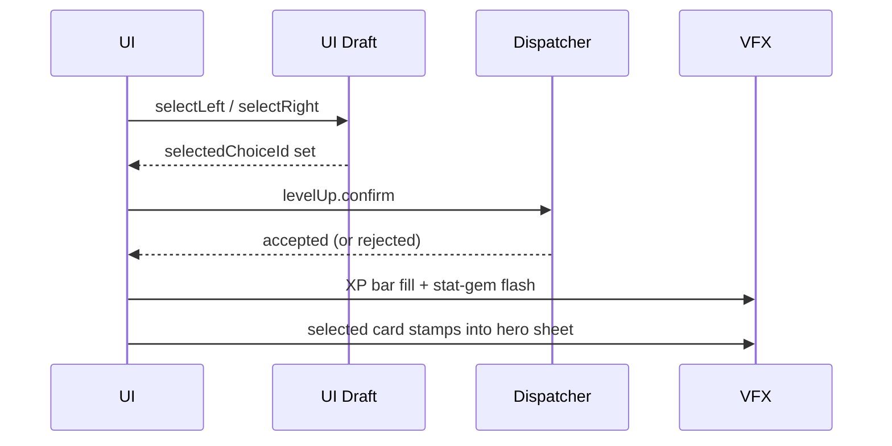
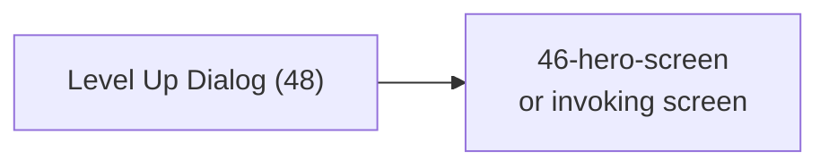

# Screen 48 Architecture: Level Up Dialog

System: hero
Screen ID: level-up-dialog
Visual Archetype: curated-level-up
Curation Status: curated-pass-5

## Purpose
Hero level-up choice modal showing primary-stat gain, two
deterministic secondary-skill choices, class weighting, and the
accepted result. The modal is opened by the runtime in response to
the `HERO_LEVEL_UP` event and closes on confirm.

## Visual Direction
- Original internal UI contract. Do not use third-party captures,
  copied franchise art, or external product pixels as implementation
  input.

## Visual Composition

## Screen Load And Data Resolution

Inputs: hero record (level, experience, skill grid), hero class
(`primaryStatGrowth` weights), ruleset (XP table, `heroLevelup.
classWeights`), and `rng("hero-levelup", heroId)` substream — all
canonical per
[`phase-2.01-spells-artifacts.00-hero-leveling`](../../../../../tasks/phase-2/01-spells-artifacts/00-hero-leveling.md).
The screen itself is read-only over these inputs; it never re-rolls.

## Main Interaction Flow

Selection is local-ui (`SELECT_LEVEL_UP_CHOICE`, not logged);
confirm is the single command (`APPLY_HERO_LEVEL_UP` →
`LEVEL_UP`) that mutates `state.heroes.byId[heroId]`. See sibling
[`interactions.md`](./interactions.md) for the full Actions table
and disabled-state rules.

## Animation Flow

Reduced-motion mode replaces the slide / fill / stamp animations
with static highlights and localized feedback (see
[`spec.md` § Animation Contract](./spec.md#animation-contract)).

## Outgoing Transitions

There is no cancel path; rejection keeps the modal open with the
local draft preserved.

## State Inputs
- `heroId` → `state.ui.levelUp.heroId`
- `primaryGain` → `state.ui.levelUp.primaryStatGain`
- `skillChoices` → `state.ui.levelUp.skillChoices`
- `selectedChoice` → `state.ui.levelUp.selectedChoiceId`
- `experience` → `state.heroes.byId[heroId].experience`

The four `state.ui.levelUp.*` slices are transient UI draft (not
persisted); `experience` is authoritative gameplay state.

## Implementation Contract
- `mockup.html` defines visible regions and data hooks only.
- [`spec.md`](./spec.md) owns the component tree and state
  bindings.
- [`interactions.md`](./interactions.md) owns control behavior,
  timing, command routing, disabled states, and error surfaces.
- [`data-contracts.md`](./data-contracts.md) owns schemas, config,
  localization, asset, audio, VFX, and save / replay references.
- The diagrams above summarize the same contract; they must not
  introduce hidden behavior.

---

## 🔍 Sync Check

- **UI: ✔** — Component tree, modal layer, and transitions match
  sibling `spec.md` and `interactions.md`; the modal id
  `48-level-up-dialog` is in
  [`modal-entry.schema.json` §`modalId`](../../../../../content-schema/schemas/modal-entry.schema.json)
  and uses the Z-Stack Contract layer `1000` per
  [`ui-technology-choice.md` § Z-Stack Contract](../../../ui-technology-choice.md#z-stack-contract).
- **Schema: ✔** — `LEVEL_UP` command shape is
  [`command.schema.json` §`levelUp`](../../../../../content-schema/schemas/command.schema.json);
  `HERO_LEVEL_UP` event is
  [`event.schema.json`](../../../../../content-schema/schemas/event.schema.json);
  `primaryStatGrowth` weights live in
  [`hero-class.schema.json`](../../../../../content-schema/schemas/hero-class.schema.json).
- **Tasks: ✔** — Owning UI task
  [`phase-2.07-ui-screen-backlog.48-level-up-dialog-screen`](../../../../../tasks/phase-2/07-ui-screen-backlog/48-level-up-dialog-screen.md);
  engine-side leveling owned by
  [`phase-2.01-spells-artifacts.00-hero-leveling`](../../../../../tasks/phase-2/01-spells-artifacts/00-hero-leveling.md)
  (command + growth weights) and
  [`phase-2.01-spells-artifacts.09-leveling-up-hero-gains-skills-and-stats`](../../../../../tasks/phase-2/01-spells-artifacts/09-leveling-up-hero-gains-skills-and-stats.md)
  (two-offer rule).

## ⚠ Issues

- **Atomicity of confirm depends on schema clarification.** This
  doc's Main Interaction Flow describes confirm as "apply primary-
  stat gain + assign chosen skill" in one step, but the
  [`LEVEL_UP` command schema](../../../../../content-schema/schemas/command.schema.json)
  carries no `secondarySkillChoiceId`. The matching skill change
  must be dispatched via `ASSIGN_SKILL` (defined adjacent in the
  same schema). See sibling
  [`data-contracts.md` § ⚠ Issues](./data-contracts.md) — the
  resolution belongs to
  [`phase-2.01-spells-artifacts.00-hero-leveling`](../../../../../tasks/phase-2/01-spells-artifacts/00-hero-leveling.md)
  and
  [`phase-2.01-spells-artifacts.09-leveling-up-hero-gains-skills-and-stats`](../../../../../tasks/phase-2/01-spells-artifacts/09-leveling-up-hero-gains-skills-and-stats.md).
  Skill did not edit the schema (Hard Prohibition D).
