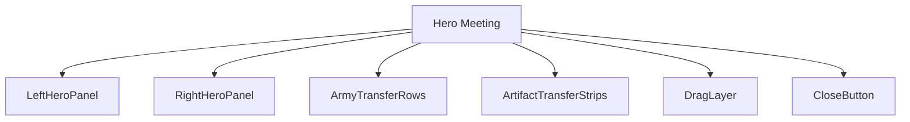
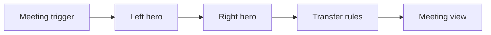
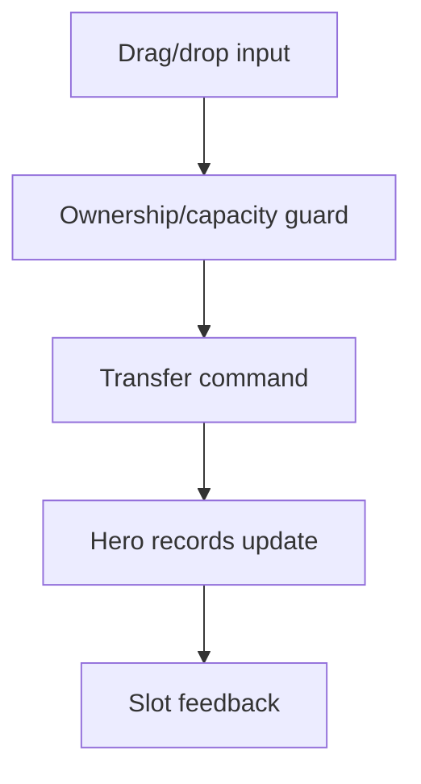
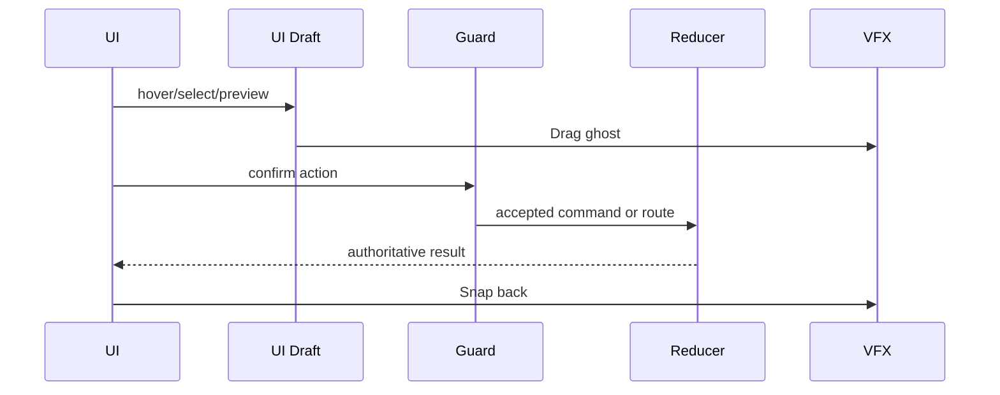
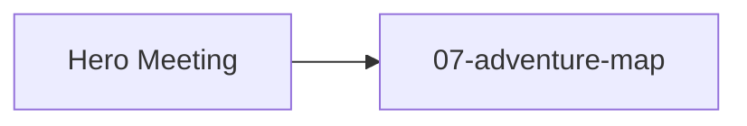

# Screen 49 Architecture: Hero Meeting

System: hero
Screen ID: hero-meeting
Visual Archetype: curated-hero-meeting
Curation Status: curated-pass-5

## Purpose
Two friendly heroes meeting on the adventure map to exchange troops, artifacts, and war machines.

## Visual Direction
- Original internal UI contract. Do not use third-party captures,
  copied franchise art, or external product pixels as implementation input.

## Visual Composition

## Screen Load And Data Resolution

## Main Interaction Flow

## Animation Flow

## Outgoing Transitions

## State Inputs
- leftHero -> state.ui.heroMeeting.leftHeroId
- rightHero -> state.ui.heroMeeting.rightHeroId
- leftArmy -> state.heroes.byId[left].army
- rightArmy -> state.heroes.byId[right].army
- dragDraft -> state.ui.heroMeeting.dragDraft

## Implementation Contract
- Mockup defines visual regions and data hooks only.
- Spec defines the component/state contract.
- Interactions define controls, timing, command routing, disabled states, and error behavior.
- Data contracts define schemas, config, localization, asset, audio, VFX, save, and replay references.
- Diagrams are screen-specific summaries of the same contract and must not introduce hidden behavior.
