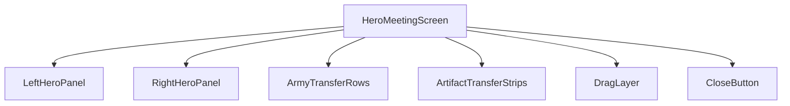
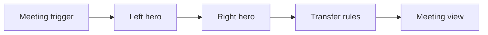
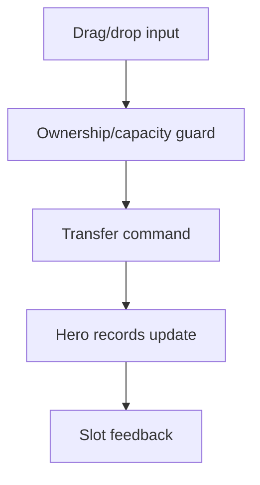
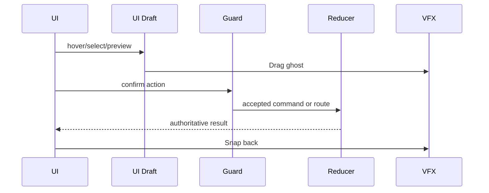
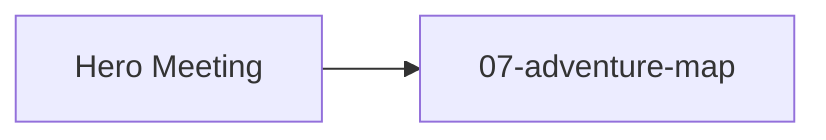

# Screen 49 Architecture: Hero Meeting

- System: `hero`
- Screen ID: `hero-meeting`
- Visual Archetype: `curated-hero-meeting`
- Curation Status: `curated-pass-5`

Companion files:
[`spec.md`](./spec.md),
[`interactions.md`](./interactions.md),
[`data-contracts.md`](./data-contracts.md),
[`mockup.html`](./mockup.html).

## Purpose

Adventure-map meeting modal between two friendly heroes on the same
or adjacent tile. Used to exchange army stacks and artifacts.

## Visual Direction

Original internal UI contract. Do not use third-party captures,
copied franchise art, or external product pixels as implementation
input.

## 1. Visual Composition

## 2. Screen Load And Data Resolution

## 3. Main Interaction Flow

## 4. Animation Flow

## 5. Outgoing Transitions

## 6. State Inputs

| Binding | Source | Notes |
| --- | --- | --- |
| `leftHero` | `state.ui.heroMeeting.leftHeroId` | First friendly hero. |
| `rightHero` | `state.ui.heroMeeting.rightHeroId` | Second friendly hero. |
| `leftArmy` | `state.heroes.byId[left].army` | Left hero stacks. |
| `rightArmy` | `state.heroes.byId[right].army` | Right hero stacks. |
| `dragDraft` | `state.ui.heroMeeting.dragDraft` | Local transfer draft. |

Canonical binding definitions live in
[`spec.md` § State Bindings](./spec.md#state-bindings) and
[`data-contracts.md` § Runtime State Selectors](./data-contracts.md#runtime-state-selectors).

## 7. Implementation Contract

- [`mockup.html`](./mockup.html) defines visual regions and data
  hooks only.
- [`spec.md`](./spec.md) owns components and state bindings.
- [`interactions.md`](./interactions.md) owns controls, timing,
  command routing, disabled states, and error surfaces.
- [`data-contracts.md`](./data-contracts.md) owns schemas, config,
  localization, asset, audio, VFX, save, and replay references.
- Diagrams in this file are screen-specific summaries of those
  contracts and must not introduce hidden behavior.

---

## 🔍 Sync Check

- **UI: ✔** — Components (`LeftHeroPanel`, `RightHeroPanel`, `ArmyTransferRows`, `ArtifactTransferStrips`, `DragLayer`, `CloseButton`) match [`spec.md` § Component Tree](./spec.md#component-tree) and the modal regions in [`mockup.html`](./mockup.html) (two hero panels, two army rows, exchange arrow, `CLOSE` button).
- **Schema: ✔** — `TRANSFER_HERO_ARMY_STACK` and `TRANSFER_HERO_ARTIFACT` defined in [`command.schema.json`](../../../../../content-schema/schemas/command.schema.json) (lines 1516, 1611); UI-local tokens (`START_HERO_MEETING_DRAG`, `CLOSE_HERO_MEETING`) match the `START_` / `CLOSE_` prefixes in [`screen-command-coverage.json`](../../../screen-command-coverage.json) `localUiPrefixes`.
- **Tasks: ✔** — Owning UI task [`phase-2.07-ui-screen-backlog.49-hero-meeting-screen`](../../../../../tasks/phase-2/07-ui-screen-backlog/49-hero-meeting-screen.md) Reads First all four sibling files; owning reducer tasks [`mvp.05-adventure-map.18-transfer-stack-commands`](../../../../../tasks/mvp/05-adventure-map/18-transfer-stack-commands.md) and [`phase-2.01-spells-artifacts.05b-transfer-hero-artifact-command`](../../../../../tasks/phase-2/01-spells-artifacts/05b-transfer-hero-artifact-command.md) name the two write commands in their Outputs.

## ⚠ Issues

_None — sibling `spec.md` carries one trailer issue (Visual Contract demotion of "split/swap controls"); see [`spec.md` § ⚠ Issues](./spec.md#-issues)._
