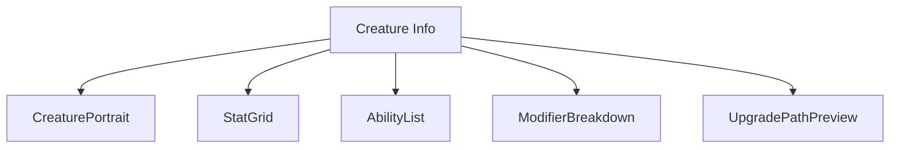
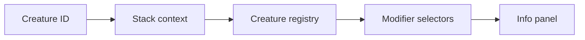
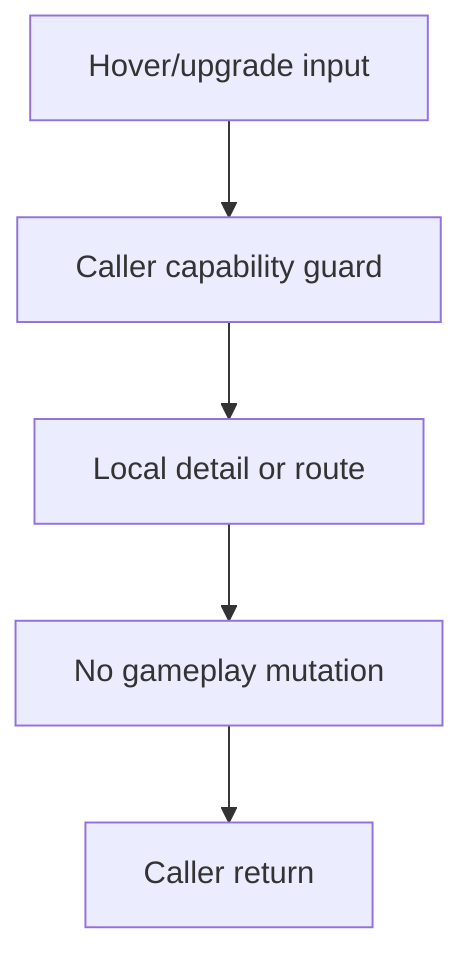
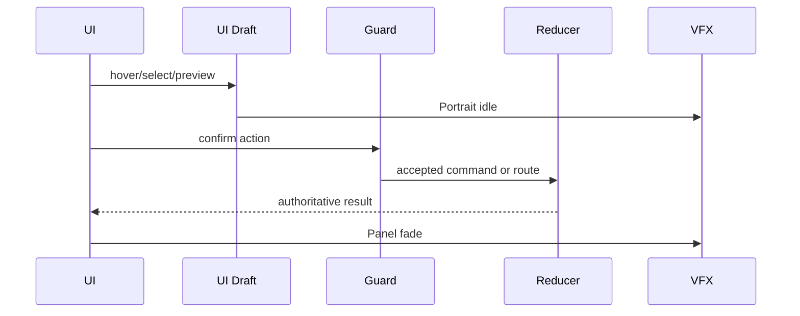
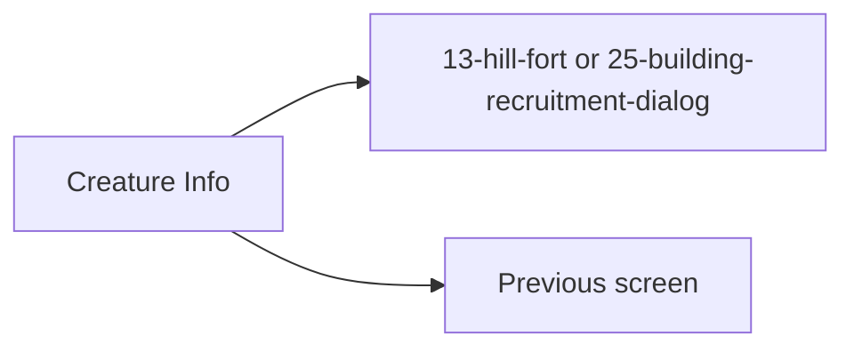

# Screen 50 Architecture: Creature Info

System: hero
Screen ID: creature-info
Visual Archetype: curated-creature-info
Curation Status: curated-pass-5

## Purpose
Detailed creature information panel for army stacks, dwellings, combat stacks, rewards, and tooltip drill-down.

## Visual Direction
- Original internal UI contract. Do not use third-party captures,
  copied franchise art, or external product pixels as implementation input.

## Visual Composition

## Screen Load And Data Resolution

## Main Interaction Flow

## Animation Flow

## Outgoing Transitions

## State Inputs
- creatureId -> state.ui.creatureInfo.creatureId
- stackContext -> state.ui.creatureInfo.stackContext
- baseStats -> registries.creatures.byId[creatureId].stats
- modifiers -> selectors.creatures.stackStatModifiers
- abilities -> registries.creatures.byId[creatureId].abilities

## Implementation Contract
- Mockup defines visual regions and data hooks only.
- Spec defines the component/state contract.
- Interactions define controls, timing, command routing, disabled states, and error behavior.
- Data contracts define schemas, config, localization, asset, audio, VFX, save, and replay references.
- Diagrams are screen-specific summaries of the same contract and must not introduce hidden behavior.
