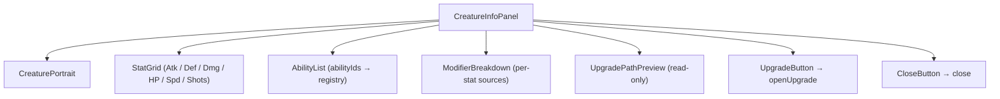
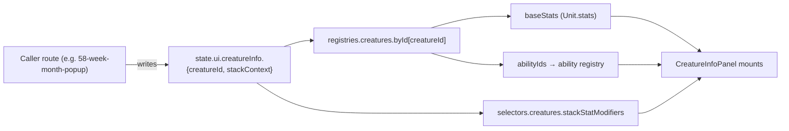
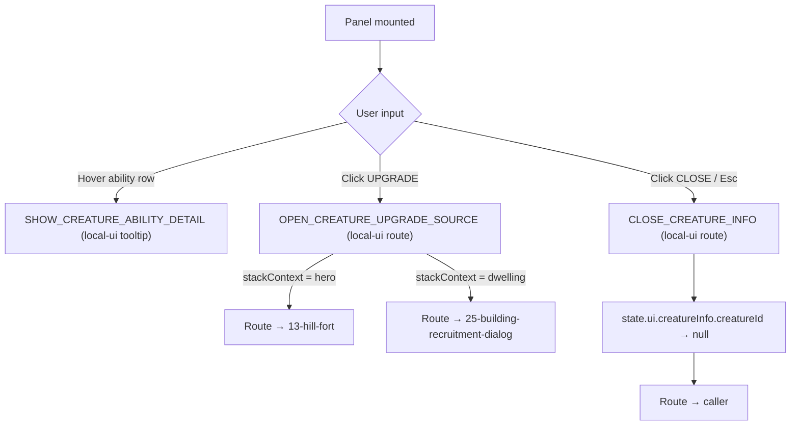
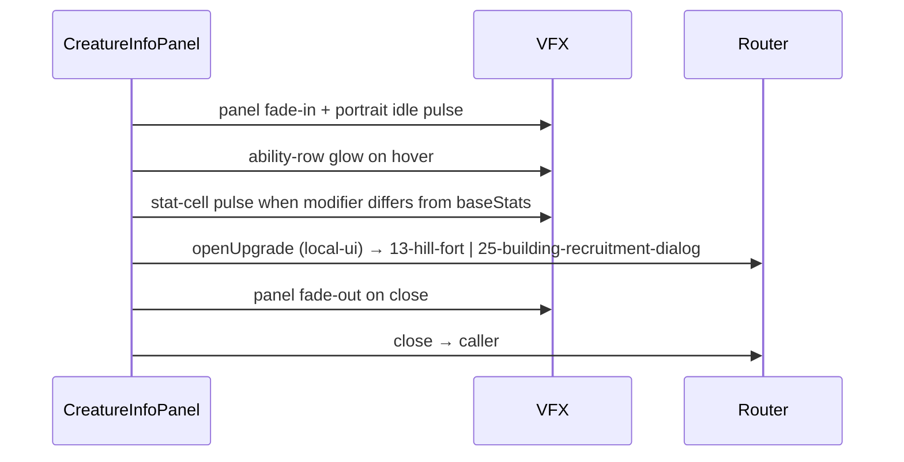
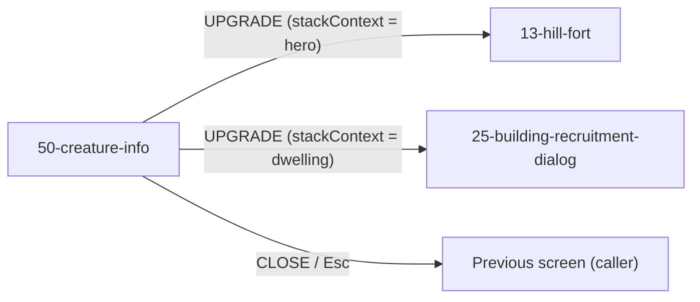

# Screen 50 Architecture: Creature Info

System: hero
Screen ID: creature-info
Visual Archetype: curated-creature-info
Curation Status: curated-pass-5

## Purpose

Read-only creature detail surface opened from army stacks,
dwellings, combat stacks, rewards, and tooltip drill-down. The
screen never mutates gameplay; `UPGRADE` is a route to the surface
that owns the upgrade mutation (`13-hill-fort` or
`25-building-recruitment-dialog`).

## Visual Direction

Original internal UI contract. Do not use third-party captures,
copied franchise art, or external product pixels as implementation
input.

## Visual Composition

## Screen Load And Data Resolution

## Main Interaction Flow

## Animation Flow

Reduced-motion mode skips fade / glow / pulse and renders the final
visible state directly per
[`autoplay-policy.md`](../../../autoplay-policy.md).

## Outgoing Transitions

## State Inputs

| Local name | Source path | Notes |
| --- | --- | --- |
| `creatureId` | `state.ui.creatureInfo.creatureId` | Set by caller route; cleared on close. |
| `stackContext` | `state.ui.creatureInfo.stackContext` | `hero` / `combat` / `dwelling` / `reward` / `calendar`. Gates `UPGRADE`. |
| `baseStats` | `registries.creatures.byId[creatureId].stats` | `attack`, `defense`, `hp`, `speed`, `shots`, `damageMin`, `damageMax` per [`unit.schema.json`](../../../../../content-schema/schemas/unit.schema.json). |
| `modifiers` | `selectors.creatures.stackStatModifiers` | Hero / spell / artifact / terrain / ruleset overlay. |
| `abilityIds` | `registries.creatures.byId[creatureId].abilityIds` | Resolved through the ability registry. |

## Implementation Contract

- `mockup.html` defines visible regions and data hooks only.
- `spec.md` defines components and state bindings.
- `interactions.md` defines controls, routing, disabled states,
  and error behavior — including the local-ui classification of all
  three tokens.
- `data-contracts.md` defines schemas, config, localization, asset,
  audio, VFX, save, and replay references.
- Diagrams above are screen-specific summaries of those contracts
  and must not introduce hidden behavior.

---

## 🔍 Sync Check

- **UI: ✔** — Component tree, state inputs, and outgoing transitions match sibling [`spec.md`](./spec.md) Component Tree and [`interactions.md`](./interactions.md) Actions / Navigation Outcomes; the upstream caller write surface matches [`58-week-month-popup/architecture.md`](../58-week-month-popup/architecture.md) (`state.ui.creatureInfo.creatureId set (local-ui)`).
- **Schema: ✔** — Stat / ability field names track [`unit.schema.json`](../../../../../content-schema/schemas/unit.schema.json); all three tokens (`SHOW_`, `OPEN_`, `CLOSE_`) are local-ui per [`screen-command-coverage.json`](../../../screen-command-coverage.json) `localUiPrefixes` and therefore do not appear in [`command-schema.md`](../../../command-schema.md) — this is correct, not a gap.
- **Tasks: ✔** — UI screen owned by [`phase-2.07-ui-screen-backlog.50-creature-info-screen`](../../../../../tasks/phase-2/07-ui-screen-backlog/50-creature-info-screen.md); downstream upgrade mutations owned by their respective screen packages (`13-hill-fort`, `25-building-recruitment-dialog`); upstream caller writes owned by [`phase-2.07-ui-screen-backlog.58-week-month-popup-screen`](../../../../../tasks/phase-2/07-ui-screen-backlog/58-week-month-popup-screen.md) and other caller-screen tasks.

## ⚠ Issues

- **Original diagrams collapsed hover, upgrade, and close into a single "Hover/upgrade input" node and omitted CLOSE entirely.** Now expanded so each branch shows its token and route target, matching sibling [`interactions.md`](./interactions.md). Same shape correction appears across all four targets in this package.
- **`state.ui.creatureInfo.*` slice path is screen-introduced and not yet declared in [`state-shape.md`](../../../state-shape.md).** Transient UI state (no [`data-inventory.md`](../../../data-inventory.md) row required), but the path is load-bearing for every caller route (see [`58-week-month-popup/architecture.md`](../58-week-month-popup/architecture.md)). Owning UI task [`phase-2.07-ui-screen-backlog.50-creature-info-screen`](../../../../../tasks/phase-2/07-ui-screen-backlog/50-creature-info-screen.md) should document the slice. Skill did not add the entry itself (Hard Prohibition D); same gap surfaced in sibling [`spec.md`](./spec.md) and [`data-contracts.md`](./data-contracts.md).
