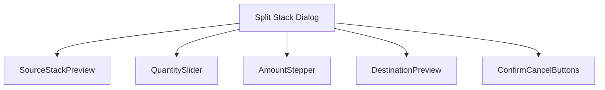
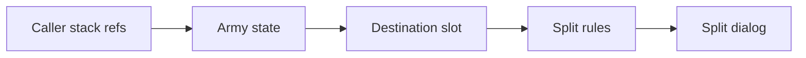
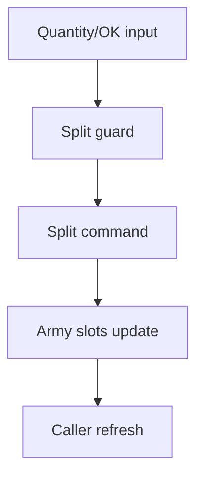
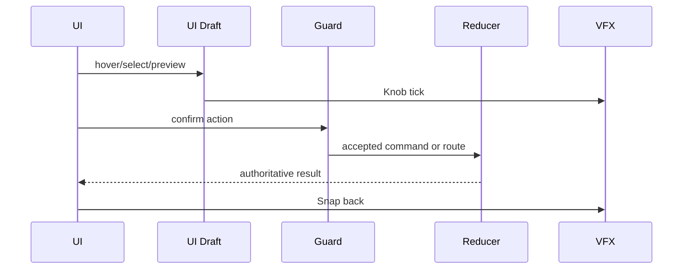
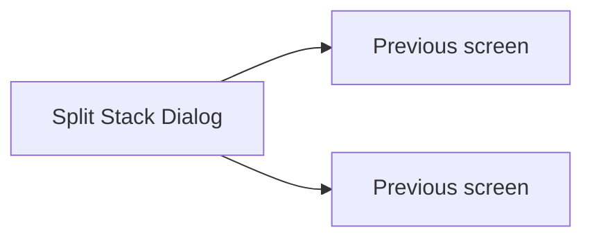

# Screen 51 Architecture: Split Stack Dialog

System: hero
Screen ID: split-stack-dialog
Visual Archetype: curated-split-stack
Curation Status: curated-pass-5

## Purpose
Army stack split dialog used by hero screen, town garrison, hero meeting, and garrison structures.

## Visual Direction
- Original internal UI contract. Do not use third-party captures,
  copied franchise art, or external product pixels as implementation input.

## Visual Composition

## Screen Load And Data Resolution

## Main Interaction Flow

## Animation Flow

## Outgoing Transitions

## State Inputs
- sourceStack -> state.ui.splitStack.sourceStackRef
- destinationSlot -> state.ui.splitStack.destinationSlotRef
- quantity -> state.ui.splitStack.quantity
- splitGuard -> selectors.armies.splitStackGuard
- caller -> state.ui.splitStack.returnScreen

## Implementation Contract
- Mockup defines visual regions and data hooks only.
- Spec defines the component/state contract.
- Interactions define controls, timing, command routing, disabled states, and error behavior.
- Data contracts define schemas, config, localization, asset, audio, VFX, save, and replay references.
- Diagrams are screen-specific summaries of the same contract and must not introduce hidden behavior.
