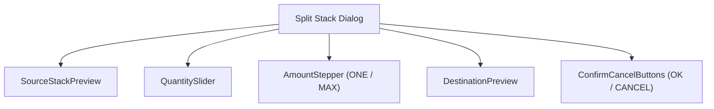
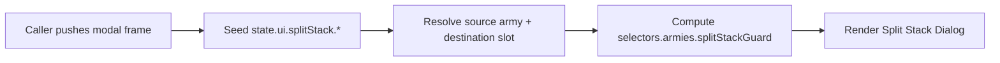
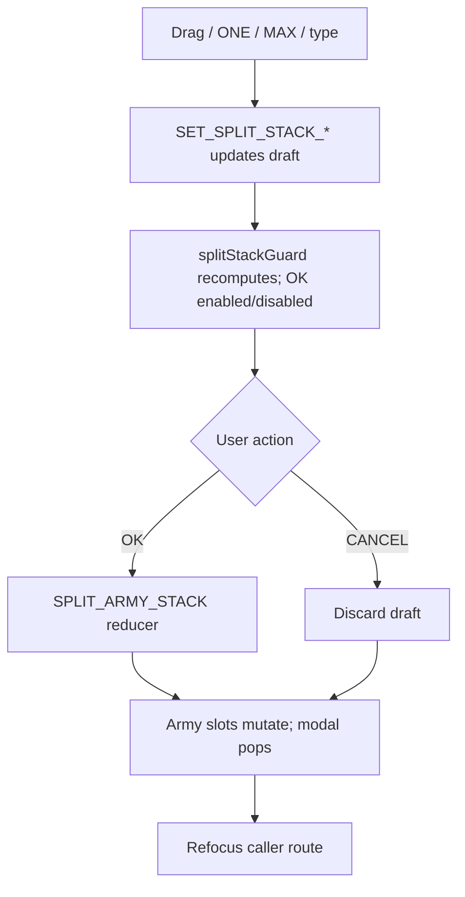
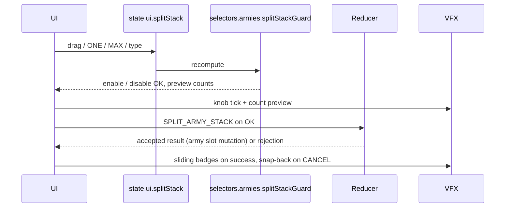
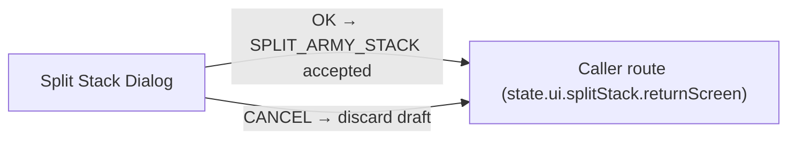

# Screen 51 Architecture: Split Stack Dialog

System: hero
Screen ID: split-stack-dialog
Modal id: `51-split-stack-dialog` (per
[`modal-entry.schema.json` §`modalId`](../../../../../content-schema/schemas/modal-entry.schema.json))
Visual Archetype: curated-split-stack
Curation Status: curated-pass-5

## Purpose
Army stack split dialog used by the hero screen, town garrison, hero
meeting, and garrison structures. Opens as a modal frame on
`state.ui.modalStack`, takes a quantity from the player, dispatches
`SPLIT_ARMY_STACK` on OK (or discards on CANCEL), and refocuses the
caller route on close.

## Visual Direction
- Original internal UI contract. Do not use third-party captures,
  copied franchise art, or external product pixels as implementation
  input.

## Visual Composition

## Screen Load And Data Resolution

## Main Interaction Flow

## Animation Flow

## Outgoing Transitions

## State Inputs
- `sourceStack` → `state.ui.splitStack.sourceStackRef`
- `destinationSlot` → `state.ui.splitStack.destinationSlotRef`
- `quantity` → `state.ui.splitStack.quantity`
- `splitGuard` → `selectors.armies.splitStackGuard`
- `caller` → `state.ui.splitStack.returnScreen` (mirrors
  `modalStack[top].callerRoute`)

## Implementation Contract
- Mockup defines visual regions and data hooks only.
- Spec defines the component / state contract.
- Interactions define controls, timing, command routing, disabled
  states, and error behavior.
- Data contracts define schemas, config, localization, asset, audio,
  VFX, save, and replay references.
- Diagrams are screen-specific summaries of the same contract and
  must not introduce hidden behavior.

---

## 🔍 Sync Check

- **UI: ✔** — Components and outgoing transitions agree with sibling
  `spec.md` § Component Tree and `interactions.md` § Navigation
  Outcomes; modal-stack caller-route handling matches
  [`ui-routing.md` § Modal Stack](../../../ui-routing.md#modal-stack).
- **Schema: ✔** — `SPLIT_ARMY_STACK` payload pinned in
  [`command.schema.json`](../../../../../content-schema/schemas/command.schema.json);
  modal id `51-split-stack-dialog` in
  [`modal-entry.schema.json` §`modalId`](../../../../../content-schema/schemas/modal-entry.schema.json).
- **Tasks: ✔** — Reducer task
  [`mvp.05-adventure-map.17-split-army-stack-command`](../../../../../tasks/mvp/05-adventure-map/17-split-army-stack-command.md)
  and UI task
  [`phase-2.07-ui-screen-backlog.51-split-stack-dialog-screen`](../../../../../tasks/phase-2/07-ui-screen-backlog/51-split-stack-dialog-screen.md)
  both reference this screen package; no orphan or inverse task drift.

## ⚠ Issues

_None._
