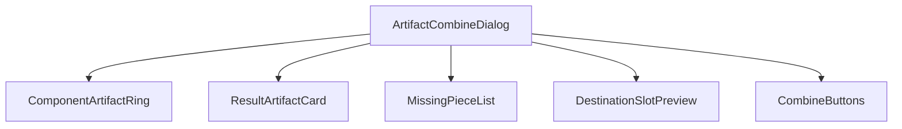
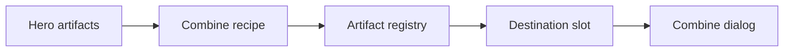
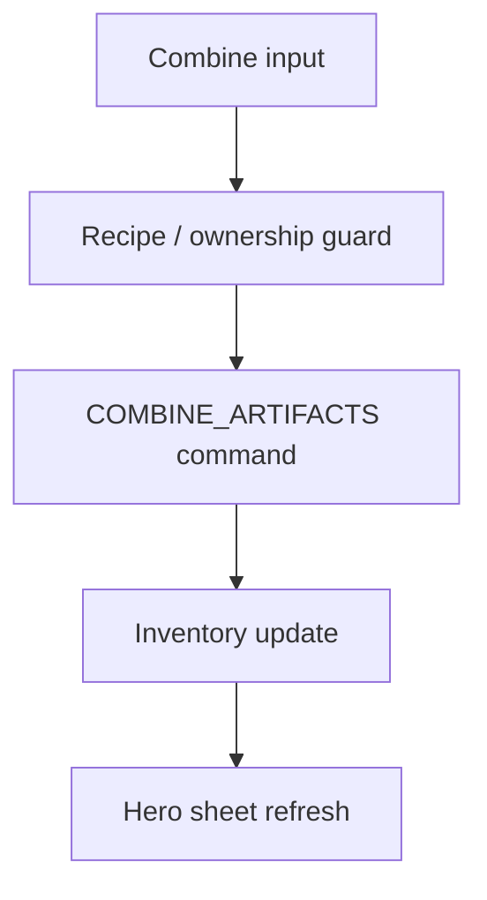
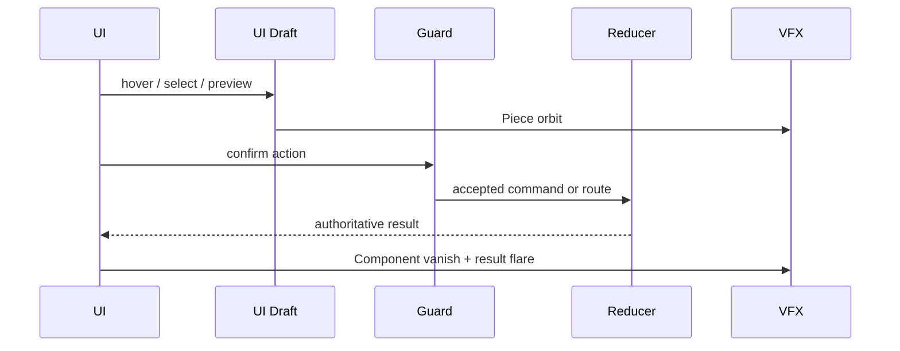
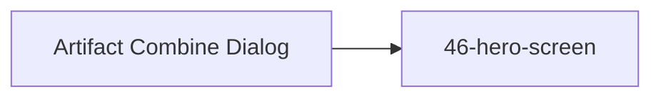

# Screen 52 Architecture: Artifact Combine Dialog

- System: `hero`
- Screen ID: `artifact-combine-dialog`
- Visual Archetype: `curated-artifact-combine`
- Curation Status: `curated-pass-5`

Companion files:
[`spec.md`](./spec.md),
[`interactions.md`](./interactions.md),
[`data-contracts.md`](./data-contracts.md),
[`mockup.html`](./mockup.html).

## Purpose

Confirmation modal for creating a combination artifact: shows the
owned component pieces, the resulting artifact, missing pieces and
blocked slots, and the equip-or-backpack destination before the
player commits.

## Visual Direction

Original internal UI contract. Do not use third-party captures,
copied franchise art, or external product pixels as implementation
input.

## 1. Visual Composition

## 2. Screen Load And Data Resolution

## 3. Main Interaction Flow

## 4. Animation Flow

## 5. Outgoing Transitions

Both `artifactCombine.confirm` (after the reducer accepts
`COMBINE_ARTIFACTS`) and `artifactCombine.cancel` return to
[`46-hero-screen`](../46-hero-screen/).

## 6. State Inputs

| Binding | Source | Notes |
| --- | --- | --- |
| `recipeId` | `state.ui.artifactCombine.recipeId` | Combination recipe being evaluated. |
| `components` | `selectors.artifacts.combineComponents` | Required pieces and ownership state. |
| `resultArtifact` | `registries.artifacts.byId[resultId]` | Result artifact record. |
| `destination` | `selectors.artifacts.combineDestination` | Equip slot or backpack target. |
| `combineGuard` | `selectors.artifacts.combineGuard` | Eligibility and disabled reason. |

Canonical binding definitions live in
[`spec.md` § State Bindings](./spec.md#state-bindings) and
[`data-contracts.md` § Runtime State Selectors](./data-contracts.md#runtime-state-selectors).

## 7. Implementation Contract

- [`mockup.html`](./mockup.html) defines visual regions and data
  hooks only.
- [`spec.md`](./spec.md) owns components and state bindings.
- [`interactions.md`](./interactions.md) owns controls, timing,
  command routing, disabled states, and error surfaces.
- [`data-contracts.md`](./data-contracts.md) owns schemas, config,
  localization, asset, audio, VFX, save, and replay references.
- Diagrams in this file are screen-specific summaries of those
  contracts and must not introduce hidden behavior.

---

## 🔍 Sync Check

- **UI: ✔** — Components (`ComponentArtifactRing`, `ResultArtifactCard`, `MissingPieceList`, `DestinationSlotPreview`, `CombineButtons`) match [`spec.md` § Component Tree](./spec.md#component-tree) and the modal regions in [`mockup.html`](./mockup.html) (centered ring with four component slots, result card at the centre, COMBINE + CANCEL buttons). Aligned with sibling [`interactions.md` § 1 Actions](./interactions.md#1-actions).
- **Schema: ✔** — `COMBINE_ARTIFACTS` defined in [`command.schema.json`](../../../../../content-schema/schemas/command.schema.json) (line 1639). UI-local tokens (`SELECT_COMBINE_COMPONENT`, `CANCEL_ARTIFACT_COMBINE`) resolve via the `SELECT_` / `CANCEL_` `localUiPrefixes` in [`screen-command-coverage.json`](../../../screen-command-coverage.json).
- **Tasks: ✔** — Owning UI task [`phase-2.07-ui-screen-backlog.52-artifact-combine-dialog-screen`](../../../../../tasks/phase-2/07-ui-screen-backlog/52-artifact-combine-dialog-screen.md) names all four sibling files in Read First; reducer-owning task [`phase-2.01-spells-artifacts.15-combine-artifacts-command`](../../../../../tasks/phase-2/01-spells-artifacts/15-combine-artifacts-command.md) names `COMBINE_ARTIFACTS` in Outputs and reads [`interactions.md`](./interactions.md) in Read First.

## ⚠ Issues

_None — see sibling [`interactions.md` § ⚠ Issues](./interactions.md#-issues) for the mockup-action-coverage note._
