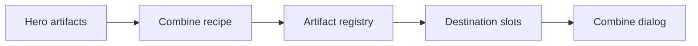
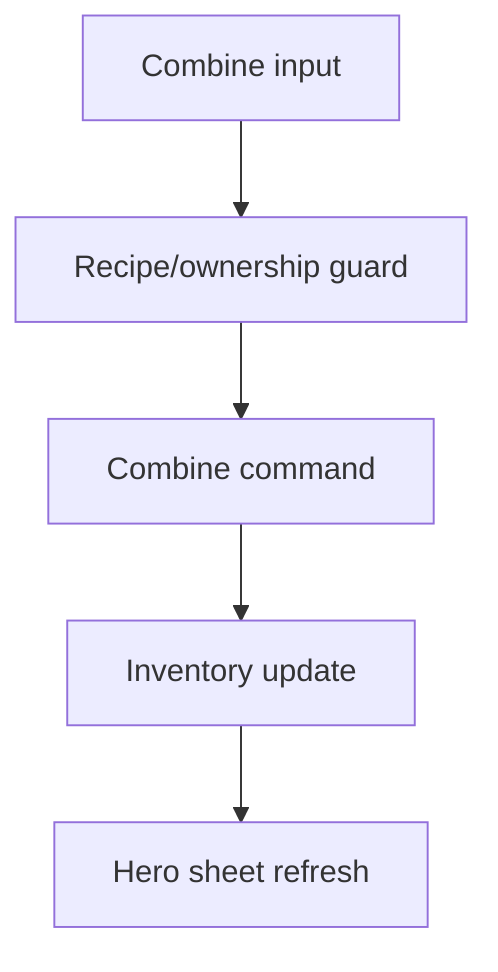
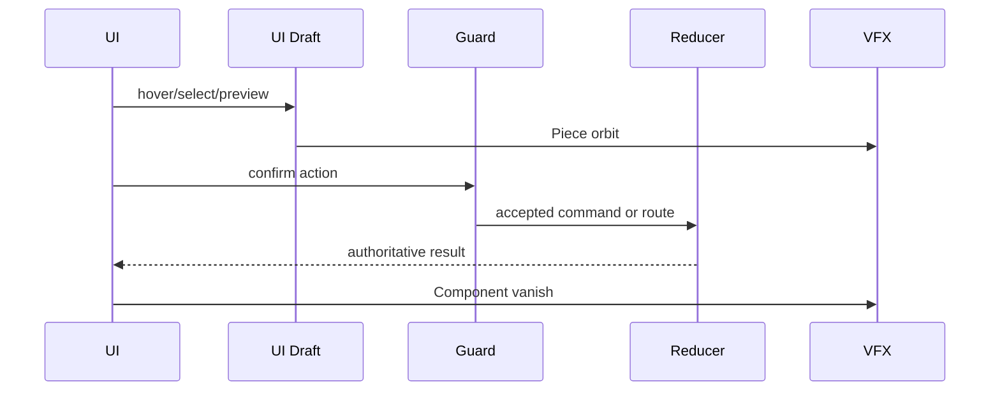
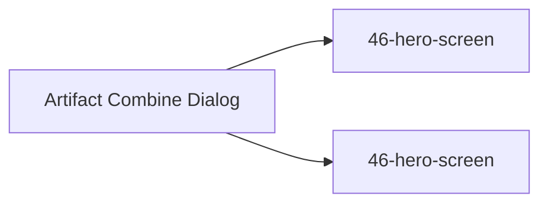

# Screen 52 Architecture: Artifact Combine Dialog

System: hero
Screen ID: artifact-combine-dialog
Visual Archetype: curated-artifact-combine
Curation Status: curated-pass-5

## Purpose
Combination artifact confirmation showing required pieces, resulting artifact, blocked slots, and equip/backpack outcome.

## Visual Direction
- Original internal UI contract. Do not use third-party captures,
  copied franchise art, or external product pixels as implementation input.

## Visual Composition

## Screen Load And Data Resolution

## Main Interaction Flow

## Animation Flow

## Outgoing Transitions

## State Inputs
- recipeId -> state.ui.artifactCombine.recipeId
- components -> selectors.artifacts.combineComponents
- resultArtifact -> registries.artifacts.byId[resultId]
- destination -> selectors.artifacts.combineDestination
- combineGuard -> selectors.artifacts.combineGuard

## Implementation Contract
- Mockup defines visual regions and data hooks only.
- Spec defines the component/state contract.
- Interactions define controls, timing, command routing, disabled states, and error behavior.
- Data contracts define schemas, config, localization, asset, audio, VFX, save, and replay references.
- Diagrams are screen-specific summaries of the same contract and must not introduce hidden behavior.
