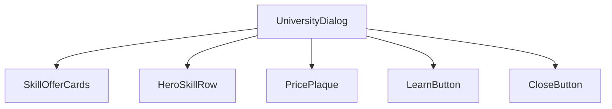
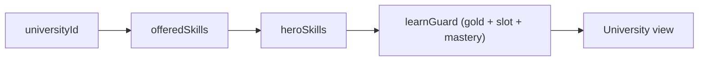
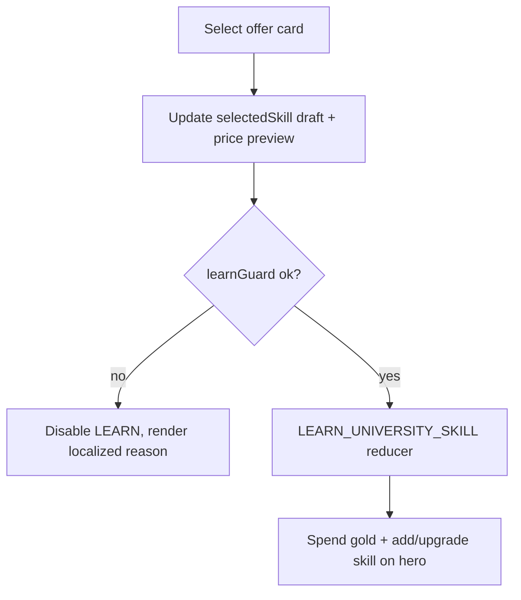
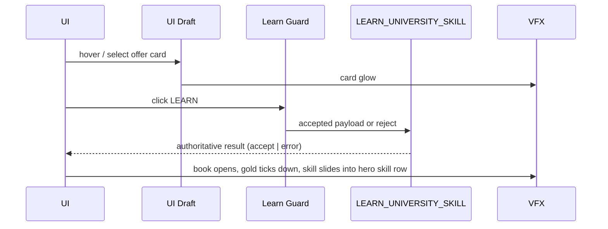
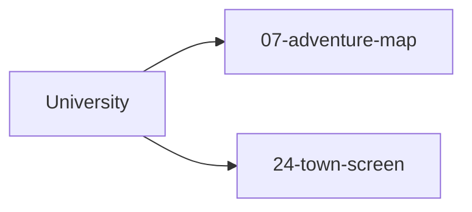

# Screen 53: University — Architecture

| Field | Value |
| --- | --- |
| System group | `hero` |
| Screen slug | `university` |
| Visual archetype | `curated-university` |
| Curation status | `curated-pass-5` |

### Screen Package
- Mockup: [`mockup.html`](./mockup.html)
- Spec: [`spec.md`](./spec.md)
- Interactions: [`interactions.md`](./interactions.md)
- Data Contracts: [`data-contracts.md`](./data-contracts.md)
- Architecture Diagrams: `architecture.md`

## Purpose
Visual + logic summary for the University secondary-skill purchase
surface: four offer cards, hero-eligibility status row, and
`LEARN` / `CLOSE` actions. Diagrams summarize the contract owned by
[`spec.md`](./spec.md) and [`interactions.md`](./interactions.md);
they must not introduce new behavior. Only
`LEARN_UNIVERSITY_SKILL` mutates deterministic state — the other two
tokens are `local-ui` per the `SELECT_` / `CLOSE_` prefixes in
[`screen-command-coverage.json`](../../../screen-command-coverage.json).

## Visual Direction
Original internal UI contract. Do **not** use third-party captures,
copied franchise art, or external product pixels as implementation
input.

## Visual Composition

## Screen Load And Data Resolution

## Main Interaction Flow

## Animation Flow

## Outgoing Transitions

`CLOSE` routes to [`07-adventure-map`](../07-adventure-map/) when
the source is an adventure-map university object, or to
[`24-town-screen`](../24-town-screen/) when entered from a town
context. The active source is recorded in
`state.ui.university.sourceId`.

## State Inputs
| Binding | State path |
| --- | --- |
| `universityId` | `state.ui.university.sourceId` |
| `offeredSkills` | `state.mapObjects.byId[universityId].offeredSkills` |
| `heroSkills` | `state.heroes.byId[selected].skills` |
| `selectedSkill` | `state.ui.university.selectedSkillId` |
| `learnGuard` | `selectors.heroes.universityLearnGuard` |

See sibling [`spec.md`](./spec.md) and
[`data-contracts.md`](./data-contracts.md) for canonical
descriptions and the open drift recorded in sibling
[`spec.md ⚠ Issues`](./spec.md#-issues) (mockup vs component tree;
selectors not in `AdventureState`).

## Implementation Contract
- [`mockup.html`](./mockup.html) defines visible regions and data
  hooks only.
- [`spec.md`](./spec.md) defines the component tree and state
  bindings.
- [`interactions.md`](./interactions.md) defines controls, timing,
  command routing, disabled states, and error surfaces.
- [`data-contracts.md`](./data-contracts.md) defines schemas,
  registries, config, localization, asset, audio, VFX, save, and
  replay references.
- The diagrams above are screen-specific summaries of the same
  contract and must not introduce hidden behavior.

---

## 🔍 Sync Check

- **UI: ⚠** — Outgoing transitions to
  [`07-adventure-map`](../07-adventure-map/) and
  [`24-town-screen`](../24-town-screen/), the offer-card layout,
  and the `LEARN` / `CLOSE` actions agree with
  [`mockup.html`](./mockup.html) and sibling
  [`interactions.md`](./interactions.md). The Visual Composition
  diagram lists `HeroSkillRow` and `PricePlaque`, which are not
  distinct mockup regions — see sibling
  [`spec.md ⚠ Issues`](./spec.md#-issues).
- **Schema: ⚠** — `LEARN_UNIVERSITY_SKILL` matches
  [`command.schema.json#/$defs/learnUniversitySkill`](../../../../../content-schema/schemas/command.schema.json)
  (line 1256); `SELECT_UNIVERSITY_SKILL` and `CLOSE_UNIVERSITY`
  correctly stay `local-ui` per
  [`screen-command-coverage.json`](../../../screen-command-coverage.json).
  Canonical `university-skill-table.schema.json` is not yet on
  disk — see sibling [`spec.md ⚠ Issues`](./spec.md#-issues).
- **Tasks: ⚠** — UI owner
  [`phase-2.07-ui-screen-backlog.53-university-screen`](../../../../../tasks/phase-2/07-ui-screen-backlog/53-university-screen.md)
  Reads First this file. Engine reducer owner
  [`phase-2.01-spells-artifacts.12-learn-university-skill-command`](../../../../../tasks/phase-2/01-spells-artifacts/12-learn-university-skill-command.md)
  Reads First sibling [`interactions.md`](./interactions.md). State
  paths in the bindings table reference projections the strategic
  state model does not yet expose — see sibling
  [`spec.md ⚠ Issues`](./spec.md#-issues).

## ⚠ Issues

- **`HeroSkillRow` and `PricePlaque` in Visual Composition without
  mockup regions (mirror).** Sibling
  [`spec.md ⚠ Issues`](./spec.md#-issues) carries the canonical
  description. The diagram keeps both nodes to mirror the spec's
  component tree; if the UI task folds price into each offer card
  and reuses the bottom status bar as the selection plaque, drop
  the two nodes here too.
- **State-path projections not in `AdventureState` (mirror).** The
  five rows in § State Inputs target projections
  (`state.mapObjects.byId[universityId]`, `state.ui.university.*`,
  `state.heroes.byId[selected].skills`,
  `selectors.heroes.universityLearnGuard`) that
  [`mvp.05-adventure-map.01-strategic-game-state-model`](../../../../../tasks/mvp/05-adventure-map/01-strategic-game-state-model.md)
  does not yet expose. Owner: that state-model task or a sibling
  UI-selector task. Full detail in sibling
  [`spec.md ⚠ Issues`](./spec.md#-issues).
