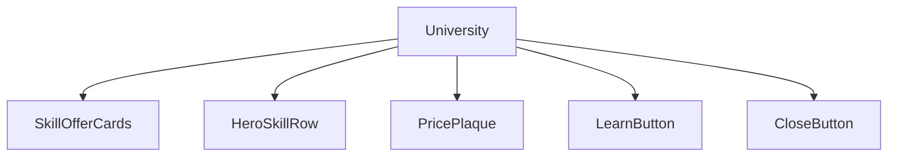
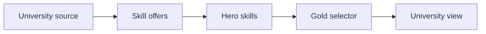
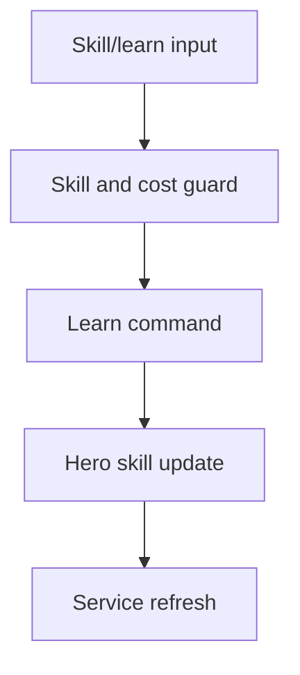
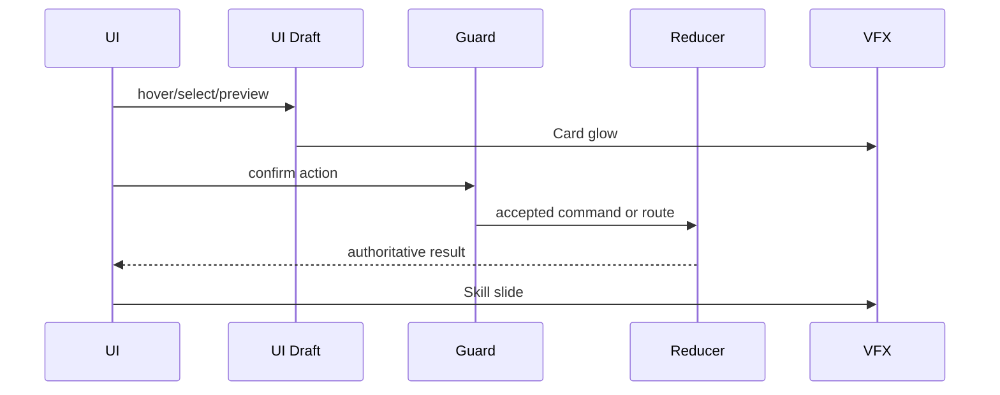
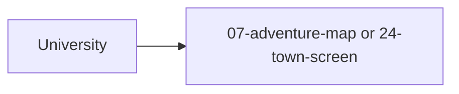

# Screen 53 Architecture: University

System: hero
Screen ID: university
Visual Archetype: curated-university
Curation Status: curated-pass-5

## Purpose
University skill-learning service where a visiting hero can buy offered secondary skills if legal.

## Visual Direction
- Original internal UI contract. Do not use third-party captures,
  copied franchise art, or external product pixels as implementation input.

## Visual Composition

## Screen Load And Data Resolution

## Main Interaction Flow

## Animation Flow

## Outgoing Transitions

## State Inputs
- universityId -> state.ui.university.sourceId
- offeredSkills -> state.mapObjects.byId[universityId].offeredSkills
- heroSkills -> state.heroes.byId[selected].skills
- selectedSkill -> state.ui.university.selectedSkillId
- learnGuard -> selectors.heroes.universityLearnGuard

## Implementation Contract
- Mockup defines visual regions and data hooks only.
- Spec defines the component/state contract.
- Interactions define controls, timing, command routing, disabled states, and error behavior.
- Data contracts define schemas, config, localization, asset, audio, VFX, save, and replay references.
- Diagrams are screen-specific summaries of the same contract and must not introduce hidden behavior.
