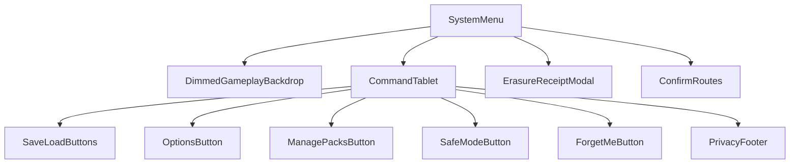
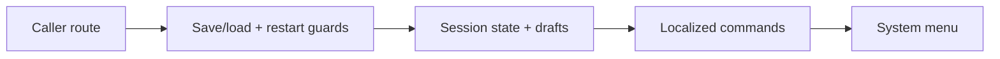
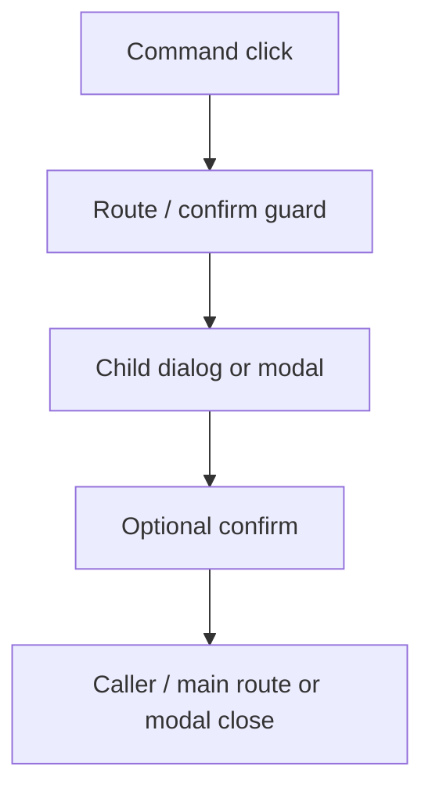
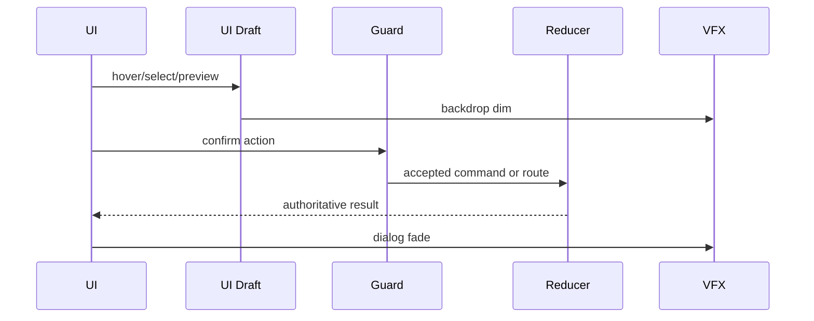
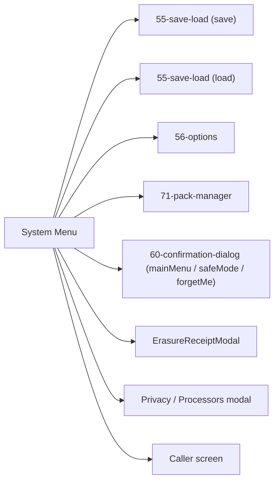

# Screen 54 Architecture: System Menu

- System: `system`
- Screen ID: `system-menu`
- Visual Archetype: `curated-system-menu`
- Curation Status: `curated-pass-6`

## Source Files
- Mockup: `mockup.html`
- Spec: `spec.md`
- Interactions: `interactions.md`
- Data Contracts: `data-contracts.md`

## Purpose
Modal overlay invoked over live gameplay for save, load, options,
pack management, privacy actions, return-to-main-menu confirmation,
and resume. Gameplay state is paused for local UI only; deterministic
reducers run only after a route guard accepts a command.

## Visual Direction
- Original internal UI contract. Do not use third-party captures,
  copied franchise art, or external product pixels as implementation
  input.

## Visual Composition

## Screen Load And Data Resolution

## Main Interaction Flow

## Animation Flow

## Outgoing Transitions

## State Inputs
| Field | Selector / state path | Notes |
| --- | --- | --- |
| `callerRoute` | `state.ui.systemMenu.callerRoute` | Screen to resume on close. |
| `canSave` | `selectors.persistence.canSaveCurrentGame` | Save command availability. |
| `canLoad` | `selectors.persistence.hasLoadableSave` | Load command availability. |
| `restartGuard` | `selectors.session.restartGuard` | Restart confirm / disabled gate. |
| `dirtyDrafts` | `state.ui.unsavedDrafts` | Local drafts needing discard confirm. |

## Implementation Contract
- `mockup.html` defines visible regions and data hooks only.
- `spec.md` owns components and state bindings.
- `interactions.md` owns controls, timing, command routing,
  disabled states, and error behavior.
- `data-contracts.md` owns schemas, config, localization, asset,
  audio, VFX, save, and replay references.
- Diagrams here summarize the contract; they must not introduce
  hidden behavior.

---

## 🔍 Sync Check

- **UI: ⚠** — Diagrams align with sibling [`spec.md` § Component Tree](./spec.md#component-tree) and [`interactions.md` § Actions](./interactions.md#actions). The legacy `mockup.html` still uses action IDs `system.main` and `system.quit` that the markdown files do not — flagged in Issues; reference-only file not edited (Hard Prohibition D).
- **Schema: ✔** — No schema enums declared here; selector names match [`ui-routing.md`](../../../ui-routing.md) (`selectors.persistence.canSaveCurrentGame` is the canonical example there). Schema set is enumerated in sibling [`data-contracts.md` § Content Schemas And Registries](./data-contracts.md#content-schemas-and-registries).
- **Tasks: ✔** — Owning task [`tasks/phase-2/07-ui-screen-backlog/54-system-menu-screen.md`](../../../../../tasks/phase-2/07-ui-screen-backlog/54-system-menu-screen.md) lists this file under Read First; no orphan task references it without reciprocal mention.

## ⚠ Issues

- **Mockup drift vs canonical action IDs.** `mockup.html` exposes
  buttons `data-action="system.main"` and `data-action="system.quit"`,
  but the canonical [`interactions.md`](./interactions.md#actions)
  uses `system.mainMenu` for the return-to-main-menu flow and lists
  no Quit-to-desktop action at all. Owning task
  [`tasks/phase-2/07-ui-screen-backlog/54-system-menu-screen.md`](../../../../../tasks/phase-2/07-ui-screen-backlog/54-system-menu-screen.md)
  must either refresh `mockup.html` to match the markdown contract or
  extend `interactions.md` with a `system.quit` action backed by a
  Quit-to-desktop command (with companion entry in
  [`command-schema.md`](../../../command-schema.md)). Suggested
  values: rename mockup `system.main` → `system.mainMenu`; either
  drop the mockup Quit button or add a `system.quit` row alongside
  it. Skill did not edit the mockup (Hard Prohibition D) and did not
  invent a Quit command (Hard Prohibition B).
