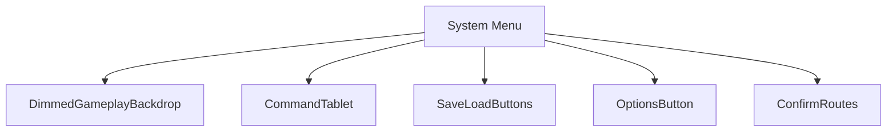
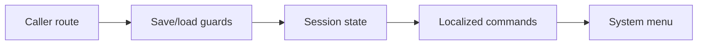
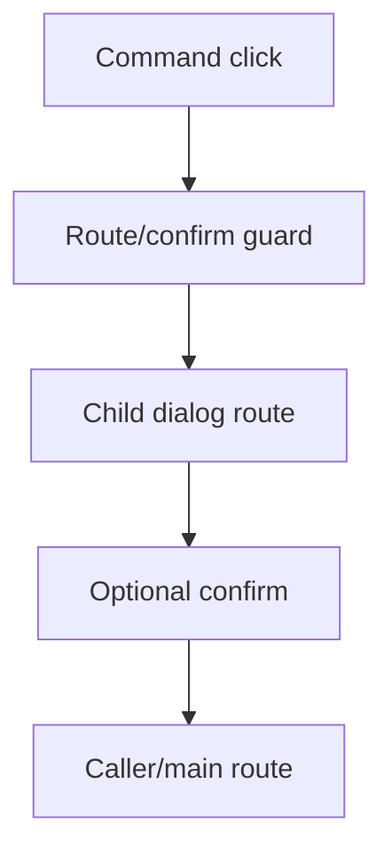
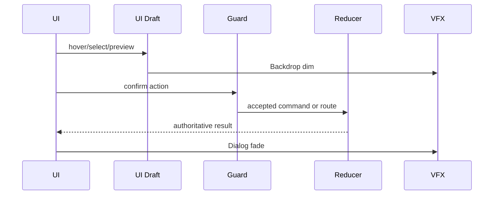
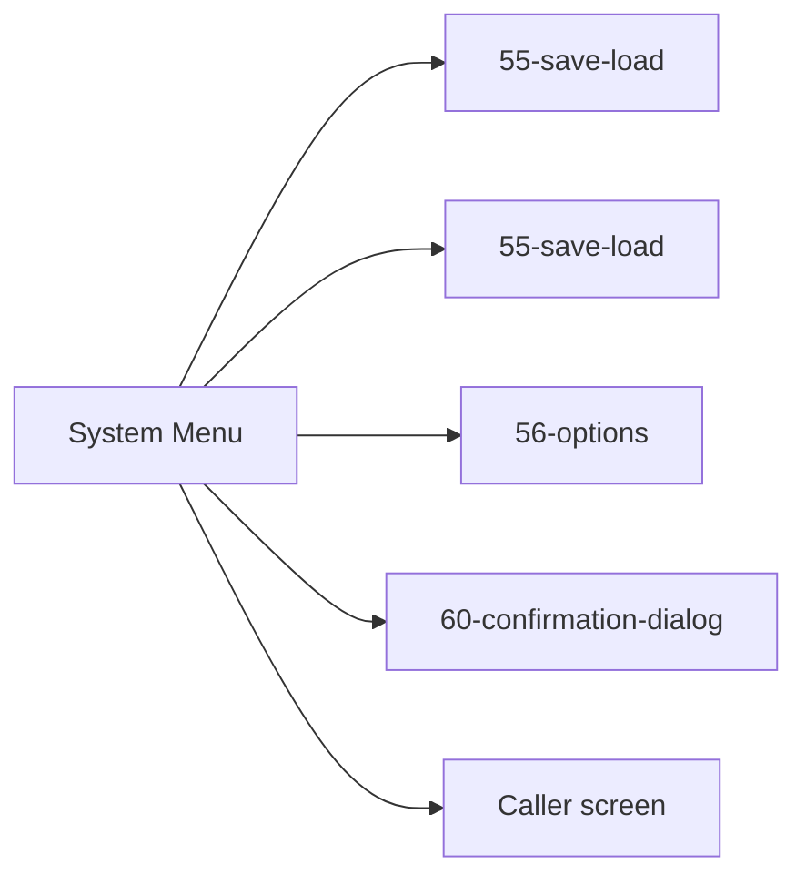

# Screen 54 Architecture: System Menu

System: system
Screen ID: system-menu
Visual Archetype: curated-system-menu
Curation Status: curated-pass-6

## Purpose
In-game system menu overlay for save, load, options, restart, main menu, and quit confirmation.

## Visual Direction
- Original internal UI contract. Do not use third-party captures,
  copied franchise art, or external product pixels as implementation input.

## Visual Composition

## Screen Load And Data Resolution

## Main Interaction Flow

## Animation Flow

## Outgoing Transitions

## State Inputs
- callerRoute -> state.ui.systemMenu.callerRoute
- canSave -> selectors.persistence.canSaveCurrentGame
- canLoad -> selectors.persistence.hasLoadableSave
- restartGuard -> selectors.session.restartGuard
- dirtyDrafts -> state.ui.unsavedDrafts

## Implementation Contract
- Mockup defines visual regions and data hooks only.
- Spec defines the component/state contract.
- Interactions define controls, timing, command routing, disabled states, and error behavior.
- Data contracts define schemas, config, localization, asset, audio, VFX, save, and replay references.
- Diagrams are screen-specific summaries of the same contract and must not introduce hidden behavior.
