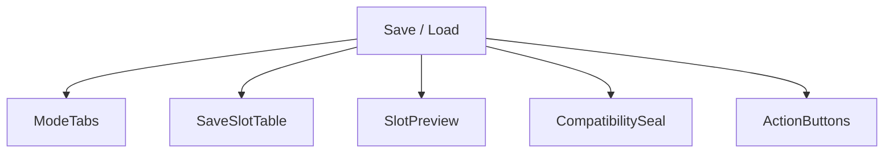
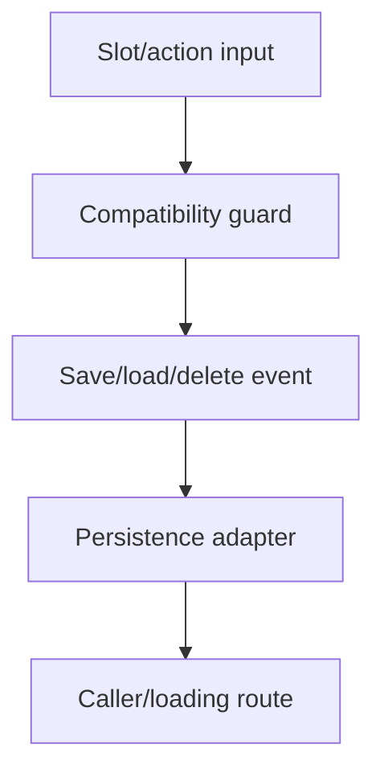
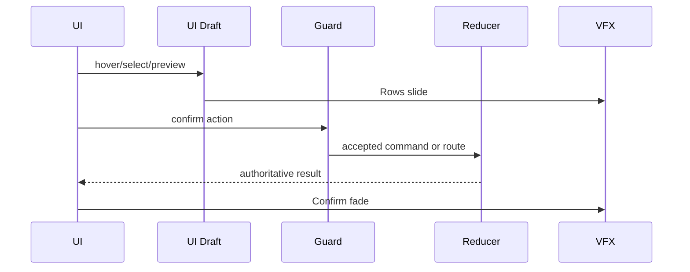
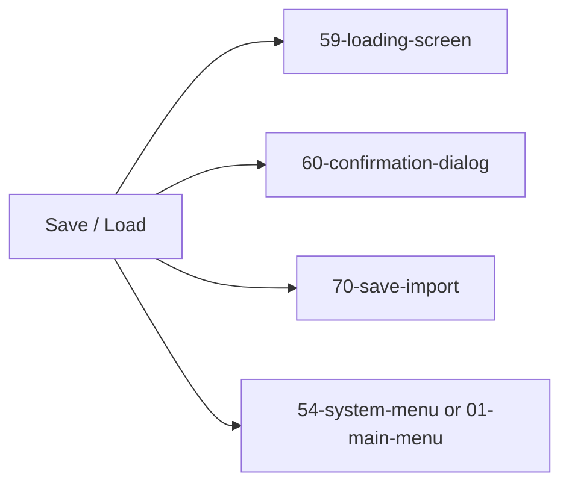

# Screen 55 Architecture: Save / Load

> Companion docs:
> [`spec.md`](./spec.md) (component tree, state bindings),
> [`interactions.md`](./interactions.md) (per-control behavior, navigation, error surfaces, multiplayer),
> [`data-contracts.md`](./data-contracts.md) (schemas, selectors, commands, fallbacks),
> [`mockup.html`](./mockup.html) (visual reference only).
>
> Owning task:
> [`mvp.08-persistence.03-save-load-ui`](../../../../../tasks/mvp/08-persistence/03-save-load-ui.md).
> Companion arch docs: [`undo-policy.md`](../../../undo-policy.md),
> [`pack-trust.md`](../../../pack-trust.md),
> [`storage-policy.md`](../../../storage-policy.md),
> [`version-policy.md`](../../../version-policy.md),
> [`diagrams/24-save-flow.md`](../../../diagrams/24-save-flow.md).

System: system
Screen ID: save-load
Visual Archetype: curated-save-load
Curation Status: curated-pass-6

## Purpose

Slot browser for user saves and the three rotating autosave slots
(`auto-1`, `auto-2`, `auto-3`). Surfaces save metadata, compatibility
checks, overwrite/delete confirmation with a non-modal undo toast,
the rolling overwrite-ring restore, the quarantined import route,
and a "Manage saves" CTA when storage quota approaches its limit.

## Visual Direction

Original internal UI contract. Do not use third-party captures,
copied franchise art, or external product pixels as implementation
input.

## Visual Composition

## Screen Load And Data Resolution

## Main Interaction Flow

## Animation Flow

## Outgoing Transitions

## State Inputs

- `mode` → `state.ui.saveLoad.mode`
- `slots` → `selectors.persistence.saveSlotManifests`
- `autosaveSlots` → `selectors.persistence.autosaveSlots`
- `selectedSlot` → `state.ui.saveLoad.selectedSlotId`
- `compatibility` → `selectors.persistence.selectedSaveCompatibility`
- `overwriteGuard` → `selectors.persistence.overwriteGuard`
- `quotaUsage` → `selectors.persistence.quotaUsage`
- `recycleRing` → `selectors.persistence.recycle.savedSlots`
- `importStaging` → `selectors.persistence.import.staging`
- `lastDestructive` → `state.ui.lastDestructive`

Per-binding semantics, fallbacks, and TTLs live in
[`spec.md` § State Bindings](./spec.md#state-bindings) and
[`data-contracts.md` § Runtime State Selectors](./data-contracts.md#runtime-state-selectors).
This file does not duplicate them.

## Implementation Contract

- `mockup.html` defines visual regions and data hooks only.
- `spec.md` defines the component tree and authoritative state
  bindings.
- `interactions.md` defines controls, timing, command routing,
  disabled states, error surfaces, and multiplayer rules.
- `data-contracts.md` defines schemas, config, localization, asset,
  audio, VFX, save, and replay references.
- Diagrams above are screen-specific summaries of those contracts
  and must not introduce hidden behavior.

---

## 🔍 Sync Check

- **UI: ✔** — Component tree, transitions, and state inputs match sibling [`spec.md`](./spec.md) and [`interactions.md`](./interactions.md). `70-save-import` added to outgoing transitions to align with [`interactions.md` § Actions](./interactions.md#actions) Import row.
- **Schema: ⚠** — Selectors and `state.ui.saveLoad.*` slices are consistent with [`data-contracts.md`](./data-contracts.md). Several screen-dispatched commands lack canonical rows in [`command-schema.md`](../../../command-schema.md); see `## ⚠ Issues`.
- **Tasks: ✔** — Owning task [`mvp.08-persistence.03-save-load-ui`](../../../../../tasks/mvp/08-persistence/03-save-load-ui.md) reads all four files first; companion task [`mvp.08-persistence.27-undo-soft-delete`](../../../../../tasks/mvp/08-persistence/27-undo-soft-delete.md) owns the `lastDestructive` slice and undo commands; task [`mvp.08-persistence.11-save-import-screen-and-quarantine`](../../../../../tasks/mvp/08-persistence/11-save-import-screen-and-quarantine.md) owns `RESTORE_OVERWRITTEN_SAVE` and the screen-70 entry route.

## ⚠ Issues

- **State Inputs drift fixed inline.** Previous revision listed 5 of the 10 selectors the screen consumes (missing `autosaveSlots`, `quotaUsage`, `recycleRing`, `importStaging`, `lastDestructive`). Expanded to match sibling [`spec.md` § State Bindings](./spec.md#state-bindings) and [`data-contracts.md` § Runtime State Selectors](./data-contracts.md#runtime-state-selectors); semantics intentionally not duplicated — only the binding list lives here.
- **Outgoing Transitions previously missed `70-save-import`.** Import action in [`interactions.md` § Actions](./interactions.md#actions) navigates to screen 70 via `OPEN_SAVE_IMPORT`. Added.
- **Screen-dispatched commands not registered canonically.** The screen dispatches `SAVE_GAME_SLOT`, `LOAD_GAME_SLOT`, `SELECT_SAVE_SLOT`, `REQUEST_DELETE_SAVE_SLOT`, `CLOSE_SAVE_LOAD`, `OPEN_SAVE_IMPORT`, and `OVERWRITE_SAVE_SLOT`, but [`command-schema.md`](../../../command-schema.md) only registers `OPEN_SAVE_IMPORT`, `RESTORE_OVERWRITTEN_SAVE`, `UNDO_LAST_DESTRUCTIVE`, and `EXPIRE_LAST_DESTRUCTIVE`; [`screen-command-coverage.json`](../../../screen-command-coverage.json) only owns `RESTORE_OVERWRITTEN_SAVE`, `DELETE_SAVE_SLOT`, `UNDO_LAST_DESTRUCTIVE`, and `EXPIRE_LAST_DESTRUCTIVE`. Per CLAUDE.md ("screen interaction tokens are checked by `screen-command-coverage.json`") the remaining tokens must be registered (owner: `mvp.08-persistence.03-save-load-ui` for the user-flow tokens; `mvp.08-persistence.27-undo-soft-delete` for `OVERWRITE_SAVE_SLOT`). The companion mismatch is already tracked by [`undo-policy.md` § Issues](../../../undo-policy.md). Flagged not rewritten because the fix lives in cross-checked files (Hard Prohibition D).
