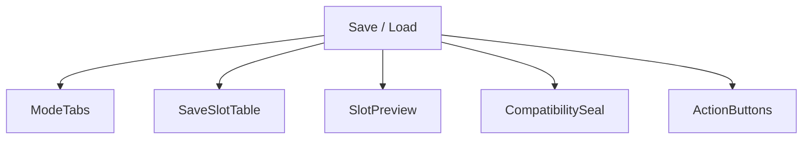
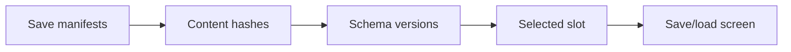
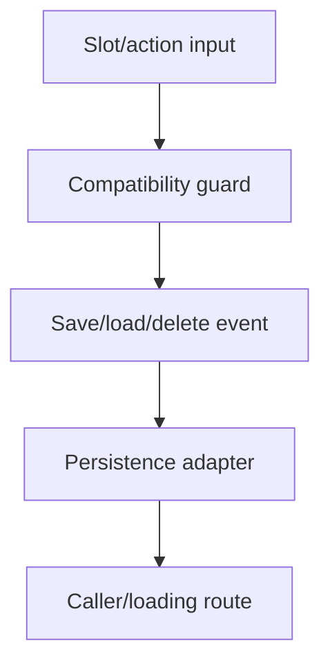
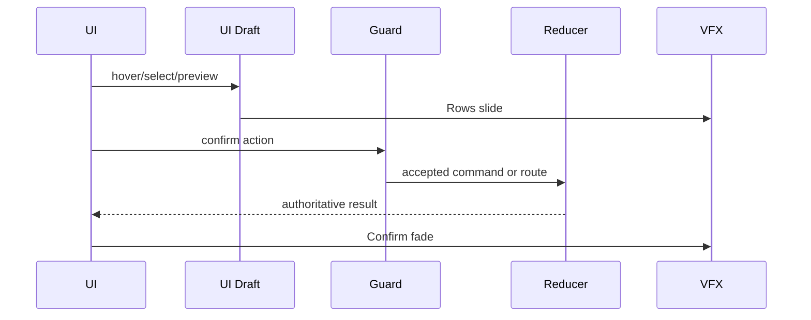
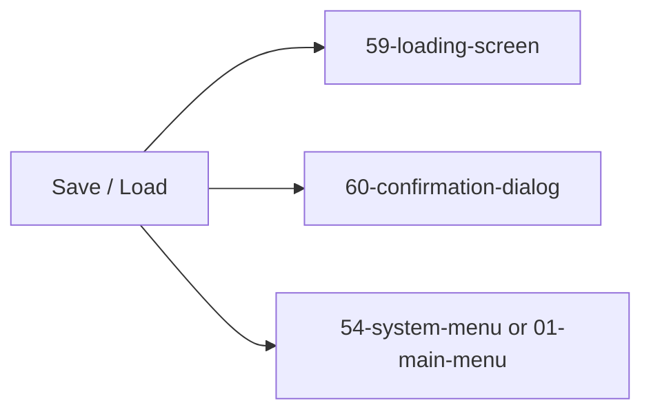

# Screen 55 Architecture: Save / Load

System: system
Screen ID: save-load
Visual Archetype: curated-save-load
Curation Status: curated-pass-6

## Purpose
Save/load slot browser with save metadata, compatibility checks, overwrite confirmation, and selected slot preview.

## Visual Direction
- Original internal UI contract. Do not use third-party captures,
  copied franchise art, or external product pixels as implementation input.

## Visual Composition

## Screen Load And Data Resolution

## Main Interaction Flow

## Animation Flow

## Outgoing Transitions

## State Inputs
- mode -> state.ui.saveLoad.mode
- slots -> selectors.persistence.saveSlotManifests
- selectedSlot -> state.ui.saveLoad.selectedSlotId
- compatibility -> selectors.persistence.selectedSaveCompatibility
- overwriteGuard -> selectors.persistence.overwriteGuard

## Implementation Contract
- Mockup defines visual regions and data hooks only.
- Spec defines the component/state contract.
- Interactions define controls, timing, command routing, disabled states, and error behavior.
- Data contracts define schemas, config, localization, asset, audio, VFX, save, and replay references.
- Diagrams are screen-specific summaries of the same contract and must not introduce hidden behavior.
