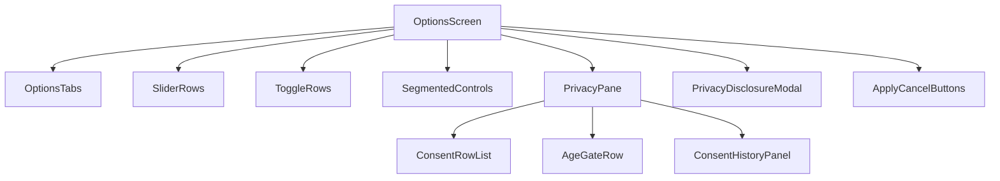
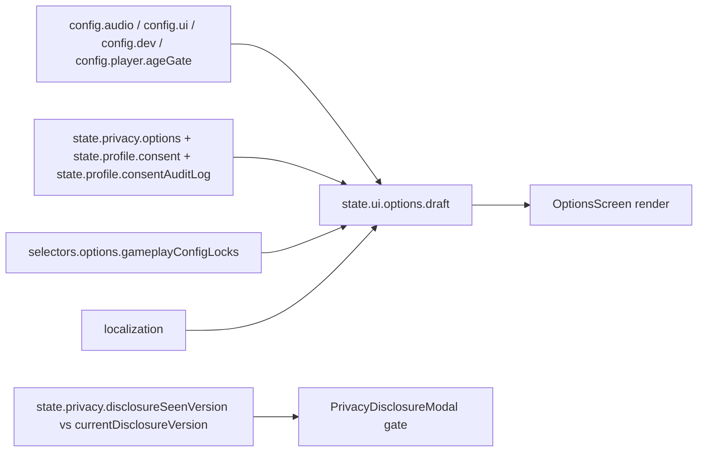
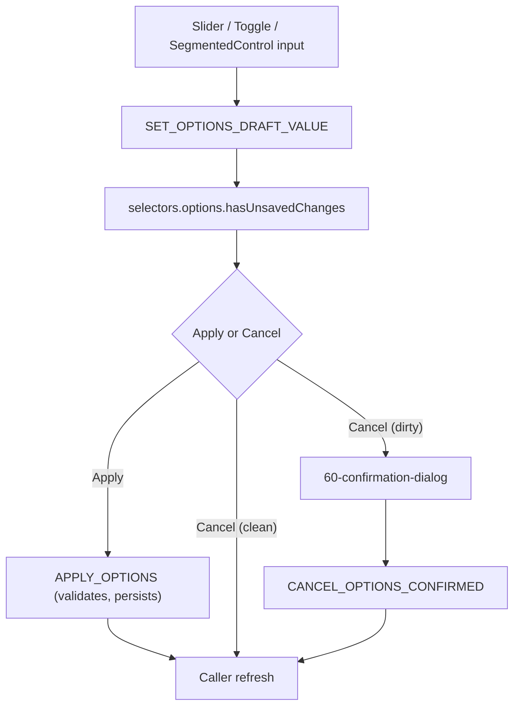
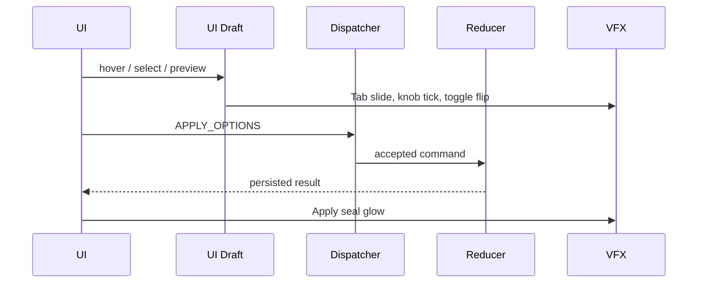
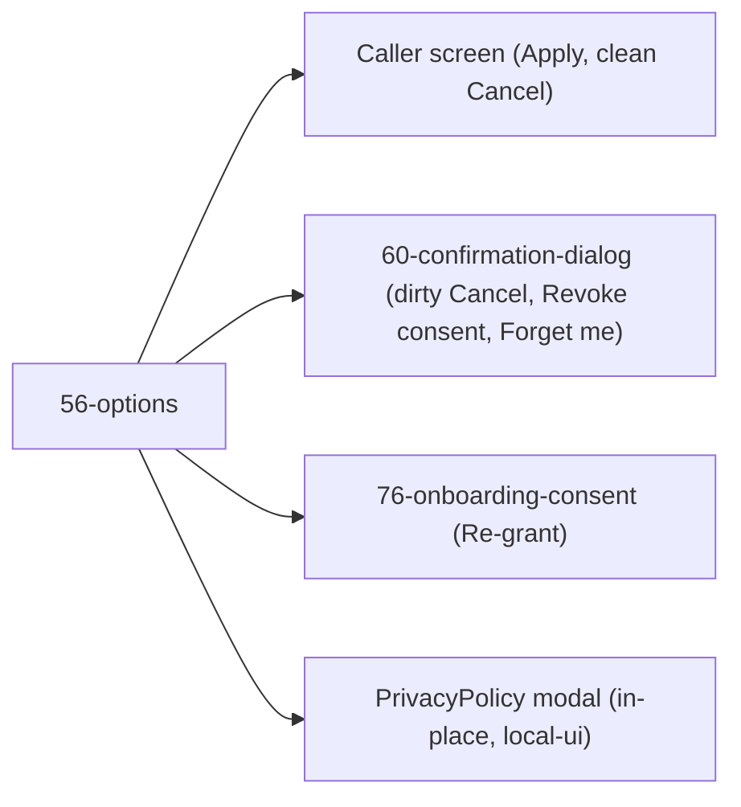

# Screen 56 Architecture: Options

System: system
Screen ID: options
Visual Archetype: curated-options
Curation Status: curated-pass-6

## Purpose
Edit a settings draft (audio, animation speed, gameplay locks, autosave,
language, accessibility, renderer scale, privacy, consent, age gate)
and persist it on Apply. Dirty Cancel and consent revoke route through
[`60-confirmation-dialog`](../60-confirmation-dialog/); re-grant routes
through [`76-onboarding-consent`](../76-onboarding-consent/).

## Companion Docs
- [`spec.md`](./spec.md) — components and state bindings.
- [`interactions.md`](./interactions.md) — per-control behavior, timing,
  command routing, error surfaces.
- [`data-contracts.md`](./data-contracts.md) — schemas, config,
  localization, assets, audio, VFX, save/replay fields.
- [`mockup.html`](./mockup.html) — visual reference (tabs + Audio pane).

## Visual Direction
Original internal UI contract. Do not use third-party captures, copied
franchise art, or external product pixels as implementation input.

## Visual Composition

## Screen Load And Data Resolution

## Main Interaction Flow

## Animation Flow

## Outgoing Transitions

## State Inputs
| Binding | Path | Notes |
| --- | --- | --- |
| `optionsDraft` | `state.ui.options.draft` | Local editable settings copy. |
| `audioConfig` | `config.audio` | Music/SFX/voice/UI volume. |
| `uiConfig` | `config.ui` | Locale, animation speed, reduced motion, scale. |
| `gameplayLocks` | `selectors.options.gameplayConfigLocks` | Settings locked during active game. |
| `dirty` | `selectors.options.hasUnsavedChanges` | Apply enabled state. |
| `privacyOptions` | `state.privacy.options` | Per [`privacy-options.schema.json`](../../../../../content-schema/schemas/privacy-options.schema.json). |
| `saltFingerprint` | `selectors.privacy.saltFingerprint` | First 4 hex chars of local salt; user-visible verification. |
| `disclosureSeen` / `currentDisclosure` | `state.privacy.disclosureSeenVersion` / `state.privacy.currentDisclosureVersion` | Gate `PrivacyDisclosureModal`. |
| `consentRecords` | `state.profile.consent` | One [`consent.schema.json`](../../../../../content-schema/schemas/consent.schema.json) per `ConsentScope`. |
| `consentAuditLog` | `state.profile.consentAuditLog` | [`consent-audit-log.schema.json`](../../../../../content-schema/schemas/consent-audit-log.schema.json) ring buffer. |
| `ageGate` | `config.player.ageGate` | `'unknown' \| 'under13' \| 'over13'` per [`age-gate.md`](../../../age-gate.md). |
| `featureAvailability` | `selectors.onboarding.featureAvailability` | Closed selector merging age gate + consent state per [`onboarding.md`](../../../onboarding.md). |

## Implementation Contract
- `mockup.html` defines visual regions and data hooks only.
- `spec.md` defines the component and state-binding contract.
- `interactions.md` defines controls, timing, command routing, disabled
  states, and error surfaces.
- `data-contracts.md` defines schemas, config, localization, asset,
  audio, VFX, save, and replay references.
- Diagrams above are screen-specific summaries of those contracts and
  must not introduce hidden behavior.

---

## 🔍 Sync Check

- **UI: ✔** — Component tree, state bindings, and outgoing transitions match sibling [`spec.md`](./spec.md) and [`interactions.md`](./interactions.md). Diagrams now mirror the extended (Privacy + Disclosure Modal) shape rather than the original 5-binding template.
- **Schema: ✔** — Schemas linked from the State Inputs table (`privacy-options.schema.json`, `consent.schema.json`, `consent-audit-log.schema.json`) all exist under [`content-schema/schemas/`](../../../../../content-schema/schemas/) and match sibling [`data-contracts.md`](./data-contracts.md).
- **Tasks: ✔** — Owning task [`tasks/mvp/07-ui-shell/22-privacy-pane-in-options.md`](../../../../../tasks/mvp/07-ui-shell/22-privacy-pane-in-options.md) lists `spec.md` + `interactions.md` under Read First; downstream commands (`TOGGLE_HASHED_DISPLAY_NAME`, `REVOKE_CONSENT`, `WIPE_LOCAL_DATA`, `CANCEL_OPTIONS_CONFIRMED`) are all registered in [`command-schema.md`](../../../command-schema.md).

## ⚠ Issues

- **Developer tab not documented in this screen package.** [`command-schema.md`](../../../command-schema.md) lists `REVEAL_DEVELOPER_TAB` as a `56-options` token (chord-unlock per [`developer-mode.md`](../../../developer-mode.md)), and sibling [`data-contracts.md`](./data-contracts.md) already enumerates `config.dev.placeholderSprites` / `config.dev.enableDebugOverlay`, so the Developer-tab surface is implied but unenumerated here, in [`spec.md`](./spec.md), and in [`interactions.md`](./interactions.md). Per Hard Prohibition B (do not invent features), the tab is not added in this audit. Owner of the developer-mode chord-unlock surface task should add a Developer tab row to `spec.md` § State Bindings, an `options.revealDeveloperTab` action row to `interactions.md`, and a `REVEAL_DEVELOPER_TAB` row to `data-contracts.md` § Commands And Events.
