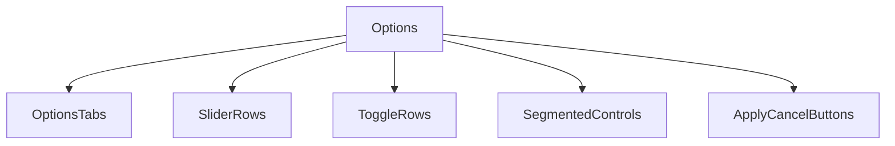
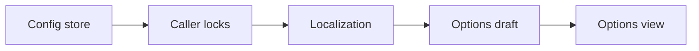
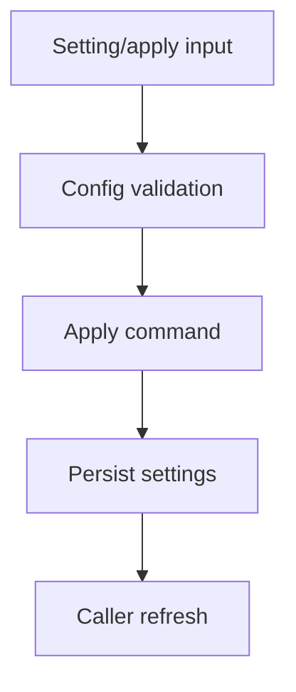
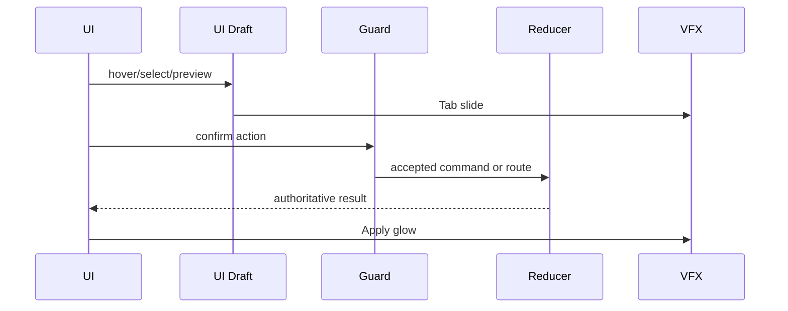
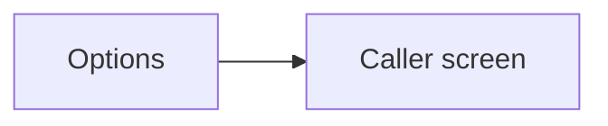

# Screen 56 Architecture: Options

System: system
Screen ID: options
Visual Archetype: curated-options
Curation Status: curated-pass-6

## Purpose
Options screen for audio, animation speed, combat settings, autosave, language, accessibility, and renderer scale.

## Visual Direction
- Original internal UI contract. Do not use third-party captures,
  copied franchise art, or external product pixels as implementation input.

## Visual Composition

## Screen Load And Data Resolution

## Main Interaction Flow

## Animation Flow

## Outgoing Transitions

## State Inputs
- optionsDraft -> state.ui.options.draft
- audioConfig -> config.audio
- uiConfig -> config.ui
- gameplayLocks -> selectors.options.gameplayConfigLocks
- dirty -> selectors.options.hasUnsavedChanges

## Implementation Contract
- Mockup defines visual regions and data hooks only.
- Spec defines the component/state contract.
- Interactions define controls, timing, command routing, disabled states, and error behavior.
- Data contracts define schemas, config, localization, asset, audio, VFX, save, and replay references.
- Diagrams are screen-specific summaries of the same contract and must not introduce hidden behavior.
