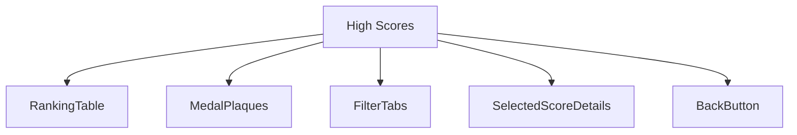
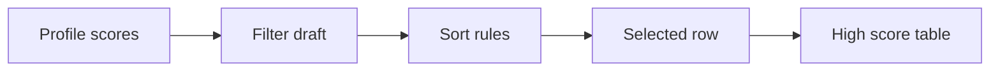
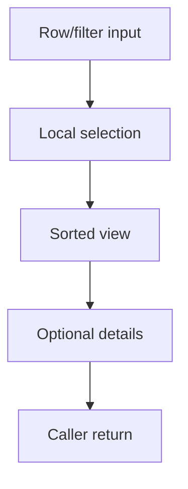
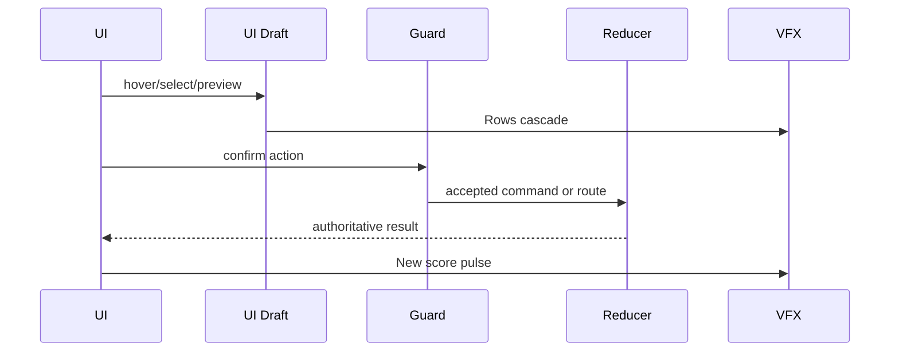
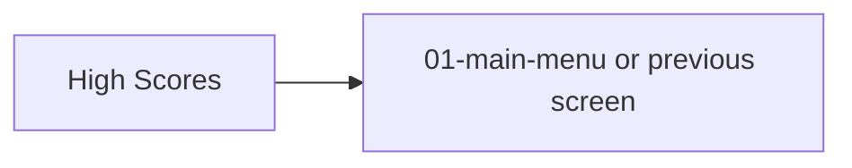

# Screen 57 Architecture: High Scores

System: system
Screen ID: high-scores
Visual Archetype: curated-high-scores
Curation Status: curated-pass-6

## Purpose
High score ledger showing completed game rankings, player names, score, days, difficulty, scenario, and campaign medals.

## Visual Direction
- Original internal UI contract. Do not use third-party captures,
  copied franchise art, or external product pixels as implementation input.

## Visual Composition

## Screen Load And Data Resolution

## Main Interaction Flow

## Animation Flow

## Outgoing Transitions

## State Inputs
- scoreRecords -> state.profile.highScores
- filter -> state.ui.highScores.filter
- selectedRecord -> state.ui.highScores.selectedRecordId
- sortOrder -> selectors.profile.sortedHighScores
- newRecordId -> state.ui.highScores.newRecordId

## Implementation Contract
- Mockup defines visual regions and data hooks only.
- Spec defines the component/state contract.
- Interactions define controls, timing, command routing, disabled states, and error behavior.
- Data contracts define schemas, config, localization, asset, audio, VFX, save, and replay references.
- Diagrams are screen-specific summaries of the same contract and must not introduce hidden behavior.
