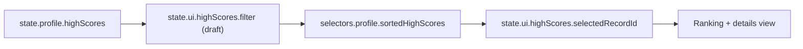
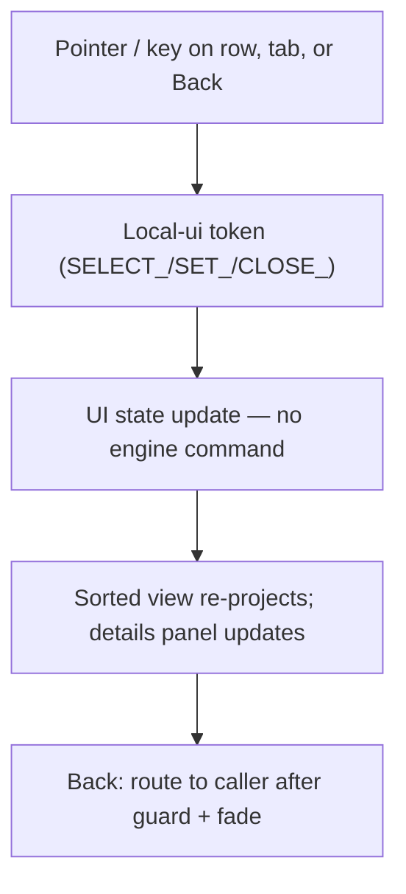
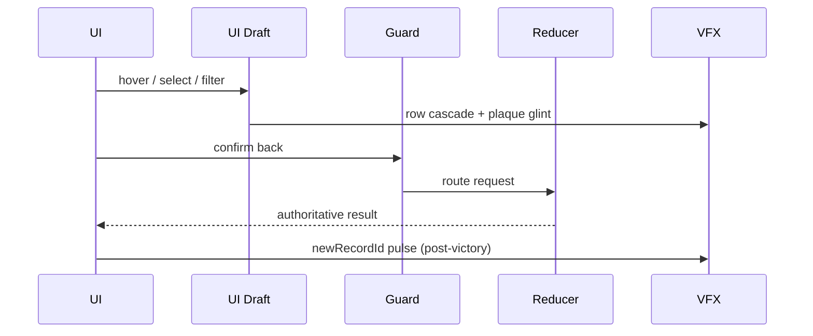
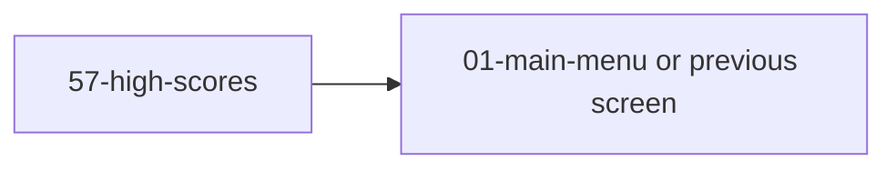

# Screen 57 Architecture: High Scores

| Field | Value |
| --- | --- |
| System | `system` |
| Screen ID | `high-scores` |
| Visual Archetype | `curated-high-scores` |
| Curation Status | `curated-pass-6` |

## Companion Files
- [`mockup.html`](./mockup.html) — visual reference (SVG).
- [`spec.md`](./spec.md) — components, bindings, acceptance criteria.
- [`interactions.md`](./interactions.md) — per-control behavior, timing, error paths.
- [`data-contracts.md`](./data-contracts.md) — schemas, config, localization, assets.

## Purpose
High-score ledger. Renders completed-game rankings, lets the player
select a row, change the filter, and return to the caller.
**Read-only** — no gameplay state mutates on this screen.

## Visual Direction
Original internal UI contract. Do not use third-party captures,
copied franchise art, or external product pixels as implementation
input.

## Visual Composition

## Screen Load & Data Resolution

## Main Interaction Flow

## Animation Flow

## Outgoing Transitions
`Back` is the only outgoing route; it returns to whichever screen
opened this view (typically `01-main-menu`, or
`42-victory-defeat-cinematic` after a campaign finish). See
[`interactions.md` § Navigation Outcomes](./interactions.md#navigation-outcomes).

## State Inputs

All five bindings refresh whenever their authoritative slice
changes. Local hover, focus, drag ghost, and animation frame are
never persisted. `state.profile.highScores` is the only persisted
slice (see [`data-inventory.md`](../../../data-inventory.md)).

| Binding handle | Authoritative selector |
| --- | --- |
| `scoreRecords` | `state.profile.highScores` |
| `filter` | `state.ui.highScores.filter` |
| `selectedRecord` | `state.ui.highScores.selectedRecordId` |
| `sortOrder` | `selectors.profile.sortedHighScores` |
| `newRecordId` | `state.ui.highScores.newRecordId` |

## Implementation Contract
- [`mockup.html`](./mockup.html) defines visual regions and data
  hooks only; it has no logic.
- [`spec.md`](./spec.md) owns static regions, component tree, and
  state bindings.
- [`interactions.md`](./interactions.md) owns controls, command
  routing, disabled states, timing, and error behavior.
- [`data-contracts.md`](./data-contracts.md) owns schemas, config,
  localization, assets, audio, VFX, save, and replay references.
- Diagrams in this file summarize the same contract and **must not
  introduce hidden behavior**.

---

## 🔍 Sync Check

- **UI: ⚠** — Visual Composition matches sibling [`spec.md` § Component Tree](./spec.md#component-tree). [`mockup.html`](./mockup.html) is a simplified visual sample — it omits `FilterTabs` and `SelectedScoreDetails`; tracked in sibling [`spec.md` ⚠ Issues](./spec.md).
- **Schema: ✔** — All three commands (`SELECT_HIGH_SCORE_ROW`, `SET_HIGH_SCORE_FILTER`, `CLOSE_HIGH_SCORES`) are local-ui per [`screen-command-coverage.json`](../../../screen-command-coverage.json#localUiPrefixes) (`SELECT_`, `SET_`, `CLOSE_` prefixes); no closed-enum surface is inlined in this file.
- **Tasks: ✔** — Owning task [`phase-2.07-ui-screen-backlog.57-high-scores-screen`](../../../../../tasks/phase-2/07-ui-screen-backlog/57-high-scores-screen.md) reads all five sibling files; the player-label render is additively owned by [`mvp.07-ui-shell.23-high-scores-player-label`](../../../../../tasks/mvp/07-ui-shell/23-high-scores-player-label.md).

## ⚠ Issues

_None._ — Mockup-omission gap is tracked in sibling [`spec.md` ⚠ Issues](./spec.md); display-name drift is tracked in sibling [`data-contracts.md` ⚠ Issues](./data-contracts.md).
