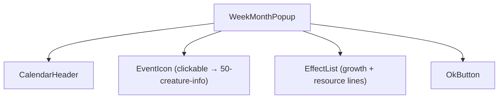
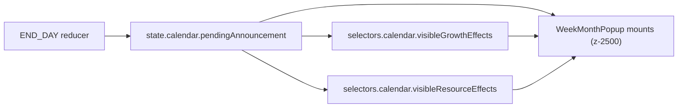
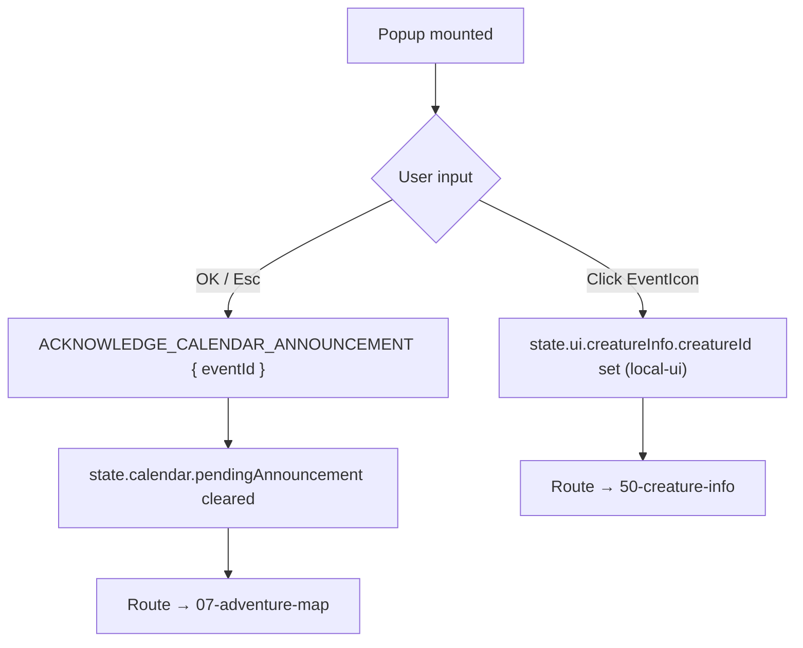
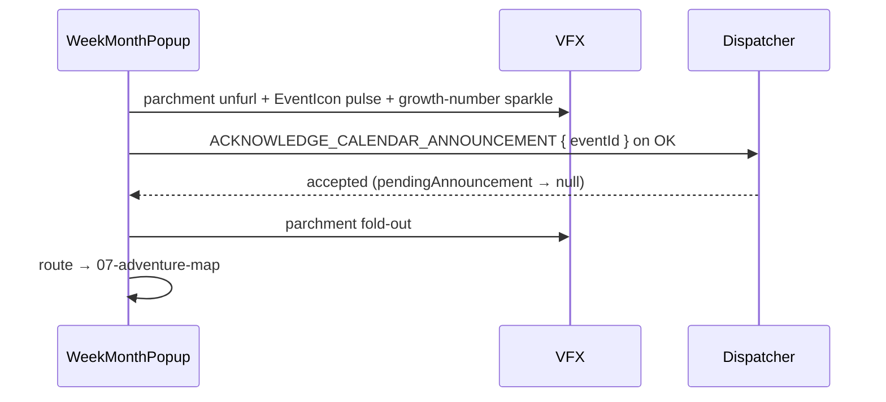
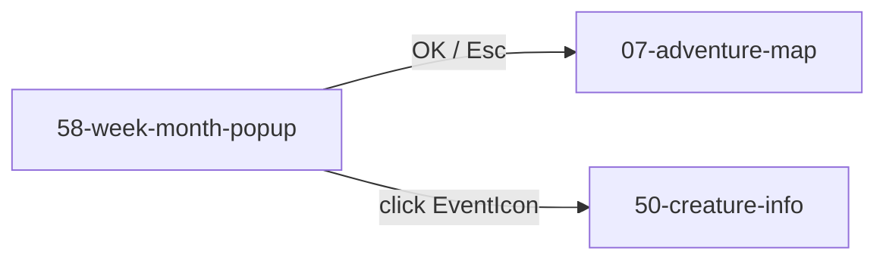

# Screen 58 Architecture: Week / Month Popup

System: system
Screen ID: week-month-popup
Visual Archetype: curated-week-month-popup
Curation Status: curated-pass-6

## Purpose

Modal announcement of the calendar transition produced by `END_DAY`
on a week or month boundary. Surfaces the themed-week / month-creature
event, growth modifiers, and resource changes already computed by the
calendar reducer; OK only acknowledges the visible record.

## Visual Direction

Original internal UI contract. Do not use third-party captures, copied
franchise art, or external product pixels as implementation input.

## Visual Composition

## Screen Load And Data Resolution

## Main Interaction Flow

## Animation Flow

Reduced-motion mode skips unfurl / pulse / sparkle / fold and renders
the final state directly per [`autoplay-policy.md`](../../../autoplay-policy.md).

## Outgoing Transitions

## State Inputs

| Local name | Source path | Notes |
| --- | --- | --- |
| `calendar` | `state.calendar.currentDate` | Month / week / day after the transition. |
| `eventRecord` | `state.calendar.pendingAnnouncement` | Week / month event to announce; carries `eventId`, optional `themedWeekId`, optional creature ref. |
| `growthEffects` | `selectors.calendar.visibleGrowthEffects` | Creature-growth modifiers to render. |
| `resourceEffects` | `selectors.calendar.visibleResourceEffects` | Resource / income changes to render. |
| `acknowledged` | `state.ui.calendarAnnouncement.acknowledged` | Local UI flag flipped after the dispatcher accepts ACK. |

## Implementation Contract

- `mockup.html` defines visual regions and data hooks only.
- `spec.md` defines components and state bindings.
- `interactions.md` defines controls, command routing, disabled states, and error behavior.
- `data-contracts.md` defines schemas, config, localization, asset, audio, VFX, save, and replay references.
- Diagrams above are screen-specific summaries of those contracts and must not introduce hidden behavior.

---

## 🔍 Sync Check

- **UI: ✔** — Component tree, state inputs, and outgoing transitions match sibling [`spec.md`](./spec.md) and [`interactions.md`](./interactions.md); `state.calendar.currentDate` matches the binding in [`07-adventure-map/spec.md`](../07-adventure-map/spec.md).
- **Schema: ⚠** — `ACKNOWLEDGE_CALENDAR_ANNOUNCEMENT` is defined in [`command.schema.json`](../../../../../content-schema/schemas/command.schema.json) with required fields `{ kind, playerId, eventId, metadata }`; the original diagrams omitted `eventId` from the dispatched payload — surfaced inline in the Main Interaction Flow.
- **Tasks: ⚠** — Owning UI task [`phase-2.07-ui-screen-backlog.58-week-month-popup-screen`](../../../../../tasks/phase-2/07-ui-screen-backlog/58-week-month-popup-screen.md) and engine task [`mvp.05-adventure-map.15-acknowledge-week-month-event-command`](../../../../../tasks/mvp/05-adventure-map/15-acknowledge-week-month-event-command.md) reference this package; themed-week integration owned by [`phase-2.08-meta-systems.08-themed-week-roller`](../../../../../tasks/phase-2/08-meta-systems/08-themed-week-roller.md) is reflected via the optional `themedWeekId` field on `eventRecord`.

## ⚠ Issues

- **`state.calendar.pendingAnnouncement` is screen-introduced and not yet declared in any sibling arch doc.** Hotseat handoff uses a queue selector (`selectors.turn.pendingStartOfTurnAnnouncements` per [`63-hotseat-turn-handoff/spec.md`](../63-hotseat-turn-handoff/spec.md)); this popup uses a single-record slice. Per CLAUDE.md ("every persisted field is registered in `data-inventory.md`"), the calendar-state owner — [`mvp.05-adventure-map.15-acknowledge-week-month-event-command`](../../../../../tasks/mvp/05-adventure-map/15-acknowledge-week-month-event-command.md) — must either register the slice in [`data-inventory.md`](../../../data-inventory.md) (if persisted) or document it as derived gameplay state in [`state-shape.md`](../../../state-shape.md). Skill did not add the row itself (Hard Prohibition D).
- **`state.ui.calendarAnnouncement.acknowledged` is screen-introduced UI slice not surfaced elsewhere.** Likely transient (no inventory row needed), but the path is unique to this package. Owning UI task should either fold the flag into existing UI shell state per [`ui-frame-lag-contract.md`](../../../ui-frame-lag-contract.md) or document the new slice. Surfaced rather than rewritten because the slice name is load-bearing for the dispatcher → UI handshake.
